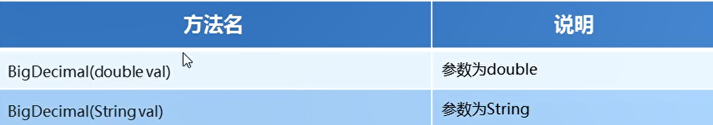
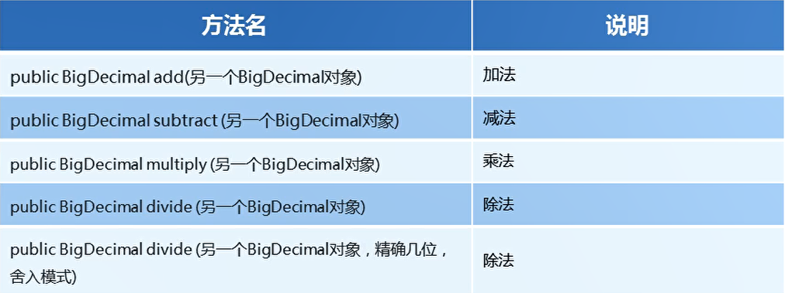
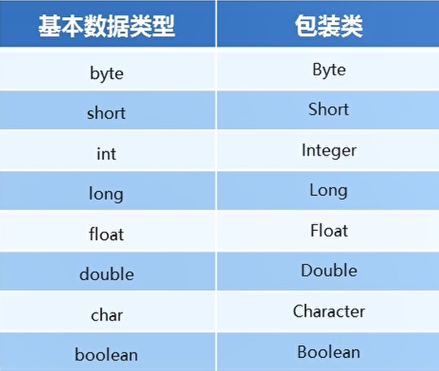
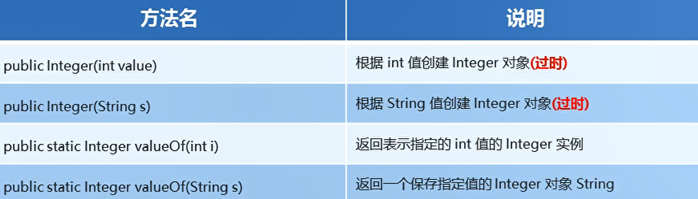
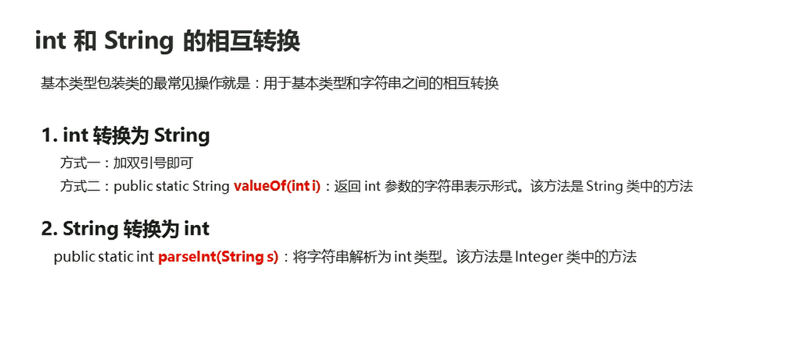

# BigDecimal

## 构造方法

  

```java
package com.hfut.edu.test1;

import java.math.BigDecimal;

public class test3 {
    public static void main(String[] args) {
        BigDecimal bd1 = new BigDecimal(10.0);
        BigDecimal bd2 = new BigDecimal("0.3");

        System.out.println(bd1);
        System.out.println(bd2);
    }
}

```

## 四则运算

**如果要使用精确运算，请使用字符串构造**

```java
package com.hfut.edu.test1;

import java.math.BigDecimal;

public class test3 {
    public static void main(String[] args) {
//        BigDecimal bd1 = new BigDecimal(10.0);
        BigDecimal bd1 = new BigDecimal("0.3");
        BigDecimal bd2 = new BigDecimal("0.4");

        // 加法运算
        BigDecimal add = bd1.add(bd2);
        System.out.println(add);

        // 减法运算
        BigDecimal subtract = bd1.subtract(bd1);
        System.out.println(subtract);

        // 乘法运算
        BigDecimal multiply = bd1.multiply(bd2);
        System.out.println(multiply);

        // 除法运算
        BigDecimal divide = bd1.divide(bd2);
        System.out.println(divide);

    }
}
```

## BigDecimal的特殊方法

  

```java
package com.hfut.edu.test1;

import java.math.BigDecimal;

public class test3 {
    public static void main(String[] args) {
//        BigDecimal bd1 = new BigDecimal(10.0);
        BigDecimal bd1 = new BigDecimal("0.3");
        BigDecimal bd2 = new BigDecimal("4");

        // 加法运算
        BigDecimal add = bd1.add(bd2);
        System.out.println(add);

        // 减法运算
        BigDecimal subtract = bd1.subtract(bd1);
        System.out.println(subtract);

        // 乘法运算
        BigDecimal multiply = bd1.multiply(bd2);
        System.out.println(multiply);

        // 除法运算  如果出现除不尽的情况 填入三个参数
        // 参数一：表示参数运算的另一个对象
        // 参数二：表示小数点后精确到多少位
        // 参数三：舍入模式  进一法： BigDecimal.ROUND_UP
        // 去尾法：BigDecimal.ROUND_FLOOR
        // 四舍五入：BigDecimal.ROUND_HALF_UP
        BigDecimal divide = bd1.divide(bd2,2,BigDecimal.ROUND_HALF_UP);// 输出0.08
        System.out.println(divide);
    }
}
```

## 基本数据类型包装类

&emsp;将基本数据类型封装成对象的好处在于可以在对象中定义更多的功能方法操作该数据

常用操作之一：用于基本数据类型与字符串之间的转换

  

* 获得Integer对象

  


```java
package com.hfut.edu.test1;

public class test4 {
    public static void main(String[] args) {

        // 创建Integer对象  但是下面两种方法已经过时
        Integer i1 = new Integer(100);
        Integer i2 = new Integer("111");
        System.out.println(i1);
        System.out.println(i2);

        // 使用Integer的静态方法 Integer.valueOf()
        Integer i3 = Integer.valueOf(100);
        Integer i4 = Integer.valueOf("171289");
        System.out.println(i3);
        System.out.println(i4);
    }
}


```

## 自动装箱与自动拆箱

```java
package com.hfut.edu.test1;

public class test5 {
    public static void main(String[] args) {
        // 自动装箱：将一个基本数据类型变量对应的包装类
        // 自动：Java底层会帮我们自动的调用valueOf方法
        Integer i1 = 100;
        System.out.println(i1);

        // 自动拆箱：将一个包装类型变成对应的基本数据类型
        int i2 = i1;
        System.out.println(i2);

        Integer i3 = 100;
        i3 += 200;
        System.out.println(i3);

    }
}


```

## Integer的类型转换

* parseInt 将字符串转换成整数类型
* 整数转换成字符串：一个是采用字符串拼接的方式 二是采用String 类的ValueOf方法

```java
package com.hfut.edu.test1;

public class test6 {
    public static void main(String[] args) {

        String s1 = "100";
        int i1 = 200;
        System.out.println(s1 + i1);// 字符串 + 任意数据类型 自动转换成字符串类型

        // 将字符串类型转换成整数类型
        int i2 = Integer.parseInt(s1);
        System.out.println(i2 + i1);

        // 将整数类型转换成字符串类型
        int i3 = 100;
        String s2 = i3 + "";
        System.out.println(s2);
        
        // 将整数转换成字符串类型
        String s3 = String.valueOf(i3);
        System.out.println(s3 + 100);
    }
}
```

  

## 将数字字符串进行拆分成整数数组


```java
package com.hfut.edu.test1;

public class test7 {
    public static void main(String[] args) {
        // 将一段字符串进行分割 存入整数类型的数组
        String s = "1 2 3 4 5";
        // 使用空格将字符串进行分割
        String[] strArr = s.split(" ");

        int[] numberArr = new int[strArr.length];// 新开辟一个数组 长度是字符串数组的长度

        for (int i = 0; i < strArr.length; i++) {
            int number = Integer.parseInt(strArr[i]);// 将每一个数字字符串转换成 整数
            numberArr[i] = number;
        }

        for (int i = 0; i < numberArr.length; i++) {
            System.out.println(numberArr[i]);
        }

    }
}


```


