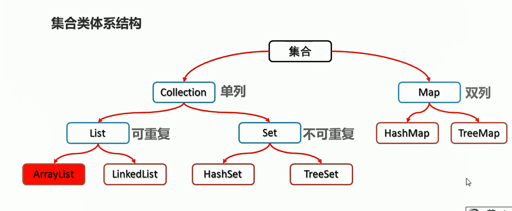
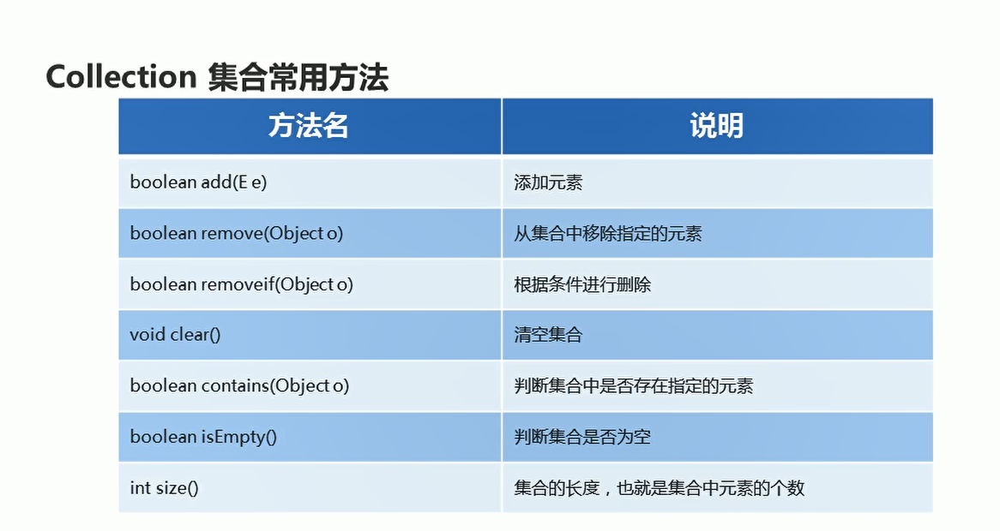
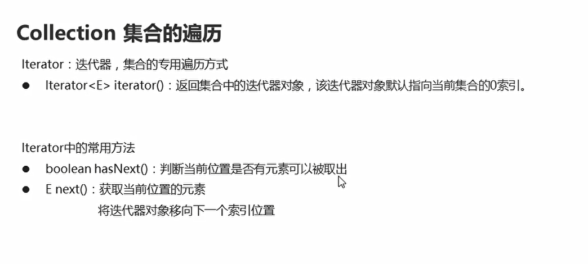
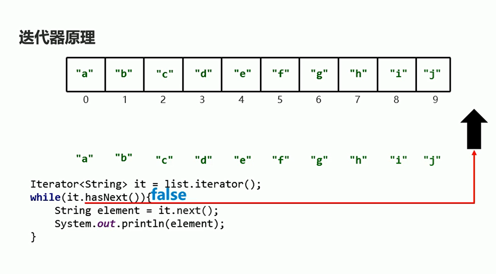
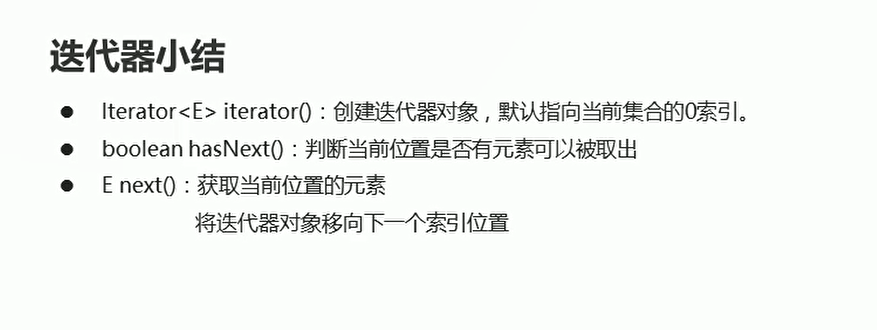
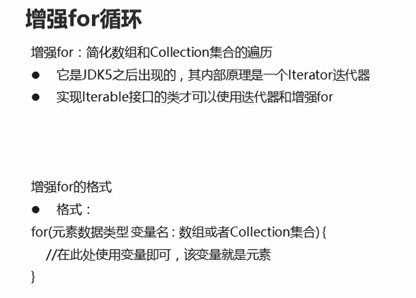
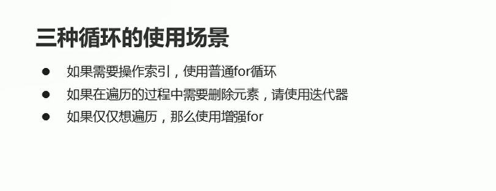

# 集合

## 集合与数组之间的区别

* 数组的长度是不可变的，集合的长度是可变的
* 数组可以存基本数据类型和引用数据类型，**集合只能存引用数据类型，如果存基本数据类型，需要存对应的包装类**

```java
package com.hfut.edu.test3;

import java.util.ArrayList;
import java.util.Arrays;

public class test11 {
    public static void main(String[] args) {
        // 数组可以存储基本数据类型也可以存储引用数据类型
        int[] arr1 = {1,2,3};
        String[] arr2 = {"a","b","c"};// 字符串数组

        // 打印数组
        System.out.println(Arrays.toString(arr1));
        System.out.println(Arrays.toString(arr2));

        // 集合只能存储引用数据类型 字符串
        ArrayList<String> list1 = new ArrayList<>();
        list1.add("a");
        list1.add("b");
        list1.add("c");

        System.out.println(list1);

        // 如果集合要存储基本数据类型 实际存储的是包装类
        ArrayList<Integer> list2 = new ArrayList<>();
        list2.add(1);
        list2.add(2);
        list2.add(3);

        System.out.println(list2);

    }
}


```

## 集合体系结构

  

## Collection常用的方法

  


关于removeIf方法的底层实现原理：**底层会遍历集合，得到集合中的每一个元素，然后将集合中的每一个元素都到lambda表达式中判断一下，如果返回的是true 进行删除  反之进行保留**

```java
package com.hfut.edu.test3;

import java.util.ArrayList;
import java.util.Collection;

public class test12 {
    public static void main(String[] args) {
        Collection<String> collection = new ArrayList<>();// 父类引用指向子类对象

        // 添加元素
        collection.add("a");
        collection.add("b");
        collection.add("ccc");
        collection.add("d");
        System.out.println(collection);

        // 删除指定元素
        method1(collection);

        // 根据条件删除元素
        // 使用lambda表达式 作为指定的条件
        collection.removeIf(
                (String s)->{
                    return s.length() == 3;// 删除长度为3的字符串
                }
        );

        System.out.println(collection);

        // 判断集合中是否包含字符串a
        boolean result1 = collection.contains("a");
        System.out.println(result1);

        // 判断集合是不是空
        boolean result2 = collection.isEmpty();
        System.out.println(result2);

        // 输出集合的长度
        System.out.println(collection.size());

    }

    private static void method1(Collection<String> collection) {

        // 删除指定元素  返回布尔类型的数据
        boolean result1 = collection.remove("a");// true
        boolean result2 = collection.remove("fff"); // false

        System.out.println(result1);
        System.out.println(result2);


    }
}


```


## 集合-迭代器
  

```java
package com.hfut.edu.test3;

import java.util.ArrayList;
import java.util.Collection;
import java.util.Iterator;

public class test14 {
    public static void main(String[] args) {
        Collection<String> list = new ArrayList<>();// Colletcion引用 指向子类对象

        list.add("a");
        list.add("b");
        list.add("c");
        list.add("d");

        // 创建该集合的迭代器对象
        Iterator<String> it = list.iterator();
        // 遍历迭代器 hasNext()判断当前位置是否有元素 next()取出当前元素
        while(it.hasNext())
        {
            System.out.println(it.next());// 打印当前迭代器指向的元素
        }
    }
}
```


## 迭代器原理分析

  

  

## 迭代器删除方法的注意事项

**集合删除方法，集合内的元素会自动的向前填充，集合的长度会自动减一**

```java
package com.hfut.edu.test4;

import java.util.ArrayList;

public class test1 {
    public static void main(String[] args) {
        ArrayList<String> list = new ArrayList<>();
        list.add("a");
        list.add("b");
        list.add("c");
        list.add("b");
        list.add("b");

        // 删除所有的b元素
        for (int i = 0; i < list.size(); i++) {
            String s = list.get(i);// 取出集合中每一个元素
            if(s.equals("b")){
                list.remove(i);// 删除该元素
                i--;// 因为集合容器删除一个元素之后集合长度会减一  所以要想删除相邻的重复元素 必须i--
            }
        }

        System.out.println(list);
    }
}


```

**迭代器删除方法，不需要考虑集合长度自动减一**

```java
package com.hfut.edu.test4;

import java.util.ArrayList;
import java.util.Iterator;

public class test1 {
    public static void main(String[] args) {
        ArrayList<String> list = new ArrayList<>();
        list.add("a");
        list.add("b");
        list.add("c");
        list.add("b");
        list.add("b");

        // 删除所有的b元素
        Iterator<String> it = list.iterator();// 创建集合的迭代器

        while(it.hasNext())
        {
            String s = it.next();// 取出当前迭代器指向的集合元素
            if(s.equals("b")){
                it.remove();// 删除当前元素
            }
        }
        System.out.println(list);
    }
}

```

## 增强for循环

  

```java
package com.hfut.edu.test4;

import java.util.ArrayList;

public class test2 {
    public static void main(String[] args) {

        ArrayList<String> list = new ArrayList<>();
        list.add("a");
        list.add("b");
        list.add("c");
        list.add("d");
        list.add("e");
        list.add("f");
        list.add("g");

        // 使用增强for循环
        for(String str:list){
            System.out.println(str);
        }

    }
}
```

  


