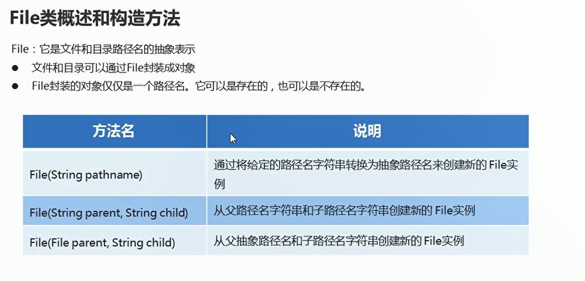
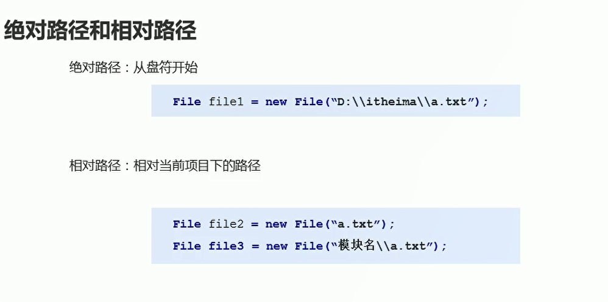
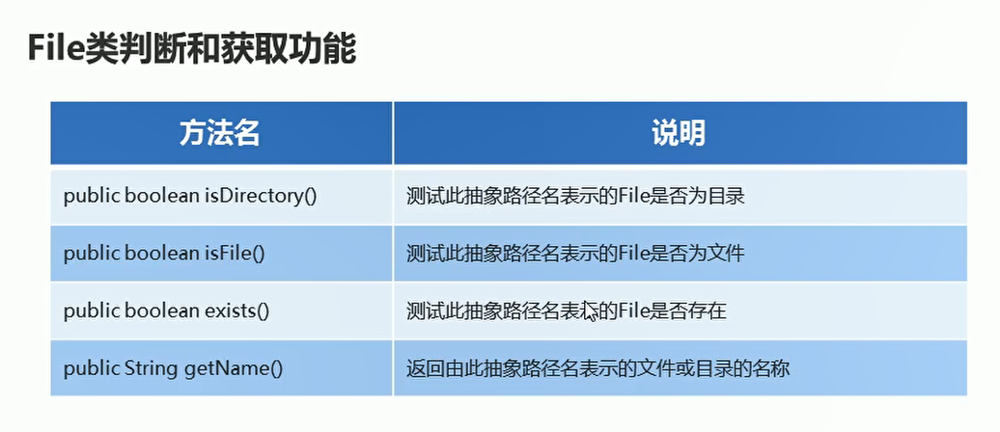

# File

## 概述-三种构造方法

  

```java
package com.hfut.edu.test9;

import java.io.File;

public class test1 {
    public static void main(String[] args) {
        method1();
        method2();
        method3();
    }


    private static void method3(){
        File file1 = new File("D:\\heima");// 创建父路径文件对象
        String path = "1.txt";
        File file = new File(file1,path);

        System.out.println(file);
    }

    // 通过指定的路径字符串 创建文件对象
    private static void method1(){
        // 第一种文件创建方法
        String path = "D:\\heima\\1.txt";// 使用转义字符

        // 创建文件对象
        File file = new File(path);// 将指定的路径名字字符串 转换为抽象路径名
        System.out.println(file);
    }

    // 通过父路径以及子路径拼接 来创建文件对象
    private static void method2(){
        // 将两个路径进行拼接
        String path1 = "D:\\heima";
        String path2 = "1.txt";

        File file = new File(path1,path2);// 将两个路径进行拼接
        System.out.println(file);
    }
}


```


## 绝对路径和相对路径

  

## File的创建功能

  

* creatfile
* 如果文件存在 那么创建失败  返回false
* 如果文件不存在 那么创建成功  返回true
* creatNewFile  不管调用有没有后缀名  只能创建文件

```java
package com.hfut.edu.test9;

import java.io.File;
import java.io.IOException;

public class terst2 {
    public static void main(String[] args) throws IOException {
        // 如果文件存在 那么创建失败  返回false
        // 如果文件不存在 那么创建成功  返回true
        // creatNewFile  不管调用有没有后缀名  只能创建文件

        File file1 = new File("D:\\heima\\2.txt");
        boolean result = file1.createNewFile();// 创建指定路径的指定文件  抛出异常
        System.out.println(result);
    }
}


```

* mkdir 创建单级文件夹
* mkdirs 创建多级文件夹

```java
package com.hfut.edu.test9;

import java.io.File;
import java.io.IOException;

public class terst2 {
    public static void main(String[] args) throws IOException {
        // 如果文件存在 那么创建失败  返回false
        // 如果文件不存在 那么创建成功  返回true
        // creatNewFile  不管调用有没有后缀名  只能创建文件

        File file1 = new File("D:\\heima\\aaa");

        // mkdir创建单级文件夹
        boolean result = file1.mkdir();
        System.out.println(result);

        // mkdirs创建多级文件夹
        File file2 = new File("D:\\heima\\aaa\\bbb\\cccf");

        boolean r = file2.mkdirs();
        System.out.println(r);

    }
}
```

## File的删除功能

  

* 不走回收站的
* 如果删除的是文件 直接删除 如果删除的是文件夹 只能删除空文件夹
* 总结：只能删除文件和空文件夹

```java
package com.hfut.edu.test9;

import java.io.File;
import java.io.IOException;

public class terst2 {
    public static void main(String[] args) throws IOException {

        File file1 = new File("D:\\heima\\aaa");
        boolean result = file1.delete();// 删除空文件夹
        System.out.println(result);
    }
}


```

## File的判断和获取功能

  

```java
package com.hfut.edu.test9;

import java.io.File;
import java.io.IOException;

public class terst2 {
    public static void main(String[] args) throws IOException {
        File file1 = new File("D:\\heima\\1.txt");
        boolean result1 = file1.isFile();// 判断是不是文件
        boolean result2 = file1.isDirectory();// 判断是不是文件夹

        System.out.println(result1);
        System.out.println(result2);

        // 判断路径是否存在
        boolean result3 = file1.exists();
        System.out.println(result3);

        // getName() 如果调用者是文件 那么获取的是文件名和后缀名
        // 如果调用者是一个文件夹 那么获取的是文件夹的名字

        String name = file1.getName();
        System.out.println(name);
    }
}
```


## listFile方法

  

  

## 练习1：在当前模块下面aaa文件夹创建一个文件a.txt

**使用createNewFile创建文件的时候，文件所在的文件夹必须要存在**

```java
package com.hfut.edu.test9;

import java.io.File;
import java.io.IOException;

public class test3 {
    public static void main(String[] args) throws IOException {
        // 在当前模块的aaa文件夹下面创建a.txt

        File file = new File(".\\aaa");

        // 首先判断文件夹是否存在
        if(!file.exists()){
            // 如果文件夹不存在 就创建出来
            file.mkdirs();// 创建文件夹
        }

        // 使用凭借的方法创建文件对象
        File newFile = new File(file,"a.txt");

        // 抛出IO异常
        newFile.createNewFile();


    }
}

```

## 练习2：删除一个多级文件夹

```java
package com.hfut.edu.test9;

import java.io.File;

public class test4 {
    public static void main(String[] args) {
        // 删除多级文件夹
        // 首先删除文件夹里面所有内容
        // 然后再删除这个文件夹

        File src = new File("D:\\heima\\aaa");
        deleteSrc(src);
    }

    private static void deleteSrc(File src) {

        // 先删除文件夹里面的所有内容
        // 首先遍历src中所有的文件或者文件夹对象
        File[] files = src.listFiles();

        for (File file : files) {

            if(file.isFile()){
                // 如果是一个文件 直接删除即可
                file.delete();
            }else{
                // 递归判断
                deleteSrc(file);// 如果是文件夹 递归删除即可
            }
        }

        // 最后删除文件夹
        src.delete();

    }
}


```

## 练习3：统计一个文件夹中每一种文件的个数

```java
package com.hfut.edu.test9;

import java.io.File;
import java.util.HashMap;

public class test9 {
    public static void main(String[] args) {
        // 使用map集合进行数据统计  
        File file = new File("D:\\heima");

        // 使用哈希集合存储每一种文件的出现次数
        HashMap<String,Integer> hm = new HashMap<>();
        getCount(hm,file);
        System.out.println(hm);
    }

    private static void getCount(HashMap<String, Integer> hm, File file) {
        
        // 首先获取该文件夹下面的所有文件
        File[] files = file.listFiles();
        for (File file1 : files) {
            if(file1.isFile()){
                // 如果是文件
                // 获取文件名
                String fileName = file1.getName();
                String[] filenameArr = fileName.split("\\.");
                if(filenameArr.length == 2){
                    String fileEndName = filenameArr[1];// 获取文件后缀名
                    // 判断容器中有没有这种文件存在
                    if(hm.containsKey(fileEndName)){
                        // 将已经出现的次数获取出来
                        Integer count = hm.get(fileEndName);
                        count++;

                        // 将已经出现的次数覆盖掉
                        hm.put(fileEndName,count);
                    }
                    else {
                        // 不存在表示文件是第一次出现
                        hm.put(fileEndName,1);
                    }
                }


            }else{
                getCount(hm,file1);//如果是文件夹 继续递归下去即可
            }
        }
        
    }
}


```


