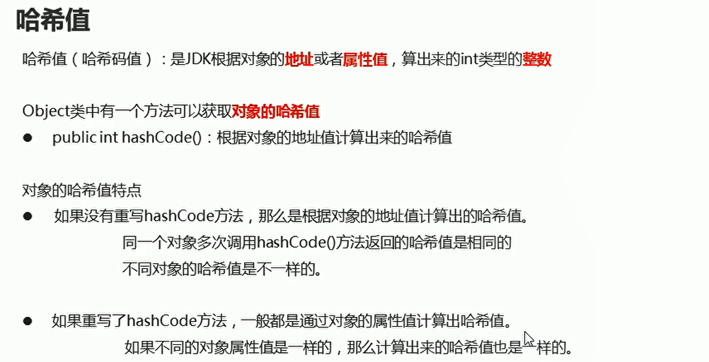
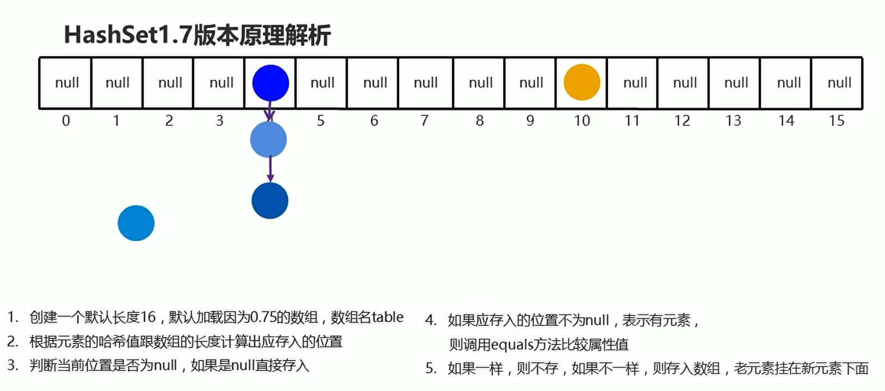
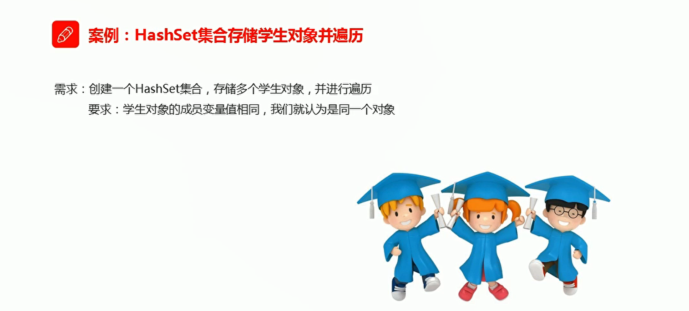
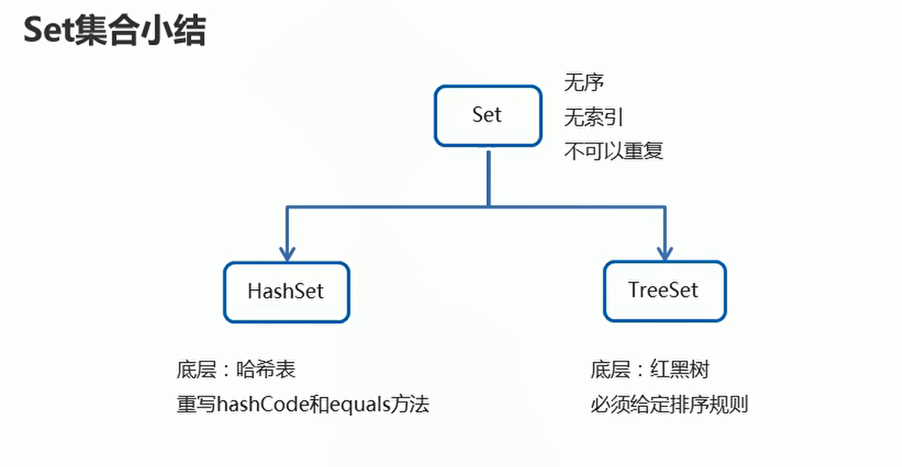

# HashSet

## 概述

* 底层数据结构是哈希表
* 不能保证存储和去除的顺序完全一致
* 没有带索引的方法，所以不能使用普通的for循环进行遍历  使用增强for循环或者迭代器进行遍历
* 由于是Set集合，所以元素唯一


简单使用：

```java
package com.hfut.edu.test7;
import java.util.HashSet;
import java.util.Iterator;

public class test1 {
    public static void main(String[] args) {
        HashSet<String> hs = new HashSet<>();

        // HashSet是集合 每一个元素只能存在一个  并且存入顺序和读取顺序是不一致的
        hs.add("hrfiuweshrfiuv");
        hs.add("hrfiuweswqhrfiuv");
        hs.add("hrfiuwewqshrfiuv");
        hs.add("hrfiuweshwqrfiuv");
        hs.add("hrfiuwewqshrfiuv");
        hs.add("q");
        hs.add("q");

        // 使用迭代器进行遍历
        Iterator<String> it = hs.iterator();

        while(it.hasNext()){
            String s = it.next();
            System.out.println(s);
        }
        System.out.println("=============================================");
        // 使用增强for循环进行遍历
        for(String i:hs){
            System.out.println(i);
        }
    }
}


```

## 哈希值

  

## hashSet原理

  

**HashSet1.7版本原理总结：**

* 底层数据结构：哈希表（数组 + 链表）
* 数组的长度默认为16，加载因子是0.75（数组扩容）
* 首先会先获取元素的哈希值，计算出数组中应该存入的索引
  * 判断该索引处是否为null
  * 如果是null,直接添加
  * 如果不是null,则与链表中所有元素，通过equals方法比较属性值
  * 只要有一个相同，就不存，如果都不一样，才会存入集合


## HashSet存储学生对象并遍历


  

* Student学生类
```java
package com.hfut.edu.test8;

import java.util.Objects;

public class Student {
    private int age;
    private String name;

    public Student() {
    }

    @Override
    public boolean equals(Object o) {
        if (this == o) return true;
        if (o == null || getClass() != o.getClass()) return false;

        Student student = (Student) o;

        if (age != student.age) return false;
        return Objects.equals(name, student.name);
    }

    // 根据属性值 计算哈希值
    @Override
    public int hashCode() {
        int result = age;
        result = 31 * result + (name != null ? name.hashCode() : 0);
        return result;
    }

    public Student(int age, String name) {
        this.age = age;
        this.name = name;
    }

    public int getAge() {
        return age;
    }

    public void setAge(int age) {
        this.age = age;
    }

    public String getName() {
        return name;
    }

    public void setName(String name) {
        this.name = name;
    }

    @Override
    public String toString() {
        return "Student{" +
                "age=" + age +
                ", name='" + name + '\'' +
                '}';
    }
}


```

```JAVA
package com.hfut.edu.test8;

import java.util.HashSet;
import java.util.Iterator;

public class Main {
    public static void main(String[] args) {

        HashSet<Student> hs = new HashSet<>();

        // s1和s2理论上是不同的对象 但是由于年龄和姓名都是一样的  所以不应该存入HashSet中
        // 但是如果没有重写hashCode方法 那就是根据对象的地址值计算的哈希值  这个哈希值是不一样的  那么计算出来应该存入的索引就不一样
        Student s1 = new Student(11,"12");
        Student s2 = new Student(11,"12");
        Student s3 = new Student(111,"12");
        hs.add(s1);
        hs.add(s2);
        hs.add(s3);
        Iterator<Student> it = hs.iterator();

        while(it.hasNext()){
            Student s = it.next();
            System.out.println(s);// 调用toString方法进行打印
        }


    }
}


```

## 小结


  

