# IDEA中使用git

## 操作步骤

* 打开设置

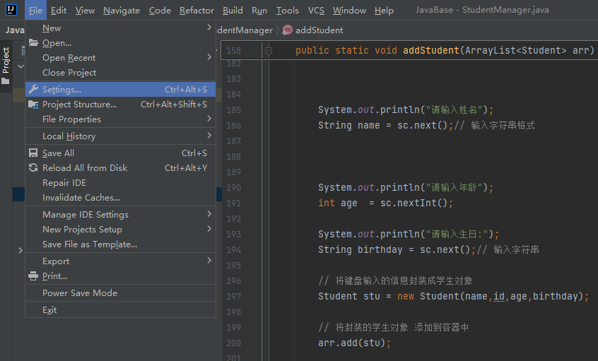  

* 指定git的路径

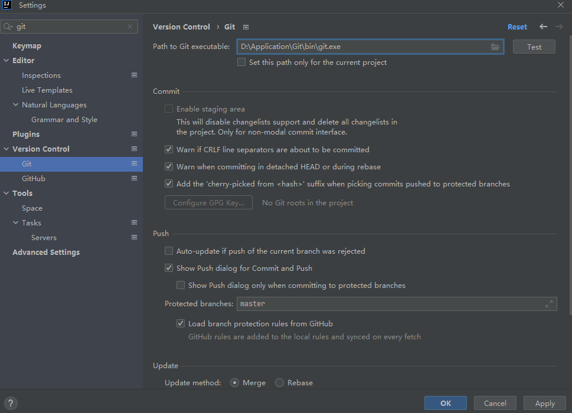  

* 将项目作为本地仓库

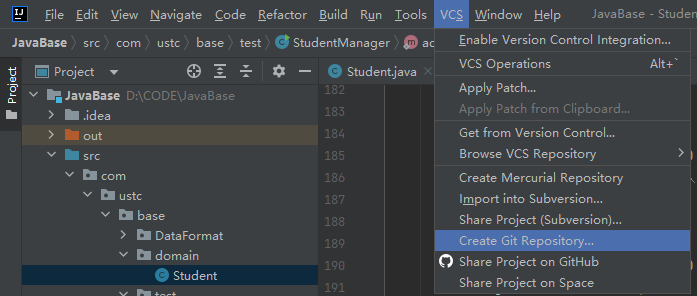  

**将这个项目创建仓库**
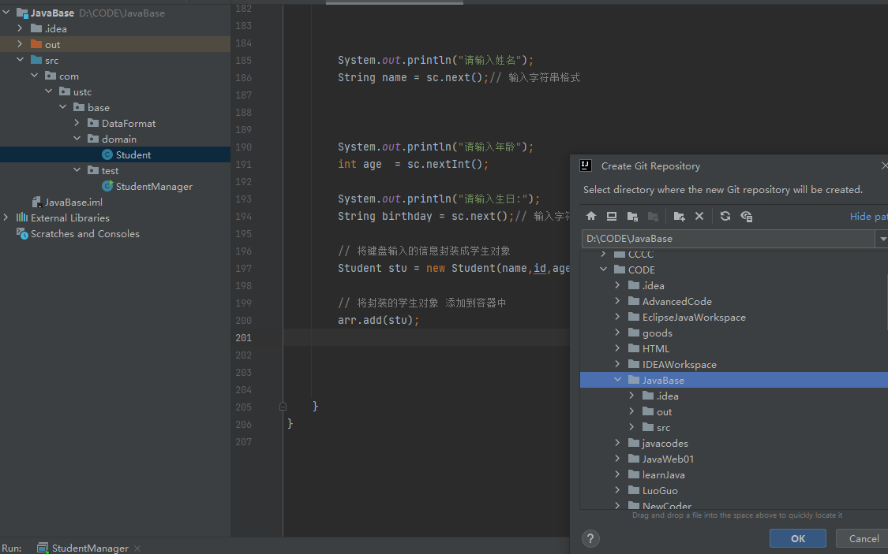  

右上角出现变化
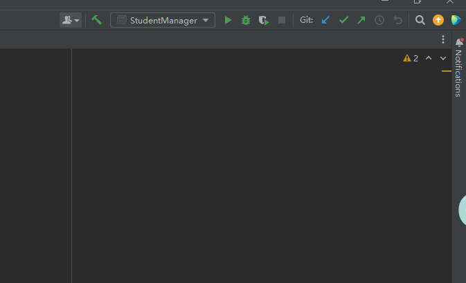  

* commit项目

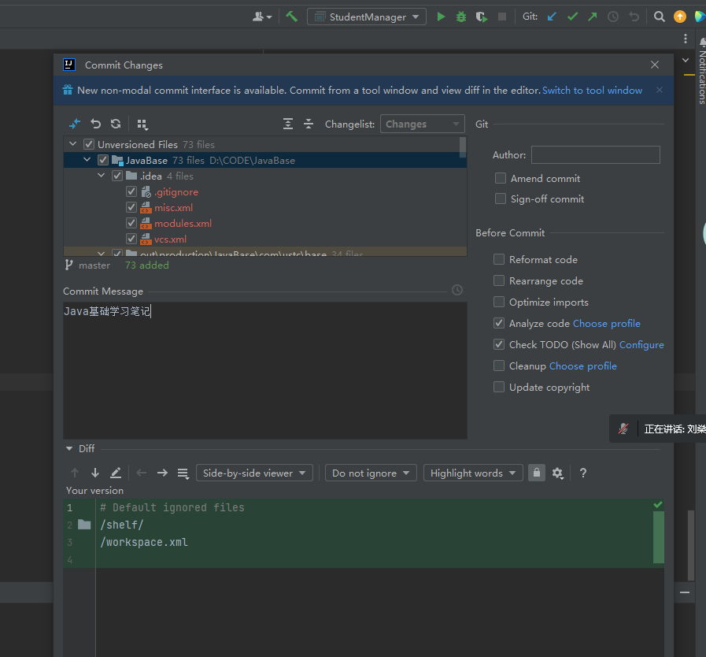  

* log日志 查看 记录
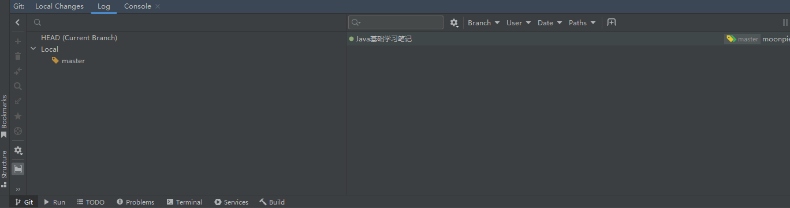  

* 分支操作
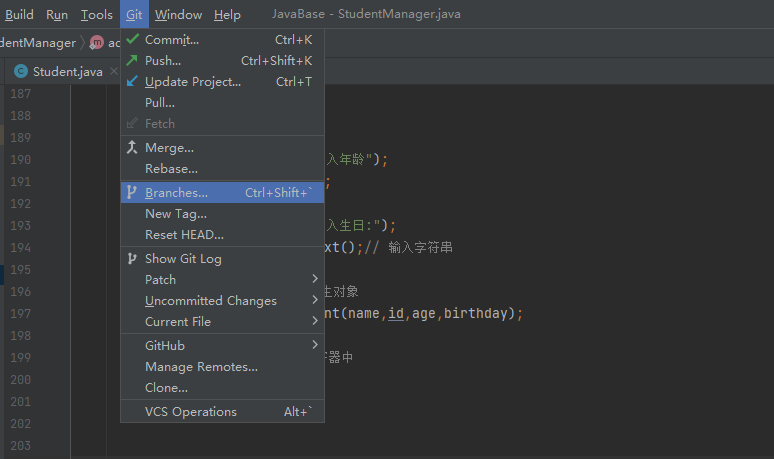  

切换分支
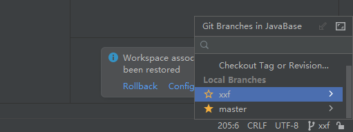  

* 合并操作

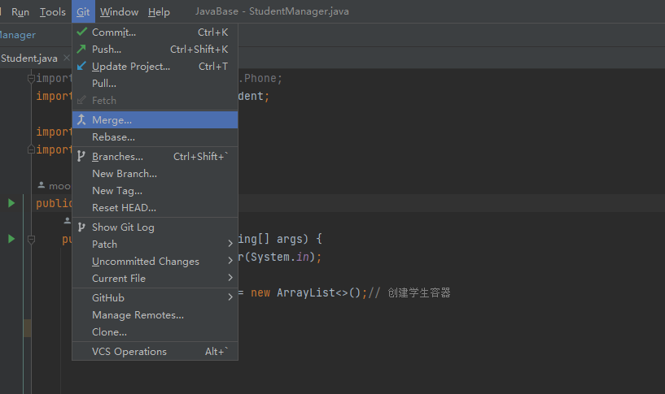  

  

* 本地代码推送到远程仓库
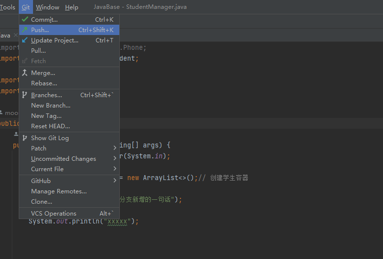  

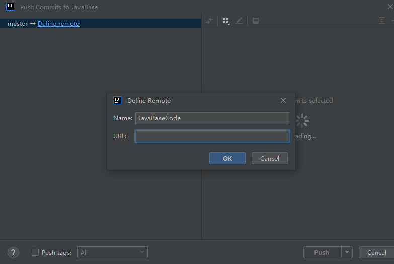  

* 远程仓库克隆
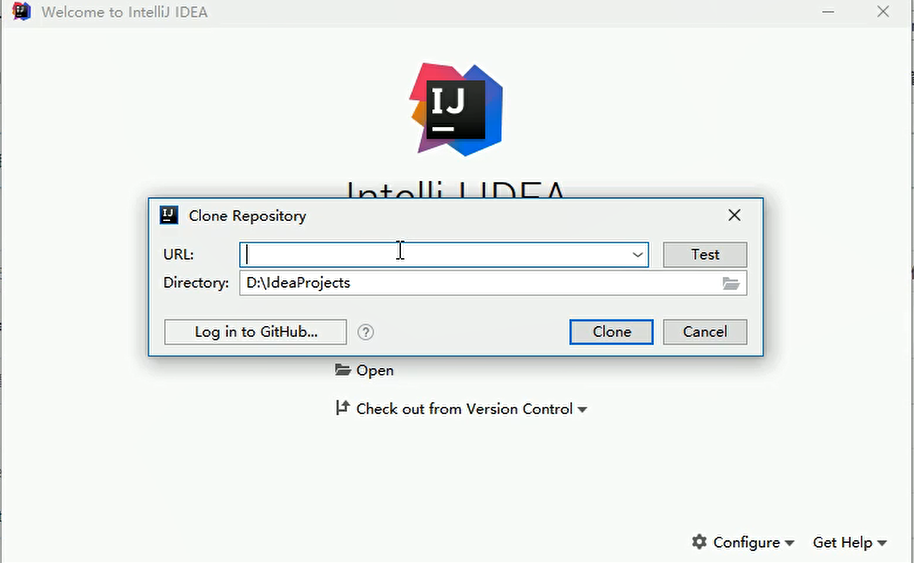  

