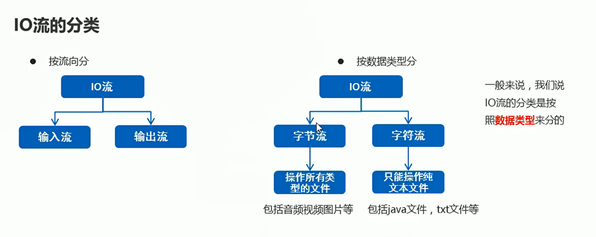
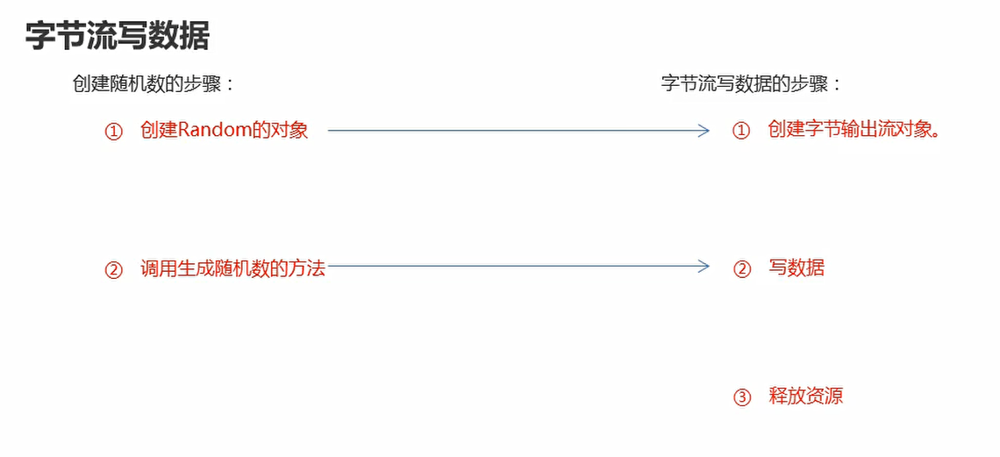
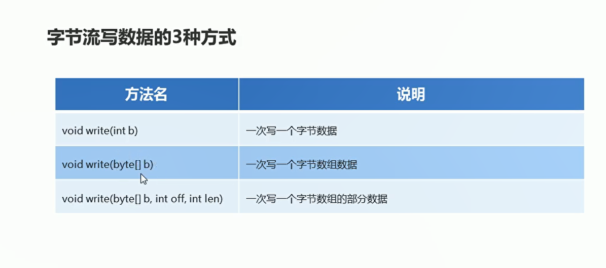
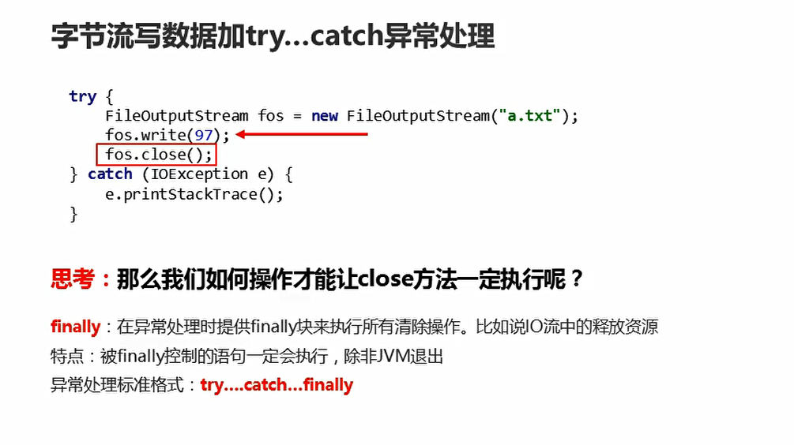
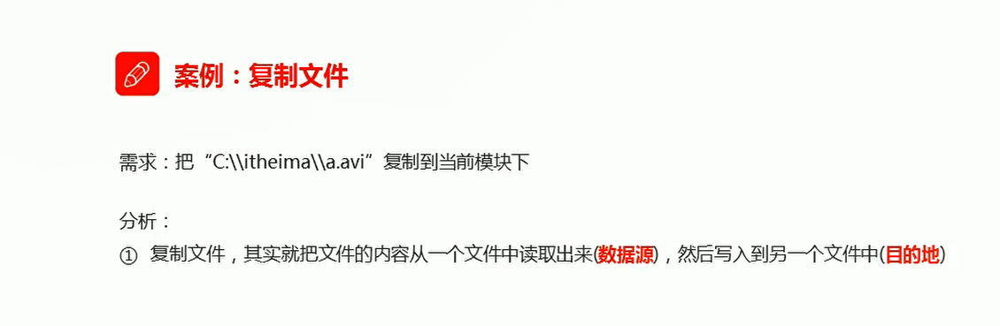

# IO字节流

## 概述
  

## 字节输出流快速入门

  


```java
package com.hfut.edu.test9;

import java.io.File;
import java.io.FileNotFoundException;
import java.io.FileOutputStream;
import java.io.IOException;

public class test10 {
    public static void main(String[] args) throws IOException {
        // 创建字节输出流的对象  -- 告诉JVM要往哪一个文件中写数据
        FileOutputStream fos = new FileOutputStream("D:\\heima\\1.txt");// 直接传入路径 创建字节输出流对象

        // 传入File对象  创建字节输出流对象
        FileOutputStream fos1 = new FileOutputStream(new File("D:\\heima\\1.txt"));

        // 写数据
        fos.write(97);

        // 释放资源
        fos.close();

    }
}
```

## 字节输出流的注意事项

* 如果文件不存在 创建该文件
* 如果文件存在 写入数据的时候 直接清空
* 写出的整数 实际是ASCII值  对应码表的一个字符
* 每次使用完输出流，必须释放该资源

## 输出字节流-一次性写多个数据

  

```java
package com.hfut.edu.test9;

import java.io.FileOutputStream;
import java.io.IOException;

public class test11 {
    public static void main(String[] args) throws IOException {
        FileOutputStream fos = new FileOutputStream("D:\\heima\\1.txt");// 字节输出流

        byte[] bys = {97,98,99,101,102,103};// 字节数组

        fos.write(bys);// 一次性写入多个字节  传入字节数组

        // 传入字节数组 以及字符的开始索引 写入几个字符
        fos.write(bys,0,2);

        // 关闭资源
        fos.close();
    }
}


```

## 字节输出流的两个问题

* 如何实现换行写入

```java
package com.hfut.edu.test9;

import java.io.FileOutputStream;
import java.io.IOException;
import java.nio.charset.StandardCharsets;

public class test11 {
    public static void main(String[] args) throws IOException {
        FileOutputStream fos = new FileOutputStream("D:\\heima\\1.txt");// 字节输出流

        fos.write(97);
        fos.write("\r\n".getBytes());// 实现换行

        fos.write(98);
        fos.write("\r\n".getBytes());// 实现换行

        fos.write(99);
        fos.write("\r\n".getBytes());// 实现换行

        // 关闭资源
        fos.close();
    }
}
```


* 如何实现续写 就是接着前面的字符 不是清除重写

```java
package com.hfut.edu.test9;

import java.io.FileOutputStream;
import java.io.IOException;
import java.nio.charset.StandardCharsets;

public class test11 {
    public static void main(String[] args) throws IOException {
        // 打开续写开关
        FileOutputStream fos = new FileOutputStream("D:\\heima\\1.txt",true);// 字节输出流

        fos.write(97);
        fos.write("\r\n".getBytes());// 实现换行

        fos.write(98);
        fos.write("\r\n".getBytes());// 实现换行

        fos.write(99);
        fos.write("\r\n".getBytes());// 实现换行

        // 关闭资源
        fos.close();
    }
}
```


## try-catch-finally捕获异常

  

```java

package com.hfut.edu.test9;

import java.io.File;
import java.io.FileOutputStream;
import java.io.IOException;

public class test12 {
    public static void main(String[] args) {

        FileOutputStream fos = null;
        try {

            // 这里的fos已经是局部变量  所以需要一开始进行声明
            fos = new FileOutputStream(new File("D:\\heima\\1.txt"));
            fos.write(97);// 出现IO异常

        } catch (IOException e) {
            e.printStackTrace();
        } finally {
            // finally里面的代码一定会被执行

            // 如果字节输出流不是null 关闭字节输出流
            if(fos != null){
                try {
                    fos.close();
                } catch (IOException e) {
                    throw new RuntimeException(e);
                }
            }

        }


    }
}

```

## 字节输入流写数据

```java
package com.hfut.edu.test9;

import java.io.File;
import java.io.FileInputStream;
import java.io.FileNotFoundException;
import java.io.IOException;

public class test13 {
    public static void main(String[] args) throws IOException {
        // 如果文件不存在  直接报错
        FileInputStream fis = new FileInputStream(new File("D:\\heima\\1.txt"));// 字节输入流
        // 一次只读取一个字符 返回值是字符的ASCII值
        int read = fis.read();// 读取数据
        System.out.println((char)read);// 强制转换成字符类型
        fis.close();
    }
}


```

## 字节流读数据 一次性读取多个数据

```java
package com.hfut.edu.test9;

import java.io.File;
import java.io.FileInputStream;
import java.io.FileNotFoundException;
import java.io.IOException;

public class test14 {
    public static void main(String[] args) throws IOException {
        FileInputStream fis = new FileInputStream(new File("D:\\heima\\1.txt"));
        int b;
        // while循环一次性读取多个字节
        while ((b = fis.read()) != -1)
        {
            // 读取到空格的时候  返回-1
            System.out.println(b);
        }
        fis.close();
    }
}


```

## 案例、文件复制

  

```java
package com.hfut.edu.test9;

import java.io.File;
import java.io.FileInputStream;
import java.io.FileOutputStream;
import java.io.IOException;

public class test15 {
    public static void main(String[] args) throws IOException {
        // 创建 字节输入流  准备读数据
        FileInputStream fis = new FileInputStream(new File("D:\\heima\\1.txt"));

        // 创建字节输出流
        FileOutputStream fos = new FileOutputStream("D:\\heima\\2.txt");

        int b;

        while((b = fis.read()) != -1){
            fos.write(b);
        }

        fis.close();
        fos.close();
    }
}


```

## 使用字节数组进行拷贝文件

```java
package com.hfut.edu.test9;

import java.io.File;
import java.io.FileInputStream;
import java.io.FileOutputStream;
import java.io.IOException;

public class test15 {
    public static void main(String[] args) throws IOException {
        // 创建 字节输入流  准备读数据
        FileInputStream fis = new FileInputStream(new File("D:\\heima\\1.txt"));

        // 创建字节输出流
        FileOutputStream fos = new FileOutputStream("D:\\heima\\2.txt");

        byte [] bytes = new byte[1024];// 字节数组
        int len;// 本次读取的有效字节个数

        while((len = fis.read()) != -1){
            fos.write(bytes,0,len);// 读取多少字节 写入多少字节
        }

        fis.close();
        fos.close();
    }
}


```


