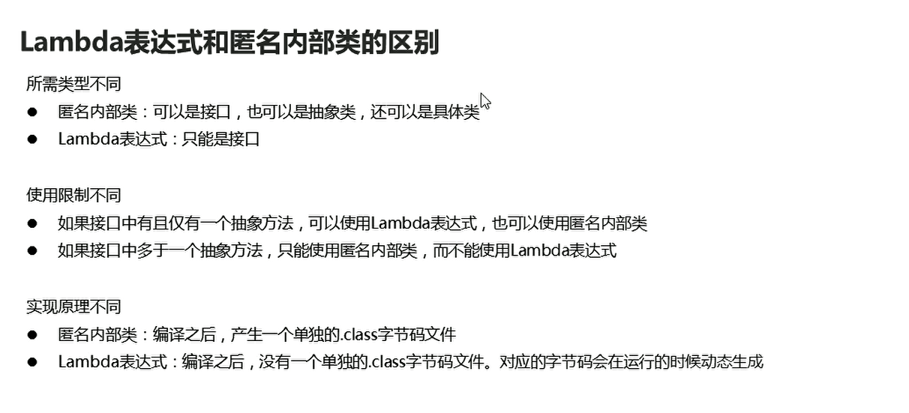

# Lambda

## 概述

Lambda表达式就是对匿名內部类进行了优化，产生和匿名內部类一样的效果

```java
package com.hfut.edu.test3;

public class Test {
    public static void main(String[] args) {

        // 创建一个匿名内部类 使用接口引用指向实现类对象  就不需要创建一个实现类对象
        Swimming s = new Swimming() {
            @Override
            public void swim() {
                System.out.println("去游泳");
            }
        };

        goSwimming(s);

        goSwimming(()->{
            System.out.println("lambda表达式初体验");
        });

    }

    public static void goSwimming(Swimming s)
    {
        s.swim();
    }
}


interface Swimming{
    void swim();
}
```


## 标准格式

* (形式参数)->{代码块}
* 形式参数：如果有多个参数，参数之间使用逗号进行隔开，如果没有参数，留空即可
* ->:代表指向动作
* 代码块：是我们具体要做的事情

  


```java
package com.hfut.edu.test4;
public class test4 {
    public static void main(String[] args) {
        useShowHandler(new ShowHandler() {
            @Override
            public void show() {
                System.out.println("匿名內部类的实现方法");
            }
        });

        // Lambda实现
        useShowHandler(()->{
            System.out.println("我是lambda中的show方法");
        });


    }

    public static void useShowHandler(ShowHandler showHandler){
        showHandler.show();// 接口引用指向实现类对象 然后调用方法
    }
}

interface ShowHandler{

    public  abstract  void show();// 接口的抽象方法

}


```

带参数的lambda表达式：

```java
package com.hfut.edu.test4;
public class test4 {
    public static void main(String[] args) {
        useShowHandler(new ShowHandler() {
            @Override
            public void show(String m) {
                System.out.println("匿名內部类的实现方法");
            }
        });

        // Lambda实现
        useShowHandler((String msg)->{
            System.out.println("我是lambda中的show方法");
        });


    }

    public static void useShowHandler(ShowHandler showHandler){
        showHandler.show("xz");// 接口引用指向实现类对象 然后调用方法
    }
}

interface ShowHandler{

    public  abstract  void show(String message);// 接口的抽象方法

}

```

## lambda：无参数有返回值

```java
package com.hfut.edu.test5;

import java.util.Random;

public class test {
    public static void main(String[] args) {
        useRandomNumHandler(new RandomNumHandler() {
            @Override
            public int getNumber() {
                Random r = new Random();// 创建random 对象
                int num = r.nextInt(10) +1;// 产生 1 - 10 的随机数
                return num;
            }
        });

        // 使用lambda表达式
        useRandomNumHandler(()->{
            Random r = new Random();// 创建random 对象
            int num = r.nextInt(10) +1;// 产生 1 - 10 的随机数
            return num;
        });
    }

    public static void useRandomNumHandler(RandomNumHandler randomNumHandler){
        int result = randomNumHandler.getNumber();
        System.out.println("打印随机数" + result);
    }
}

interface RandomNumHandler{
    int getNumber();
}
```

## 有参数有返回值

```java
package com.hfut.edu.test5;

import java.util.Random;

public class test {
    public static void main(String[] args) {
        useRandomNumHandler(new RandomNumHandler() {
            @Override
            public int getNumber(int a) {
                Random r = new Random();// 创建random 对象
                int num = r.nextInt(10) +1;// 产生 1 - 10 的随机数
                return num + a;
            }
        });

        // 使用lambda表达式
        useRandomNumHandler((int a)->{
            Random r = new Random();// 创建random 对象
            int num = r.nextInt(10) +1;// 产生 1 - 10 的随机数
            return num + a;
        });
    }
    
    // 测试方法
    public static void useRandomNumHandler(RandomNumHandler randomNumHandler){
        int result = randomNumHandler.getNumber(10);
        System.out.println("打印随机数" + result);
    }
}

interface RandomNumHandler{
    int getNumber(int a);
}
```

## Lambda和匿名类对比

  


