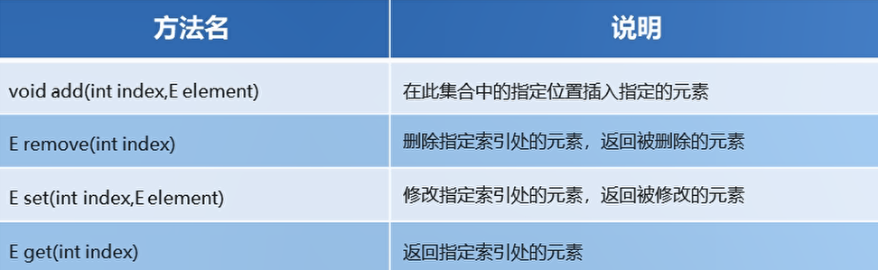
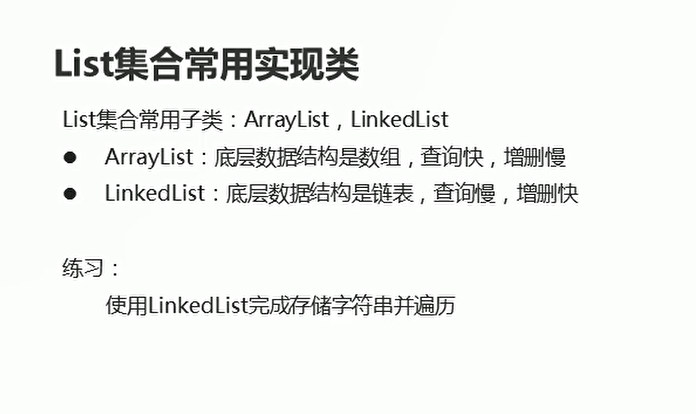
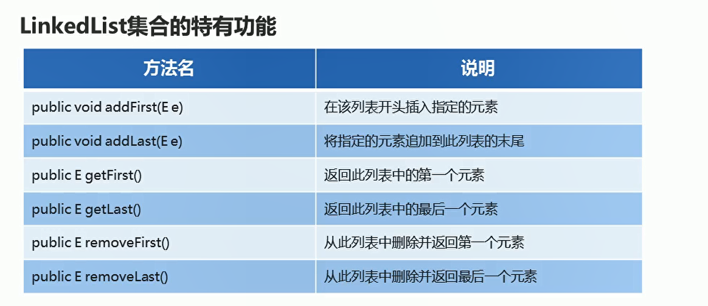

# List

## List集合概述

* 有序集合，用户可以精确控制列表中每一个元素的插入位置，用户可以通过整数索引访问元素，并搜索列表中的元素
* 与Set集合不同，列表通常允许重复的元素


List集合的特点：

* 有序：存储和取出的元素顺序一致
* 可重复：存储的元素可以重复

```java
package com.hfut.edu.test4;

import java.util.ArrayList;
import java.util.Iterator;
import java.util.List;

public class test3 {
    public static void main(String[] args) {
        List<String> l = new ArrayList<>();// 父类引用指向子类对象
        l.add("1");
        l.add("21");
        l.add("112");

        Iterator<String> i = l.iterator();

        while(i.hasNext()){
            String s = i.next();
            System.out.println(s);
        }
    }
}
```

## list集合的特有方法

  

```java
package com.hfut.edu.test4;

import java.util.ArrayList;
import java.util.List;

public class test4 {
    public static void main(String[] args) {
        List<String> l = new ArrayList<>();

        // 添加元素
        l.add("hello");
        l.add("world");
        l.add("ddddd");

        //在集合的指定位置 插入元素
        l.add(1,"dcghuasjghdfciuas");
        System.out.println(l);

        // 删除指定索引位置的元素
        l.remove(2);
        System.out.println(l);

        // 修改指定位置的元素
        l.set(0,"xxxxxxxxxxx");
        System.out.println(l);

        // 遍历集合
        for (int i = 0; i < l.size(); i++) {
            String s = l.get(i);
            System.out.println(s);
        }
    }
}


```

## LinkedList

  

**底层是链表 查询慢 增删比较快**

* 基本使用

```java
package com.hfut.edu.test4;

import java.util.Iterator;
import java.util.LinkedList;

public class test5 {
    public static void main(String[] args) {
        LinkedList<String> l = new LinkedList<>();
        l.add("aaa");
        l.add("bbb");
        l.add("ccc");

        for (int i = 0; i < l.size(); i++) {
            // 使用for循环进行遍历
            System.out.println(l.get(i));
        }

        System.out.println("-------------------");

        Iterator<String> it = l.iterator();

        while(it.hasNext()){
            String s = it.next();
            System.out.println(s);
        }

        System.out.println("----------------------");

        // 使用增强for循环进行遍历
        for(String s:l){
            System.out.println(s);
        }

    }
}


```

## LinkedList集合的特有功能

  


```java
package com.hfut.edu.test4;

import java.sql.SQLOutput;
import java.util.LinkedList;

public class test6 {
    public static void main(String[] args) {
        LinkedList<String> l = new LinkedList<>();

        l.add("a");
        l.add("b");
        l.add("c");
        l.add("d");

        l.addFirst("first");// 在列表的开头插入指定的元素
        l.addLast("Last");// 在列表的末尾插入指定的元素

        System.out.println(l);

        String s = l.getFirst();// 获取第一个元素
        String d = l.getLast();// 获取最后一个元素

        System.out.println(s);
        System.out.println(d);

        String r1 = l.removeFirst();// 从列表中删除并返回第一个元素
        String r2 = l.removeLast();// 从列表中删除并返回最后一个元素

        System.out.println(r1);
        System.out.println(r2);
        System.out.println(l);
    }
}
```


