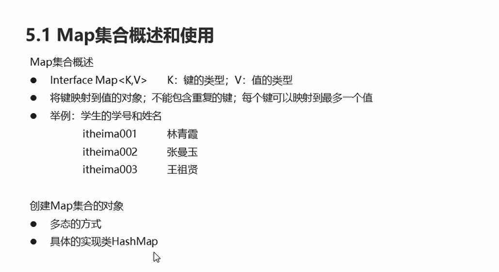
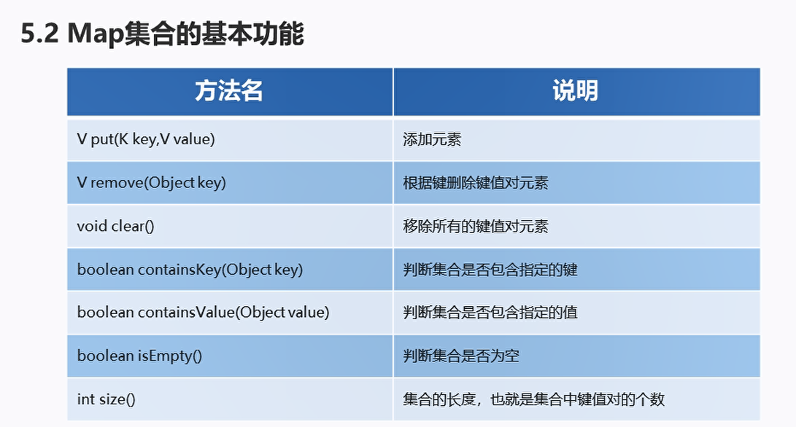
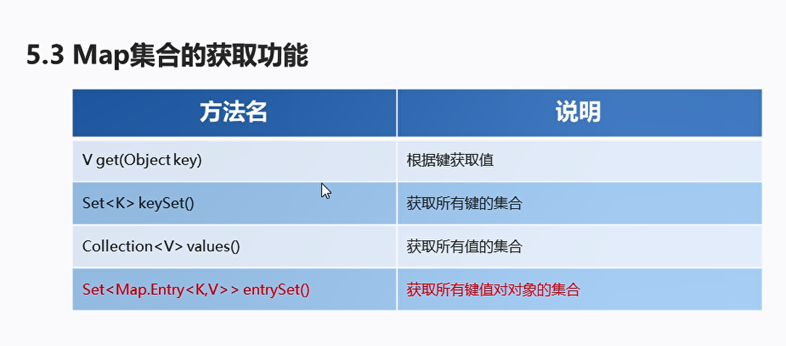
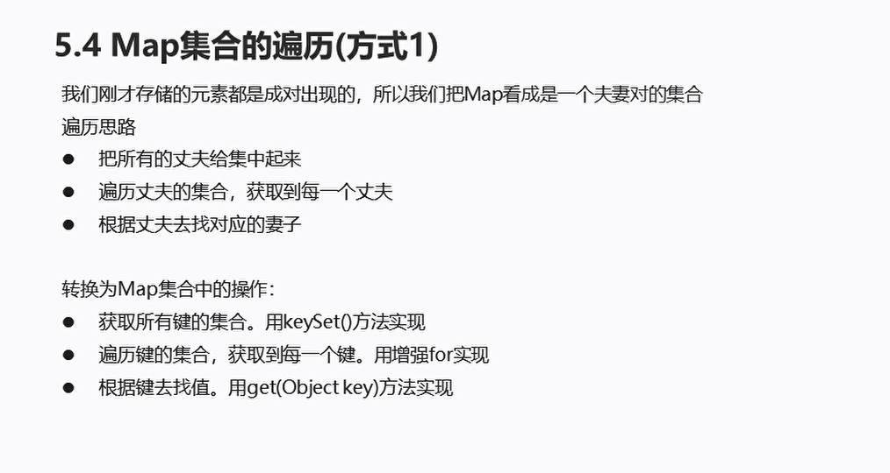
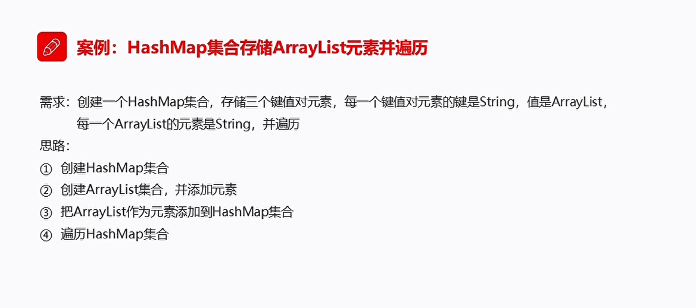
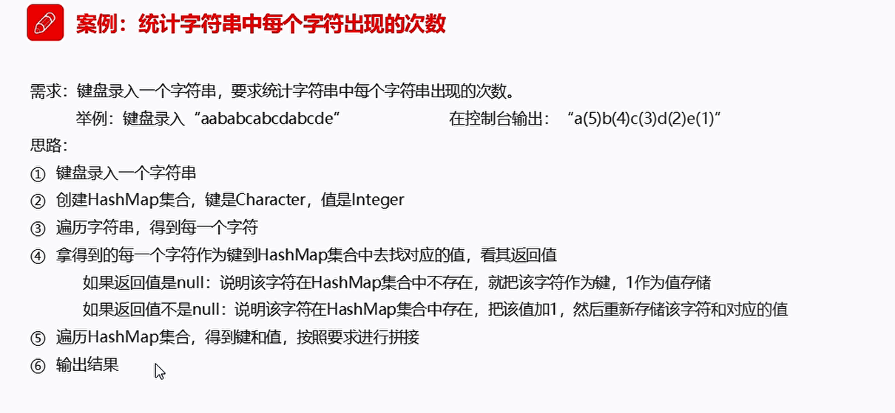

# Map

## 基本使用

  

创建Map集合的对象：
* 多态的方式：Map引用指向HashMap对象
* 具体的实现类HashMap
* 键必须唯一，当这个键不是唯一地时候，后面的键值对会替换前面的重复键值对

```java
package com.hfut.edu.test8;

import java.util.HashMap;
import java.util.Map;

public class test1 {
    public static void main(String[] args) {
        Map<String,String> map = new HashMap<>();// 多态的方式创建对象  父类引用指向子类对象
        map.put("1","sss");
        map.put("2","sss");
        map.put("3","sss");
        map.put("4","sss");
        System.out.println(map);// HashMap 重写了toString 方法，可以直接打印
    }
}
```


## Map集合的基本功能

  


```java
package com.hfut.edu.test8;

import java.util.HashMap;
import java.util.Map;

public class test1 {
    public static void main(String[] args) {
        Map<String,String> map = new HashMap<>();// 多态的方式创建对象  父类引用指向子类对象
        map.put("1","ssEQWs");
        map.put("2","ssEQWs");
        map.put("3","ssQDs");
        map.put("4","ssSAs");

        System.out.println(map);// HashMap 重写了toString 方法，可以直接打印

        // 根据指定的键 删除元素  返回的是value
        System.out.println(map.remove("1"));
        System.out.println(map.remove("dsdd"));// 返回null

        // 判断集合是否包含指定的键值对
        System.out.println(map.containsKey("郭靖"));
        System.out.println(map.containsKey("2"));

        // 判断集合是否是空
        System.out.println(map.isEmpty());

        // 输出集合的长度
        System.out.println(map.size());


    }
}


```

## Map集合的第一种遍历方式

  

```java
package com.hfut.edu.test8;

import java.util.Collection;
import java.util.HashMap;
import java.util.Map;
import java.util.Set;

public class test2 {
    public static void main(String[] args) {

        // 创建集合对象
        Map<String,String > map = new HashMap<>();

        // 添加元素
        map.put("张无忌","赵敏");
        map.put("郭靖","黄蓉");
        map.put("杨过","小龙女");

        // 根据键获取值
        System.out.println(map.get("杨过"));
        System.out.println(map.get("杨过guo"));// 输出null

        // 获取所有键的集合
        Set<String> keySet = map.keySet();

        for (String i :keySet){
            System.out.println(i);
        }

        // 获取所有值的集合
        Collection<String> values = map.values();

        for(String s:values){
            System.out.println(s);
        }


    }
}


```

## Map集合的第二种遍历方式

  

```java
package com.hfut.edu.test8;

import java.util.Collection;
import java.util.HashMap;
import java.util.Map;
import java.util.Set;

public class test2 {
    public static void main(String[] args) {

        // 创建集合对象
        Map<String,String > map = new HashMap<>();

        // 添加元素
        map.put("张无忌","赵敏");
        map.put("郭靖","黄蓉");
        map.put("杨过","小龙女");

        Set<String> s = map.keySet();// 获取所有的键

        // 遍历键的集合 然后使用get方法获取所有的value
        for(String key: s){
            String value = map.get(key);
            System.out.println(key + "," + value);
        }

    }
}

```

## 案例：HashMap集合存储ArrayList元素并遍历

  

```java
package com.hfut.edu.test8;
import java.util.ArrayList;
import java.util.HashMap;
import java.util.Set;

public class test3 {
    public static void main(String[] args) {

        // HashMap集合
        HashMap<String, ArrayList<String>> hm = new HashMap<>();// 值是ArrayList集合

        ArrayList<String> arr1 = new ArrayList<>();
        arr1.add("hello");
        arr1.add("world");

        hm.put("1",arr1);// 塞进集合容器

        ArrayList<String> arr2 = new ArrayList<>();
        arr2.add("gdhasgh");
        arr2.add("ghcfruwegrf");

        hm.put("2",arr2);

        // 遍历HashMap集合  先取出所有的键
        Set<String> s = hm.keySet();

        for (String i:s){
            ArrayList<String> arr = hm.get(i);
            System.out.println(arr);
        }
    }
}


```


## 案例：统计字符串中每一个字符出现的次数

  


```java
package com.hfut.edu.test8;

import java.util.HashMap;
import java.util.Scanner;
import java.util.Set;

public class test4 {
    public static void main(String[] args) {
        // 键盘录入字符串
        Scanner sc  = new Scanner(System.in);

        System.out.println("请输入一个字符串");
        String line = sc.nextLine();

        // 创建HashMap集合
        HashMap<Character,Integer> hm = new HashMap<>();

        // 遍历字符串  得到每一个字符
        for (int i = 0; i < line.length(); i++) {
            char key = line.charAt(i);

            // 将每一个字符作为键 存入HashMap集合中  找对应的值
            Integer value = hm.get(key);// 返回值

            if(value == null){
                hm.put(key,value);
            }else {
                // 说明原先已经存在该字符 将字符个数加一
                value++;
                hm.put(key,value);
            }
        }

        // 遍历HashMap集合  得到键值对  按照要求进行拼接
        StringBuilder sb = new StringBuilder();
        Set<Character> keySet = hm.keySet();

        for(Character key:keySet){
            Integer value = hm.get(key);
            sb.append(key).append("(").append(value).append(")");
        }
        // 将StringBuilder 转换成字符串对象
        String s = sb.toString();
        System.out.println(s);
    }
}


```


## Collections操纵集合

```java
package com.hfut.edu.test8;

import java.util.ArrayList;
import java.util.Collection;
import java.util.Collections;
import java.util.List;

public class test5 {
    public static void main(String[] args) {
        // 创建集合对象
        List<Integer> list = new ArrayList<>();

        // 添加元素
        list.add(1);
        list.add(2);
        list.add(3);

        // 对集合进行排序  调用Collections的静态方法
        Collections.sort(list);
        System.out.println(list);

        // 反转list元素
        Collections.reverse(list);
        System.out.println(list);

        // 对集合进行随机排序
        Collections.shuffle(list);
        System.out.println(list);

    }
}


```


