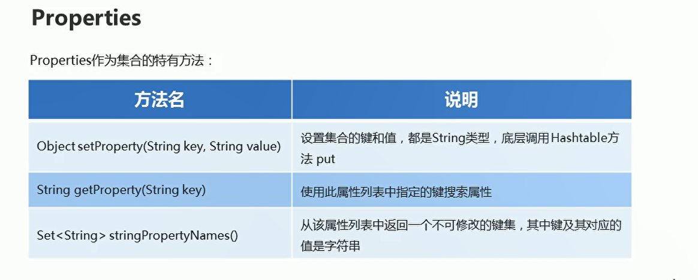
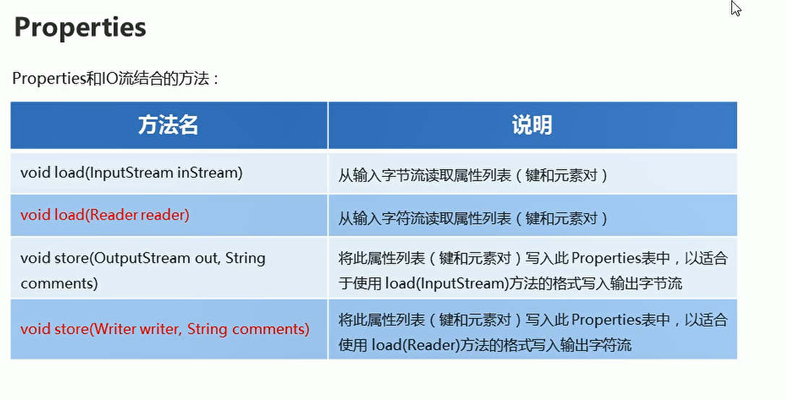

# Properites


## 概述

  


## 基本使用

```java
package com.hfut.edu.test10;

import java.io.ObjectInput;
import java.util.Properties;
import java.util.Set;

public class test12 {
    public static void main(String[] args) {
        Properties prop = new Properties();

        // 增加
        prop.put("1","腾讯");
        prop.put("2","阿里巴巴");

        // 删除
        prop.remove("1");
        System.out.println(prop);

        // 改
        // 使用put方法进行覆盖
        prop.put("1","字节跳动");
        System.out.println(prop);

        // 查询  使用get方法
        Object v = prop.get("1");
        System.out.println(v);

        // 遍历所有的键
        Set<Object> s = prop.keySet();
        for (Object o : s) {
            Object value = prop.get(o);
            System.out.println(value);
        }
        
    }
}

```

## 特有的方法

  

## Properities-load

  

```java

package com.hfut.edu.test10;

import java.io.FileNotFoundException;
import java.io.FileReader;
import java.io.IOException;
import java.util.Properties;

public class test13 {
    public static void main(String[] args) throws IOException {
        Properties prop = new Properties();// Map集合

        FileReader fr = new FileReader("prop.properties");

        prop.load(fr);

        fr.close();

        System.out.println(prop);
    }
}

```

## Properities-store

```java
package com.hfut.edu.test10;

import java.io.FileNotFoundException;
import java.io.FileReader;
import java.io.FileWriter;
import java.io.IOException;
import java.util.Properties;

public class test13 {
    public static void main(String[] args) throws IOException {
        Properties prop = new Properties();// Map集合
        prop.put("张三","1234");

        FileWriter fw = new FileWriter("prop.properties");
        prop.store(fw,null);


        System.out.println(prop);
    }
}

```


