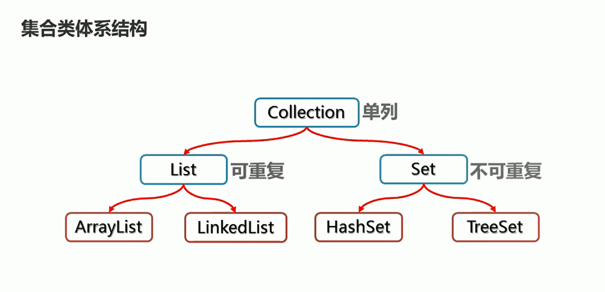
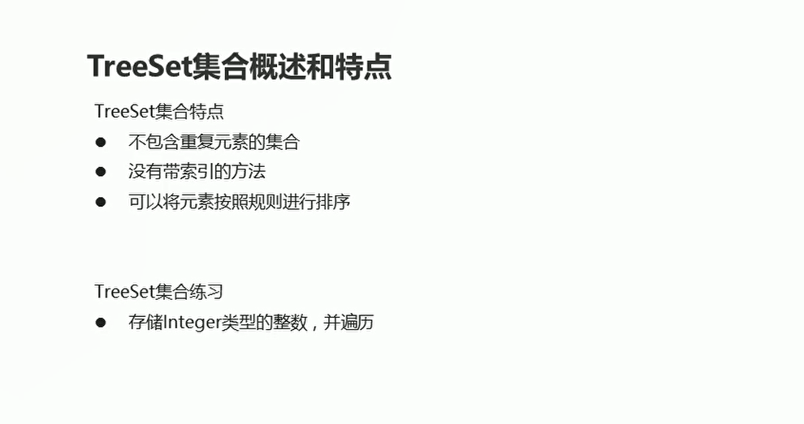
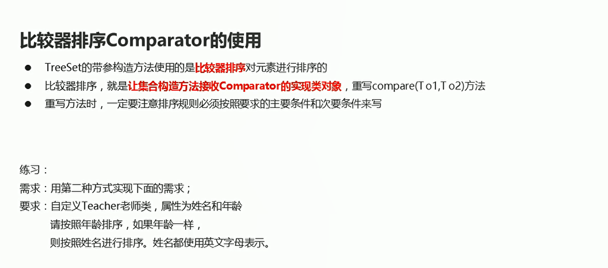
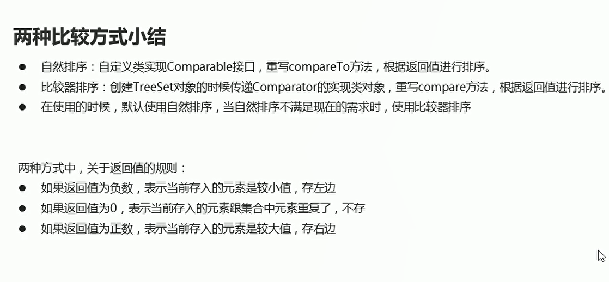

# Set

## 集合体系结构

  


## Set集合概述和特点

Set集合的特点

* 可以去除重复
* 存取顺序不一致
* 没有带索引的方法，所以不能使用普通for循环遍历，也不能通过索引来获取，删除Set集合里面的元素

```java

package com.hfut.edu.test4;

import java.util.Iterator;
import java.util.Set;
import java.util.TreeSet;

public class test7 {
    public static void main(String[] args) {
        Set<String> set = new TreeSet<>();// set容器 可以去除重复 存取顺序不一致 没有带索引的方法 所以不能使用for

        set.add("aaa");
        set.add("aaa");// set容器去重
        set.add("abb");
        set.add("aaaaxxa");

        // 不可以使用for循环进行遍历 使用迭代器进行遍历
        Iterator<String> it = set.iterator();
        // 遍历容器  打印顺序 和存入顺序不一致
        while (it.hasNext()){
            String s = it.next();
            System.out.println(s);
        }

    }
}

```

## TreeSet的基本使用

  

* TreeSet存储Integer整数类型的数据

```java
package com.hfut.edu.test4;

import com.sun.source.tree.Tree;

import java.util.TreeSet;

public class test8 {
    public static void main(String[] args) {
        TreeSet<Integer> ts = new TreeSet<>();

        ts.add(1);// 自动装箱
        ts.add(11);
        ts.add(111);

        System.out.println(ts);

    }
}


```

* TreeSet存储学生对象

```java
package com.hfut.edu.test4;

import com.sun.source.tree.Tree;

import java.util.TreeSet;

public class test8 {
    public static void main(String[] args) {
        TreeSet<Student> ts = new TreeSet<>();

        Student s1 = new Student("xxx","xxx");
        Student s11 = new Student("xx1x","xxx1");
        
        
        // TreeSet集合没有指定排序规则 不能添加进去 然后打印
        ts.add(s1);
        ts.add(s11);

        System.out.println(ts);

    }
}
```


## TreeSet自然排序

* 如果返回值是负数，表示当前存入的元素是较小值，存左边
* 如果返回值为0，表示当前存入的元素跟集合中元素重复了，不存入
* 如果返回值为正数，表示当前存入的元素是较大值，存右边

```java
package com.hfut.edu.test4;

import com.sun.source.tree.Tree;

import java.util.TreeSet;

public class test8 {
    public static void main(String[] args) {
        TreeSet<Student> ts = new TreeSet<>();

        Student s1 = new Student(11,"xxx");
        Student s11 = new Student(12,"xxx1");

        // TreeSet集合没有指定排序规则 不能添加进去 然后打印
        ts.add(s1);
        ts.add(s11);

        System.out.println(ts);

    }
}


```

```java
package com.hfut.edu.test4;

public class Student implements Comparable<Student>{
    private int age;
    private String name;

    public Student(int age, String name) {
        this.age = age;
        this.name = name;
    }

    public Student() {
    }

    public int getAge() {
        return age;
    }

    public void setAge(int age) {
        this.age = age;
    }

    @Override
    public String toString() {
        return "Student{" +
                "age=" + age +
                ", name='" + name + '\'' +
                '}';
    }

    public String getName() {
        return name;
    }

    public void setName(String name) {
        this.name = name;
    }

    // 重写比较方法
    @Override
    public int compareTo(Student o) {
        // 按照对象的年龄大小进行排序
        int result = this.age - o.age;
        return result;
    }
}
```


## 自然排序-练习

Student：相同的年龄，不同的姓名

```java
package com.hfut.edu.test4;

public class Student implements Comparable<Student>{
    private int age;
    private String name;

    public Student(int age, String name) {
        this.age = age;
        this.name = name;
    }

    public Student() {
    }

    public int getAge() {
        return age;
    }

    public void setAge(int age) {
        this.age = age;
    }

    @Override
    public String toString() {
        return "Student{" +
                "age=" + age +
                ", name='" + name + '\'' +
                '}';
    }

    public String getName() {
        return name;
    }

    public void setName(String name) {
        this.name = name;
    }

    // 重写比较方法
    @Override
    public int compareTo(Student o) {
        // 按照对象的年龄大小进行排序
        int result = this.age - o.age;
        result = result == 0?this.name.compareTo(o.getName()):result;// 如果年龄相同 那么比较姓名是否相同  姓名不同的话 返回compareTo的比较结果-1
        return result;
    }
}
```

```java
package com.hfut.edu.test4;

import com.sun.source.tree.Tree;

import java.util.TreeSet;

public class test8 {
    public static void main(String[] args) {
        TreeSet<Student> ts = new TreeSet<>();
        Student s1 = new Student(11,"xxx");

        // 年龄相同 比较姓名 如果姓名不同  仍然加入集合中
        Student s11 = new Student(12,"xxx1");
        Student s111 = new Student(12,"xxxsssdasda1");

        // TreeSet集合没有指定排序规则 不能添加进去 然后打印
        ts.add(s1);
        ts.add(s11);
        ts.add(s111);

        System.out.println(ts);

    }
}

```


## 比较器排序的使用


  


**在创建TreeSet集合的时候指定泛型 然后实例化Comparator对象 也要指定泛型**

```java
package com.hfut.edu.test7;

import java.util.Comparator;
import java.util.TreeSet;

public class TreeSetMain {
    public static void main(String[] args) {

        TreeSet<Teacher> ts = new TreeSet<>(new Comparator<Teacher>() {
            @Override
            public int compare(Teacher o1, Teacher o2) {
                // o1表示要存入集合的元素  O2表示已经存入集合的元素
                int result = o1.getAge() - o2.getAge();
                result = result == 0 ? o1.getName().compareTo(o2.getName()) : result;// 如果年龄相等 比较姓名 否则比较年龄
                return result;
            }
        });// 创建TreeSet集合 使用Comparator创建排序规则  也需要指定泛型 Teacher

        Teacher t1 = new Teacher("xz",11);
        Teacher t2 = new Teacher("xd21z",1121);
        Teacher t3 = new Teacher("qxz",11121);

        ts.add(t1);
        ts.add(t2);
        ts.add(t3);

        System.out.println(ts);
    }
}
```


## 两种排序方式的比较


  


