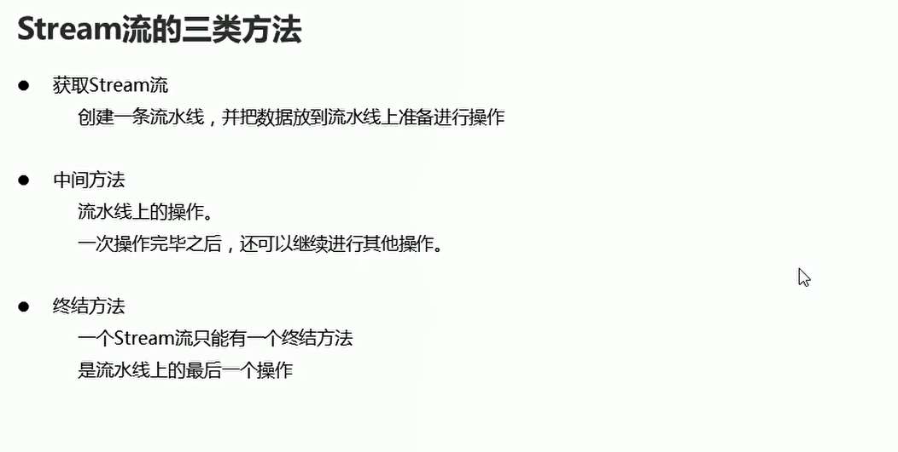

# Stream

## 初体验

```java
package com.hfut.edu.test8;

import java.util.ArrayList;
import java.util.List;

public class test6 {
    public static void main(String[] args) {
        // 集合的批量添加
        ArrayList<String> list1 = new ArrayList<>(List.of("张三","张大宝","张伟"));
        // 将f开头的字符串 添加到集合当中

        ArrayList<String> list2 = new ArrayList<>();

        // 增强for循环
        for(String i:list1){
            // 看该字符串是不是f开头
            if(i.startsWith("张"))
            {
                list2.add(i);
            }
        }

        // 使用Stream流
        list1.stream().filter(s->s.startsWith("张")).filter(s->s.length() == 3).forEach(s-> System.out.println(s));

    }
}
```

## Stream流三类方法

  


  

```java
package com.hfut.edu.test8;
import java.util.ArrayList;
import java.util.Arrays;
import java.util.HashMap;
import java.util.stream.Stream;

public class test7 {
    public static void main(String[] args) {
        method1();// 单列集合
        method2();// 双列集合
        method3();// 数组

    }

    private  static void method3(){
        int[] arr = {1,2,3,4,5};
        Arrays.stream(arr).forEach(s-> System.out.println(s));
    }

    private static void method2(){
        // 双列集合
        HashMap<String,Integer> hm = new HashMap<>();
        hm.put("张三",23);
        hm.put("李四",23);
        hm.put("王五",112);

        // 双列集合不能直接获取Stream流
        // 先获取所有的键  然后再把这个Set集合中所有的键 都放到Stream流
        hm.keySet().stream().forEach(s-> System.out.println(s));

        // entrySet集合 先获取到所有的键值对 对象
        // 再把这个Set集合中所有的键值对对象放到Stream流中
        hm.entrySet().stream().forEach(s-> System.out.println(s));

    }

    private static void method1(){
        ArrayList<String> list = new ArrayList<>();
        list.add("1");
        list.add("2");
        list.add("3");

        Stream<String> stream = list.stream();// 单列集合获取Stream流
        stream.forEach(s-> System.out.println(s));

        list.stream().forEach(s-> System.out.println(s));
    }
}


```

## 中间方法filter

  

```java
package com.hfut.edu.test8;

import java.util.ArrayList;
import java.util.function.Predicate;

public class test8 {
    public static void main(String[] args) {
        ArrayList<String> list = new ArrayList<>();
        list.add("张三");
        list.add("李四");
        list.add("张一鸣");

        // 过滤  使用匿名內部类实现 实现Predicate接口进行实现  只接受张
        list.stream().filter(new Predicate<String>() {
            @Override
            public boolean test(String s) {
                boolean result = s.startsWith("张");
                return result;
            }
        }).forEach(s-> System.out.println(s));

        // 使用lambda表达式进行实现
        list.stream().filter((String s)->{
            boolean result = s.startsWith("张");// 保留以张开头的字符串
            return result;
        }).forEach(s-> System.out.println(s));

        // 简化
        list.stream().filter(s->s.startsWith("张"));


    }
}


```

## 常用中间方法

  

```java
package com.hfut.edu.test8;

import java.util.ArrayList;
import java.util.stream.Stream;

public class test9 {
    public static void main(String[] args) {
        ArrayList<String> list = new ArrayList<>();

        list.add("张三");
        list.add("张伟");
        list.add("张大炮");
        list.add("谢广坤");

        // 截取指定参数个数的数据
        list.stream().limit(2).forEach(s-> System.out.println(s));// 只输出前两个集合元素

        // 跳过前两个元素输出
        list.stream().skip(2).forEach(s-> System.out.println(s));
        ArrayList<String> list1 = new ArrayList<>();

        list1.add("张三");
        list1.add("张伟");
        list1.add("张大炮");
        list1.add("谢广坤");

        Stream<String> stream1 = list.stream();// 获取第一个流
        Stream<String> stream2 = list.stream();// 获取第二个流


        Stream<String> stream3 = Stream.concat(stream1,stream2);// 合并两个流

        stream3.forEach(s-> System.out.println(s));

        // 去除流中重复的数据

        list.stream().distinct().forEach(s-> System.out.println(s));
    }
}
```

## Stream流中常见的终结操作

  


```java
package com.hfut.edu.test8;

import java.util.ArrayList;
import java.util.function.Consumer;
import java.util.stream.Stream;

public class test9 {
    public static void main(String[] args) {
        ArrayList<String> list = new ArrayList<>();

        list.add("张三");
        list.add("张伟");
        list.add("张大炮");
        list.add("谢广坤");

        // 在forEach方法的底层 会循环获取流中的每一个数据 并循环调用accept方法 将每一个数据传递给accept方法
        // 匿名內部类：实现Consumer String 泛型接口
        list.stream().forEach(new Consumer<String>() {
            @Override
            public void accept(String s) {
                System.out.println(s);
            }
        });

        // 使用lambda表达式进行简化
        list.stream().forEach((String s)->{
            System.out.println(s);
        });

        // lambda表达式只有一个参数的时候 可以进一步进行简化
        list.stream().forEach(s-> System.out.println(s));

        // 打印流中元素的个数
        long count = list.stream().count();
        System.out.println(count);

    }

}

```

注意：**Stream流的操作是没有办法直接修改集合中的数据**

输出集合中的所有偶数

```java

package com.hfut.edu.test8;
import java.util.ArrayList;

public class test10 {
    public static void main(String[] args) {
        ArrayList<Integer> list = new ArrayList<>();

        for (int i = 0; i < 10; i++) {
            list.add(i + 1);
        }

        // 使用lambda表达式进行过滤
        list.stream().filter((Integer i)->{
            return  i % 2 == 0;// 只保留偶数
        }).forEach(s-> System.out.println(s));

        // 使用简化之后的lambda表达式进行过滤
        list.stream().filter(number->number % 2 == 0).forEach(s-> System.out.println(s));
    }
}

```


## Stream流中收集操作toList和toSet

  

```java
package com.hfut.edu.test8;
import java.util.ArrayList;
import java.util.List;
import java.util.Set;
import java.util.stream.Collectors;

public class test10 {
    public static void main(String[] args) {
        ArrayList<Integer> list = new ArrayList<>();

        for (int i = 0; i < 10; i++) {
            list.add(i + 1);
        }
        // filter负责过滤数据
        // collect负责收集数据  调用静态方法

        List<Integer> collect = list.stream().filter(number -> number % 2 == 0).collect(Collectors.toList());
        System.out.println(collect);

        Set<Integer> collect1 = list.stream().filter(number -> number % 2 == 0).collect(Collectors.toSet());// 不可重复的集合
        System.out.println(collect1);
    }
}


```


## Stream流的收集方法toMap

```java
package com.hfut.edu.test8;

import java.util.ArrayList;
import java.util.Map;
import java.util.stream.Collectors;

public class test11 {
    public static void main(String[] args) {
        ArrayList<String> list = new ArrayList<>();

        list.add("zhangsan,23");
        list.add("lisi,24");
        list.add("wangwu,25");

        Map<String,Integer> m = list.stream().filter(s->{
            String[] split = s.split(",");// 使用,进行分割
            int age = Integer.parseInt(split[1]);// 将年龄字符串转换成整数
            return age >= 24;
        }).collect(Collectors.toMap(
                // 第一个lambda表达式就是如何获取到Map中的键
                // 第二个lambda表达式就是获取Map中的值
                (String s)->{
                    return s.split(",")[0];// 获取键
                },
                (String s)->{
                    // 首先分割  然后去除第二个元素字符串  使用Integer.parseInt将字符串转换成整数
                    return Integer.parseInt(s.split(",")[1]);
                }
        ));

        System.out.println(m);

    }
}
```


