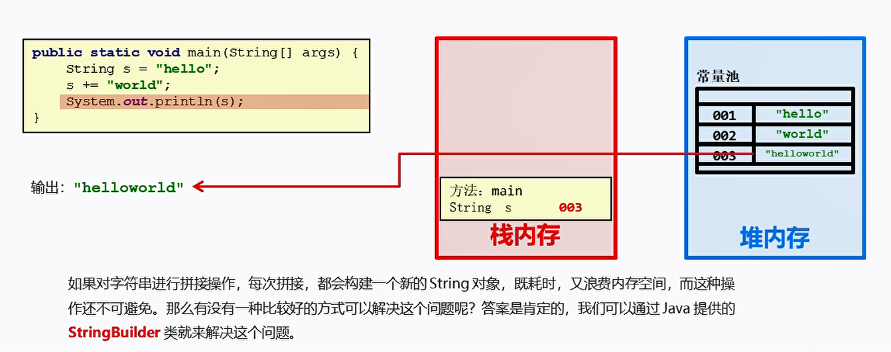
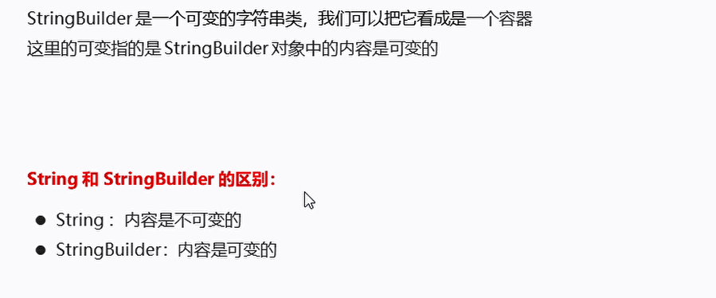
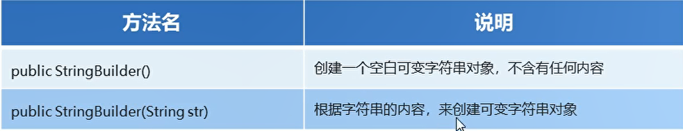
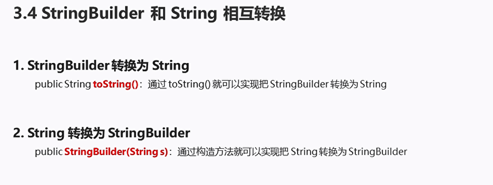

# StringBuilder

## 一、概述

  

也就是使用String 拼接字符串每一次都要开辟新的堆内存空间，使用StringBuilder不需要开辟新的内存空间

  

* String内容是不可变的
* StringBuilder内容是可变的

## 二、构造方法

  

```java
package com.ustc.base.DataFormat;

public class test22 {
    public static void main(String[] args) {
        StringBuilder s = new StringBuilder();// 创建空白的可变字符串对象
        System.out.println(s.length());

        StringBuilder ss = new StringBuilder("xxx");
        System.out.println(ss);
    }
}


```

## 三、常用方法

* append() 添加数据  并返回对象本身
* reverse() 返回相反的字符序列

```java
package com.ustc.base.DataFormat;

public class test22 {
    public static void main(String[] args) {
        StringBuilder s = new StringBuilder();// 创建空白的可变字符串对象
        System.out.println(s.length());

        s.append("xxxx");
        s.append("xxxx121");

        StringBuilder ss = s.append("zxcv");

        System.out.println(s);
        System.out.println(ss);
        System.out.println(ss == s);// 引用数据类型  指向的是同一块内存地址

        System.out.println(s.reverse());

    }
}


```

## 四、StringBuilder提高效率的原理

* StringBuilder 和 String之间相互转换

  

```java
package com.ustc.base.DataFormat;

public class test22 {
    public static void main(String[] args) {
        StringBuilder s = new StringBuilder();// 创建空白的可变字符串对象
        System.out.println(s.length());

        s.append("xxxx");

        String ss = s.toString();// 转换为字符串

        System.out.println(ss);
        System.out.println();

        // String 转换为StringBuilder

        StringBuilder sb = new StringBuilder(ss);
        System.out.println(sb);

    }
}


```


对称字符串案例：

```java
package com.ustc.base.DataFormat;

public class test23 {
    public static void main(String[] args) {
        int[] arr = {1,2,3};
        String s = arrayToString(arr);
        System.out.println(s);

    }

    public static String arrayToString(int [] arr)
    {
        StringBuilder sb = new StringBuilder();// 创建一个String Builder对象

        sb.append("[");

        for (int i = 0; i < arr.length; i++) {
            if(i == arr.length - 1)
            {
                sb.append(arr[i]);// 如果是最后一个元素 直接添加即可
            }
            else{
                sb.append(arr[i]).append(", ");//添加逗号吧 不是最后一个元素
            }
        }

        sb.append("]");

        String s = sb.toString();
        return s;
    }
}
```

## 五、StringBuilder实现字符串反转

```java
package com.ustc.base.DataFormat;

public class test24 {
    public static void main(String[] args) {
        String s = "abc";

        String a = myReverse(s);

        System.out.println(a);

    }

    public static String myReverse(String s){
        StringBuilder ss = new StringBuilder(s);// 使用String对象创建一个StringBuilder
        ss.reverse();

        String s1= ss.toString();// 转换成String对象
        return s1;
    }

}


```


