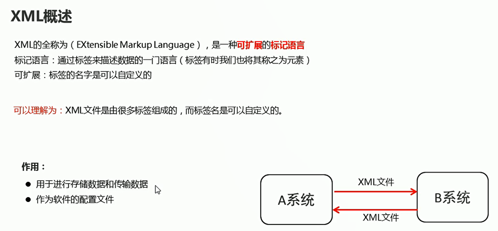
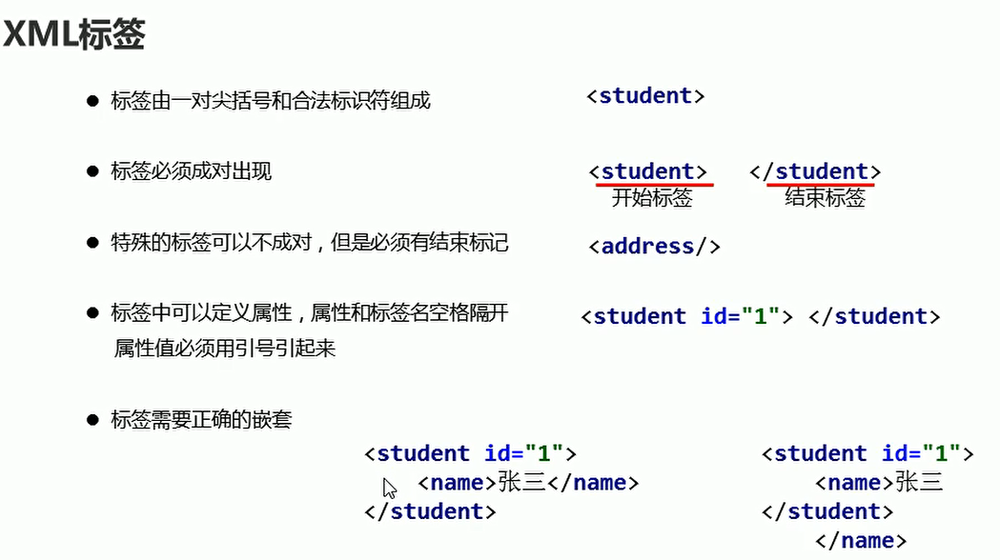
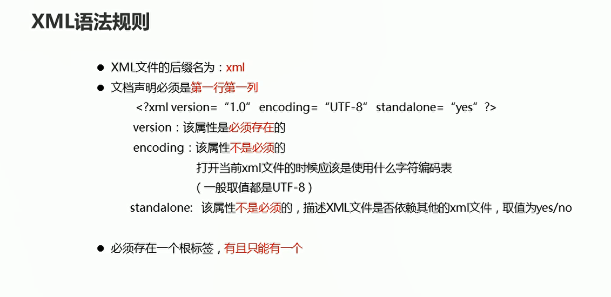
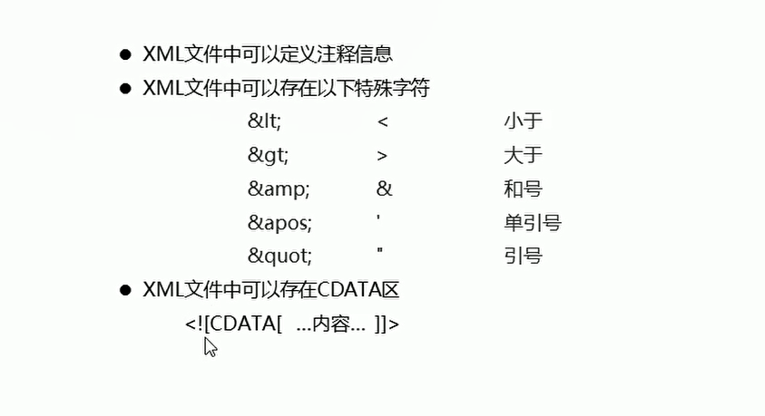
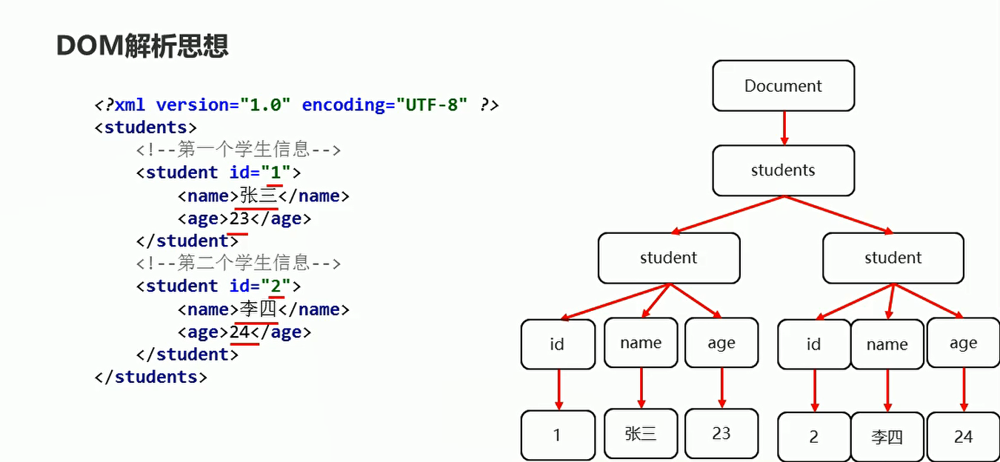
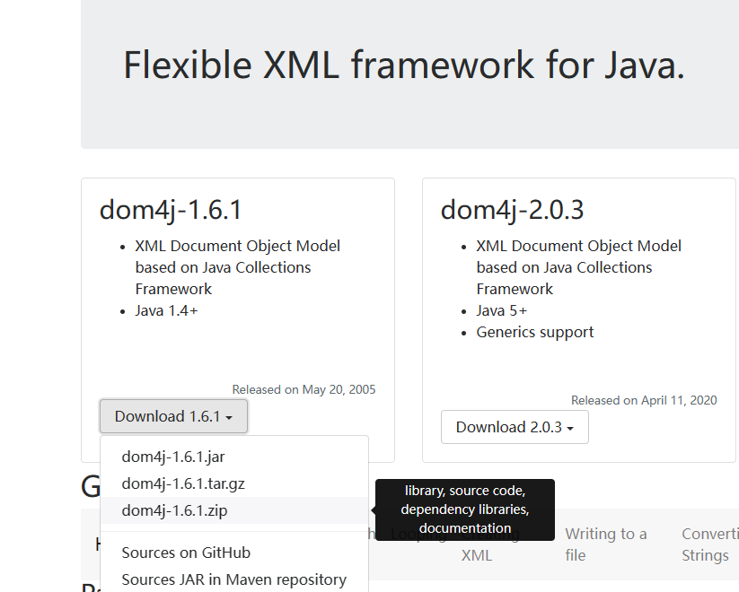
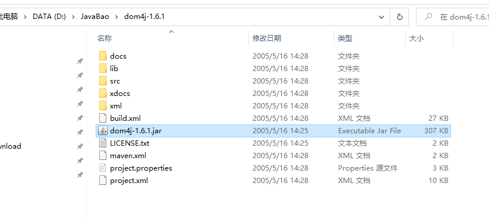
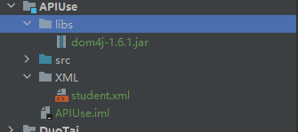
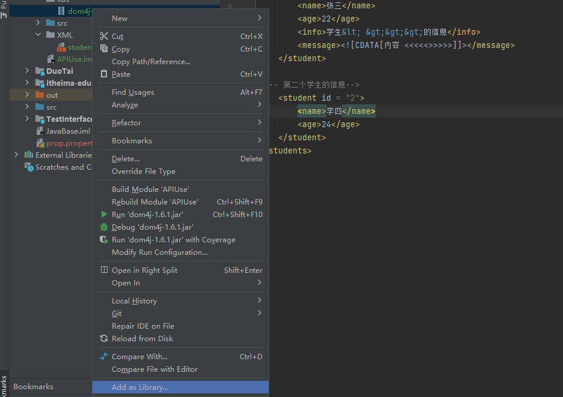
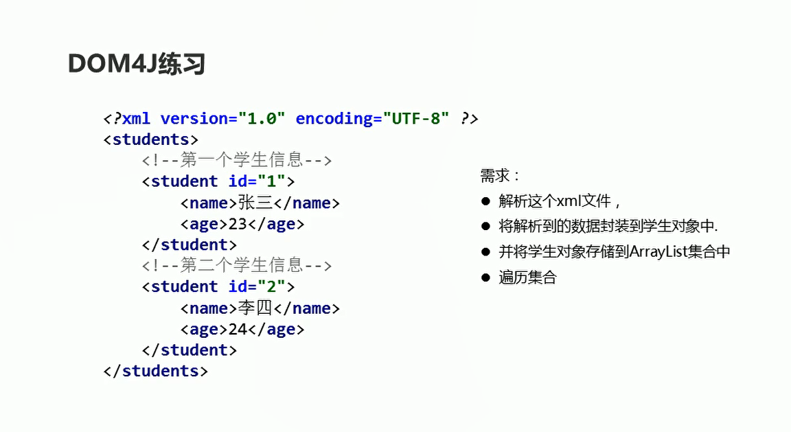

# XML

## 概述

  


## 标签的规则

  

## xml的语法规则

  

  

```xml
<?xml version="1.0" encoding="UTF-8" ?>
<!--本xml文件用于描述多个学生信息-->
<students>
<!--第一个学生的信息-->
    <student id = "1">
        <name>张三</name>
        <age>22</age>
        <info>学生&lt; &gt;&gt;&gt;的信息</info>
        <message><![CDATA[内容 <<<<<>>>>>]]></message>
    </student>

<!-- 第二个学生的信息-->
    <student id = "2">
        <name>李四</name>
        <age>24</age>
    </student>
</students>

```

## 解析XML

  

**层层拨开，从最外层标签开始**

* Document对象：整个xml文档
* Element对象：所有标签
* Attribute对象：所有属性
* Text对象：所有文本内容

## XML解析的准备工作

* 下载dom4j
  

* 找到jar包并复制

  

  

* 导入当前项目当中

  

## XML解析文件的代码实现

  

* 获取根标签下面的所有的子标签
```java
package com.hfut.edu.XMLP;
import org.dom4j.Document;
import org.dom4j.DocumentException;
import org.dom4j.Element;
import org.dom4j.io.SAXReader;
import javax.xml.parsers.SAXParser;
import java.io.File;
import java.util.List;

public class XmlParse {
    public static void main(String[] args) throws DocumentException {
        //  获取一个解析器对象
        SAXReader saxReader = new SAXReader();

        // 使用解析器对象将xml文件加载到内存中，并返回一个文档对象
        Document document = saxReader.read(new File("D:\\CODE\\JavaBase\\APIUse\\XML\\student.xml"));

        // 获取根标签
        Element rootElement = document.getRootElement();

        // 通过跟标签来获取student标签
        // elements()可以获取调用者所有的子标签 会把这些子标签放到一个集合中 并进行返回
        List list = rootElement.elements();
        System.out.println(list.size());

    }
}
```

* 获取指定标签下面的所有子标签

```java
package com.hfut.edu.XMLP;

import org.dom4j.Attribute;
import org.dom4j.Document;
import org.dom4j.DocumentException;
import org.dom4j.Element;
import org.dom4j.io.SAXReader;

import javax.xml.parsers.SAXParser;
import java.io.File;
import java.util.List;

public class XmlParse {
    public static void main(String[] args) throws DocumentException {
        //  获取一个解析器对象
        SAXReader saxReader = new SAXReader();
        // 使用解析器对象将xml文件加载到内存中，并返回一个文档对象
        Document document = saxReader.read(new File("D:\\CODE\\JavaBase\\APIUse\\XML\\student.xml"));

        // 获取根标签
        Element rootElement = document.getRootElement();
        // 指定标签 再获取子标签
        List<Element> list = rootElement.elements("student");
        System.out.println(list.size());

        for (Element element : list) {
            System.out.println(element);

            Attribute attribute = element.attribute("id");// 获取id属性
            String id = attribute.getValue();

            //获取name标签
            Element nameElement = element.element("name");
            // 获取这个标签的标签体内容
            String text = nameElement.getText();
            System.out.println(text);
        }

    }
}
```

* 获取所有标签的内容，然后封装成对象

```java
package com.hfut.edu.XMLP;
import org.dom4j.Attribute;
import org.dom4j.Document;
import org.dom4j.DocumentException;
import org.dom4j.Element;
import org.dom4j.io.SAXReader;

import javax.xml.parsers.SAXParser;
import java.io.File;
import java.util.ArrayList;
import java.util.List;

public class XmlParse {
    public static void main(String[] args) throws DocumentException {
        //  获取一个解析器对象
        SAXReader saxReader = new SAXReader();
        // 使用解析器对象将xml文件加载到内存中，并返回一个文档对象
        Document document = saxReader.read(new File("D:\\CODE\\JavaBase\\APIUse\\XML\\student.xml"));

        // 获取根标签
        Element rootElement = document.getRootElement();
        // 指定标签 再获取子标签
        List<Element> list = rootElement.elements("student");
        System.out.println(list.size());

        // 创建学生对象集合
        ArrayList<Student> studentArrayLists = new ArrayList<>();
        
        
        for (Element element : list) {
            System.out.println(element);
            Attribute attribute = element.attribute("id");// 获取id属性
            String id = attribute.getValue();

            //获取name标签
            Element nameElement = element.element("name");
            // 获取这个标签的标签体内容
            String text = nameElement.getText();
            System.out.println(text);

            Element ageElement = element.element("age");
            String age = ageElement.getText();
            System.out.println(age);

            // 将上面获取到的元素封装成学生对象
            Student s = new Student(id,text,Integer.parseInt(age));// 将三个元素封装成学生对象
            studentArrayLists.add(s);
        }

        for (Student studentArrayList : studentArrayLists) {
            System.out.println(studentArrayList);
        }

    }
}


```


