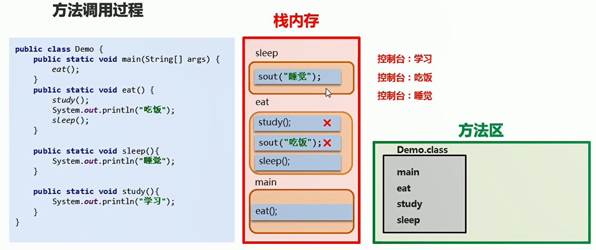
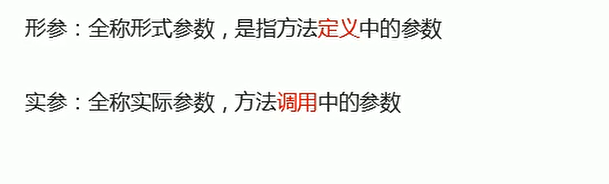
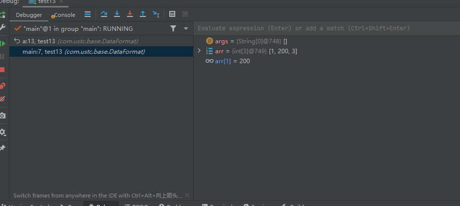
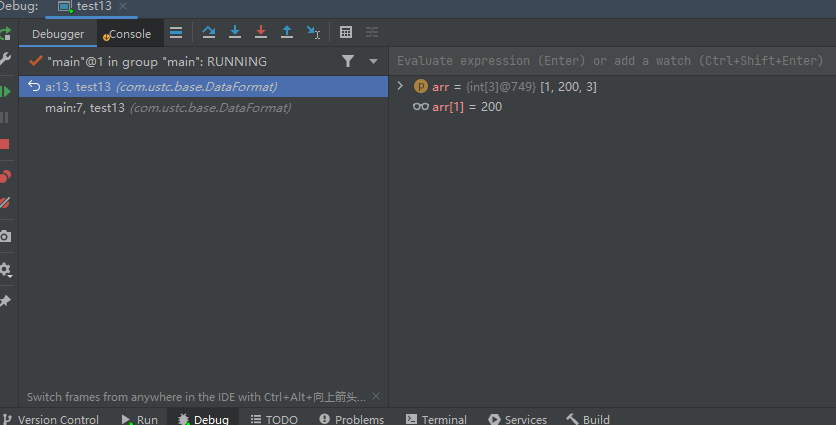
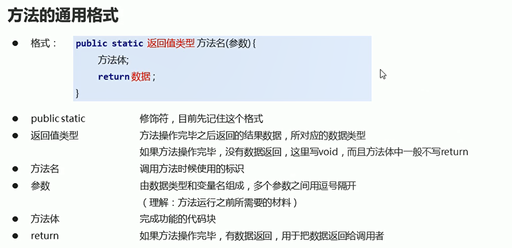
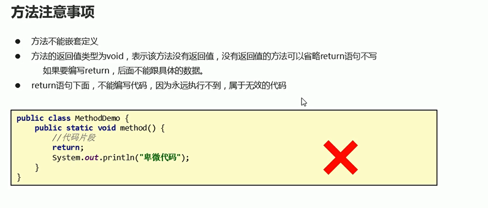
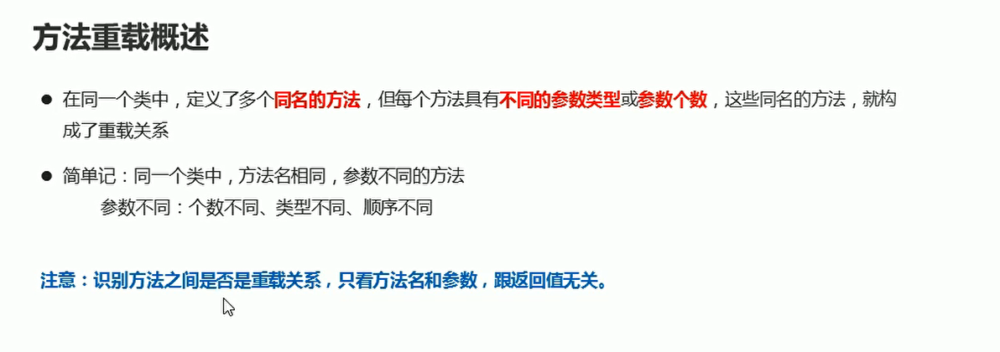

# 方法

## 一、定义

方法就是一段具有独立功能的代码块，不调用就不执行

## 二、方法的定义和调用

* 方法与方法之间是平级关系，不可以嵌套定义

```java
package com.ustc.base.DataFormat;

public class test12 {
    public static void main(String[] args) {
        eat();
    }

    // 方法和方法之间是平级关系 不可以嵌套定义
    public static void eat()
    {
        System.out.println("吃饭");
    }
}


```

## 三、方法调用过程

  

## 四、带参数的方法和调用
  


```java
package com.ustc.base.DataFormat;

public class test12 {
    public static void main(String[] args) {
//        eat();
            isEvenNumber(8);
    }
    
    public static void isEvenNumber(int num){
        if(num % 2 == 0)
        {
            System.out.println("偶数");
        }
        else {
            System.out.println("奇数");
        }
    }
}


```

```java
package com.ustc.base.DataFormat;

public class test12 {
    public static void main(String[] args) {
//        eat();
            print(1,8);
    }

    public static void print(int n,int m)
    {
        for (int i = n; i <=m; i++) {
            if(i % 2 == 1)
            {
                System.out.println(i);// 打印所有奇数
            }
        }
    }
}

```

## 五、debug查看方法参数传递

```java
package com.ustc.base.DataFormat;

public class test13 {
    public static void main(String[] args) {
        int [] arr = {1,2,3};
        System.out.println("调用前:" + arr[1]);
        a(arr);
        System.out.println("调用之后：" + arr[1]);
    }
    public  static void a(int[] arr)
    {
        arr[1] = 200;// 引用数据类型更改原内存中的数据
    }
}

```

上面的代码函数的参数类型是引用数据类型，deubg过程中可以看到main方法中的arr[1]和a方法中的a[1]数据是同步的

  

  

## 六、带返回值的方法的调用

  


```java
package com.ustc.base.DataFormat;

public class test13 {
    public static void main(String[] args) {
        int result = getMax(1,2);
        System.out.println(result);
    }
    public static int getMax(int a,int b)
    {
        if(a > b)
        {
            return a;
        }
        else
        {
            return  b;
        }
    }
}


```

  

## 七、方法重载

同样的方法名，不同的参数，调用方法的时候，Java虚拟机会通过参数的不同来区分同名的方法。

  


## 八、方法传递数据

* 方法传递基本数据类型
相当于传递一个副本

```java
package com.ustc.base.DataFormat;

public class test14 {
    public static void main(String[] args) {
        int number = 100;
        System.out.println(number);
        change(number);
        System.out.println(number);// 仍然打印100 没有改变原来的数据
    }

    public static void change(int number){
        number = 200;
    }
}


```


* 方法传递引用数据类型:相当于传递该参数的内存地址

```java
package com.ustc.base.DataFormat;

public class test14 {
    public static void main(String[] args) {
        int []arr = {1,2,3,4};
        System.out.println(arr[1]);
        change(arr);
        System.out.println(arr[1]);// 仍然打印100 没有改变原来的数据
    }

    public static void change(int []arr){
       arr[1] = 1111;
    }
}


```

## 九、返回一个数组的最大值和最小值

```java
package com.ustc.base.DataFormat;

public class test15 {
    public static void main(String[] args) {
        int []arr = {1,2,3,4,5};
        int []a = getMaxAndMin(arr);// 使用数组接受返回数据
        for (int i = 0; i < a.length; i++) {
            System.out.println(a[i]);
        }
    }
    // 函数返回数组类型的数据
    public static int[] getMaxAndMin(int []arr)
    {
        int max = arr[0];
        for (int i = 0; i < arr.length; i++) {
            if(max < arr[i])
            {
                max = arr[i];
            }
        }

        int min  = arr[0];
        for (int i = 0; i < arr.length; i++) {
            if(min > arr[i])
            {
                min = arr[i];
            }
        }

        // 新建一个数组 填入参数
        int[] maxAndMin = {min,max};
        return maxAndMin;
    }
}

```

