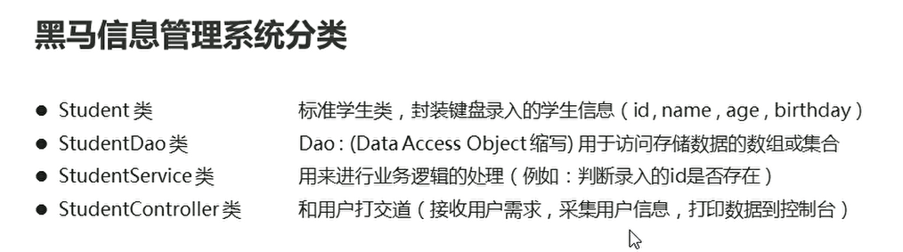
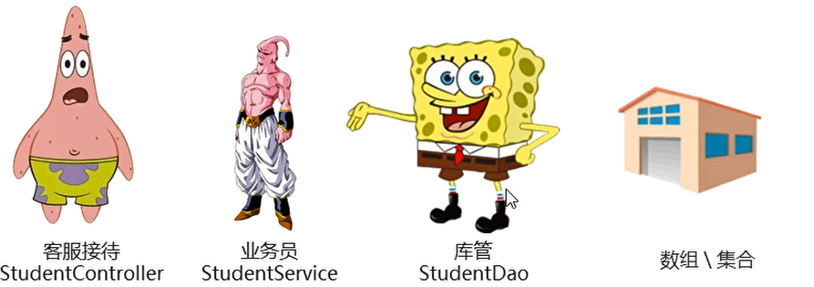
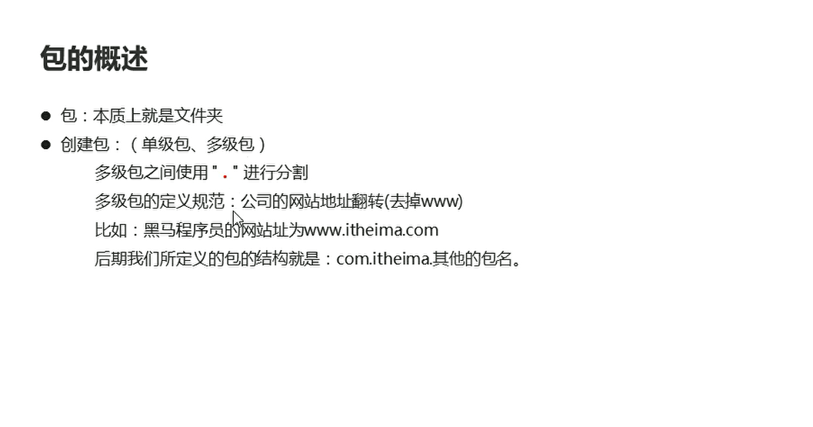
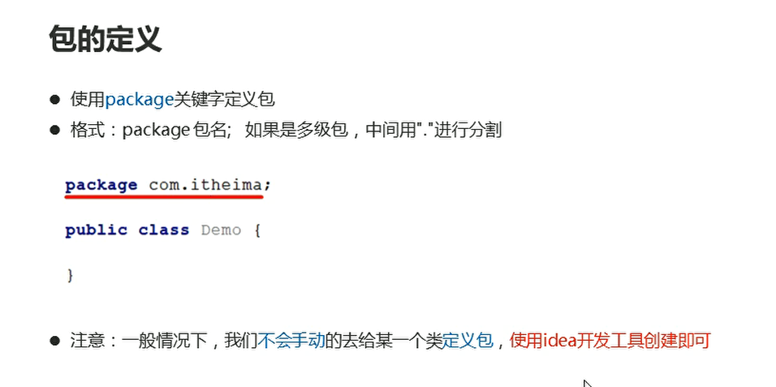
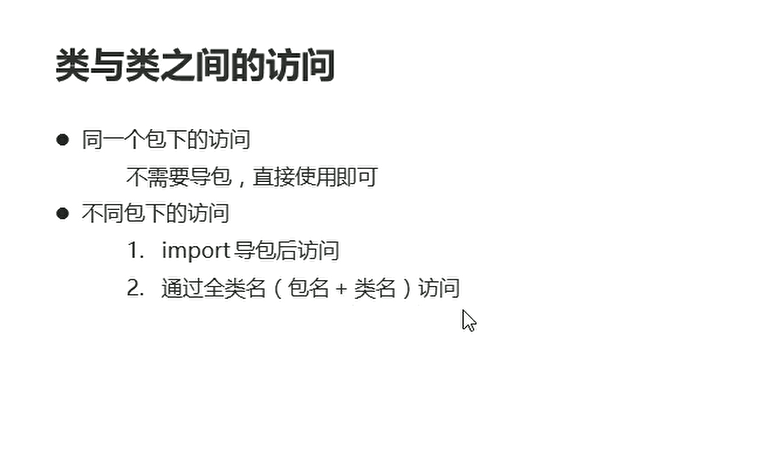
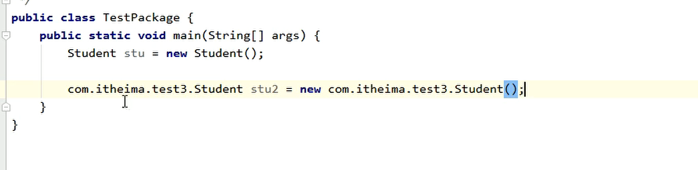
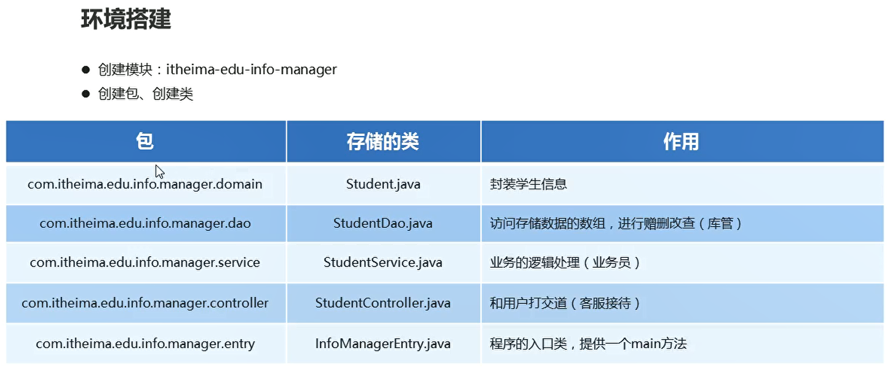
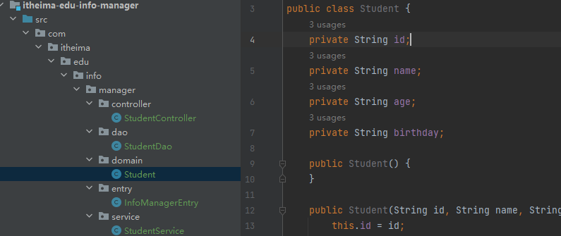
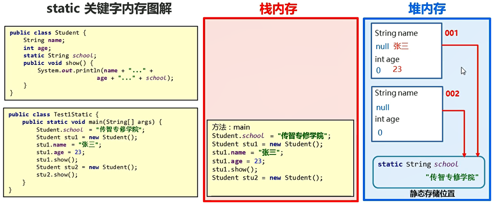

# 分类思想

## 一、概述

分类思想：专门人干专门的事情

  

  

包的相关概念：一个类归属于一个包，加上包语句
  

  

  

全类名：多个包下，出现了相同的类名称，就可以使用这种访问进行区分

  

## 二、黑马信息管理系统

  

项目结构：

  

### 2.1 static关键字

* static 关键字是静态的意思 是Java中的一个修饰符，可以修饰成员方法，成员变量
* 被static修饰的成员变量 一般叫做静态变量
* 被static修饰的成员方法 一般叫做静态方法
* 被类的所有对象共享
* 随着类的加载而加载 优先于对象的存在
* 对象需要被类加载之后才可以创建、
* 可以通过类名调用 也可以对象名调用
* **静态方法只能访问静态成员**
* 非静态成员必须创建对象之后进行使用
* 非静态方法可以访问静态的成员，也可以访问非静态的成员
* 静态方法中是没有this关键字

静态修饰的成员会被该类的所有方法共享：

  

