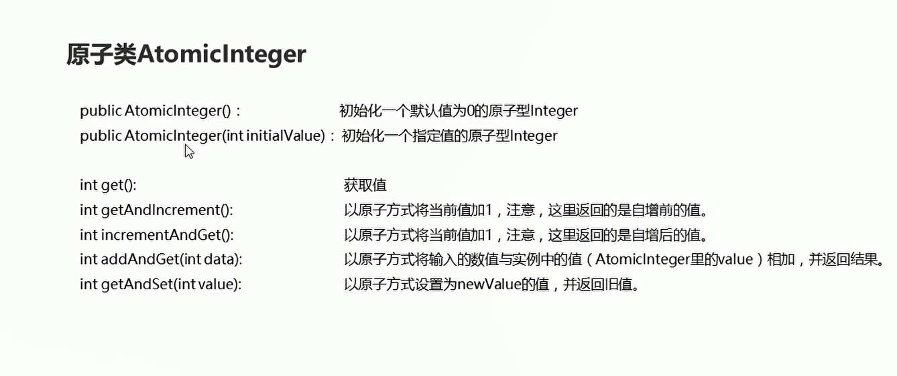
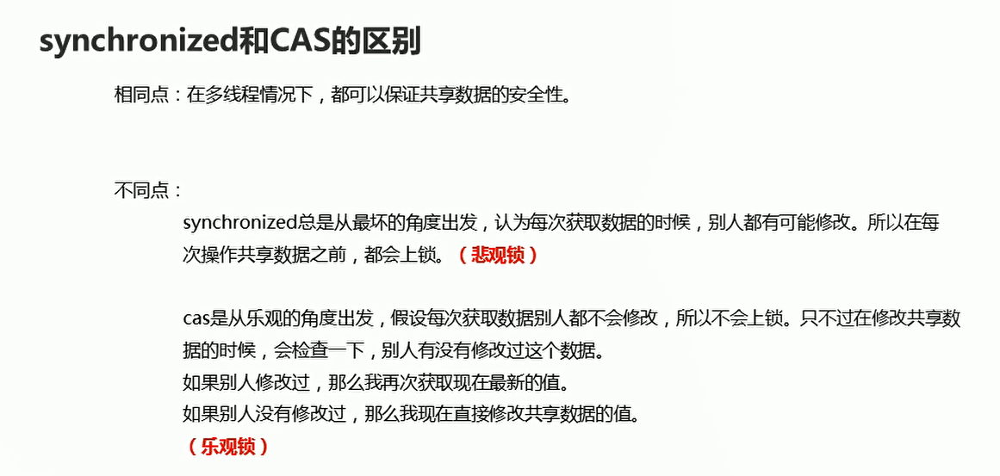

# 原子性

## 概述

&emsp;所谓的原子性是指在一次操作或者多次操作中，要么所有的操作都得到执行并且不会收到任何因素的干扰而中断，要么所有的操作都不执行，多个操作是一个不可分割的整体

以下代码会出现问题，count++操作不具有原子性

**因为这里的count++操作，A线程执行完毕之后，count的值还没赋值给共享数据的时候，cpu的执行权就被B线程抢走，B线程执行count++,导致两次执行结果之后的count都是一样的，看似执行力两次count,count的值增加2，但是只增加1**

```java
package com.hfut.edu.test14;

public class MyAtomThread implements Runnable{
    private int count = 0;// 送冰淇淋的数量

    @Override
    public void run() {
        // 实现接口
        for (int i = 0; i < 100; i++) {
            // 线程从共享数据中读取数据到本线程栈吧中
            // 修改本线程栈中变量副本的值
            // 会把本线程栈中变量副本的值赋值给共享数据
            count++;// 不是原子性操作 可能别别的线程打断 导致变量副本的值没有及时赋值给共享数据  导致共享数据没有及时进行更新
            System.out.println("已经送了" + count +"个冰淇淋");
        }
    }
}

```

```java
package com.hfut.edu.test14;

public class Demo {
    public static void main(String[] args) {
        // 实例化 Runable对象
        MyAtomThread atom = new MyAtomThread();

        for (int i = 0; i < 100; i++) {
            // 将Runable实现类对象作为Thread参数
            new Thread(atom).start();
        }
    }
}


```

使用volatile关键字：

* 只能保证线程每次在使用共享数据的时候是最新值
* 但是不可以保证原子性


使用同步代码块synchronsize可以解决问题

```java
package com.hfut.edu.test14;

public class MyAtomThread implements Runnable{
    private int count = 0;// 送冰淇淋的数量
    private Object lock = new Object();// 创建锁对象

    @Override
    public void run() {
        // 实现接口
        for (int i = 0; i < 100; i++) {
            // 线程从共享数据中读取数据到本线程栈吧中
            // 修改本线程栈中变量副本的值
            // 会把本线程栈中变量副本的值赋值给共享数据

            // 添加synchronized 保证count 变量的值被及时赋值给共享数据 保证cpu执行权不被抢走
            synchronized (lock) {
                count++;// 不是原子性操作 可能别别的线程打断 导致变量副本的值没有及时赋值给共享数据  导致共享数据没有及时进行更新
                System.out.println("已经送了" + count +"个冰淇淋");
            }
        }
    }
}


```

## 原子性

  

```java
package com.hfut.edu.test14;

import java.util.AbstractQueue;
import java.util.concurrent.atomic.AtomicInteger;

public class test1 {
    public static void main(String[] args) {
        // 初始化一个默认值为0的原子性Integer
        AtomicInteger ac = new AtomicInteger();
        System.out.println(ac);

        AtomicInteger ac1 = new AtomicInteger(10);// 给定初始值的原子性Integer
        System.out.println(ac1);
        System.out.println(ac1.get());// 获取值

        int a =  ac1.getAndIncrement();// 自增1  然后返回自增之前的值
        System.out.println(a);// 输出10
        System.out.println(ac1.get());// 输出11

        int b = ac1.incrementAndGet();// 先++ 然后返回自增之后的值
        System.out.println(b);// 输出12
        System.out.println(ac1.get());// 输出12

        AtomicInteger ac3 = new AtomicInteger(10);
        int i = ac3.addAndGet(20);// 先进行加法 然后返回结果
        System.out.println(i);

        AtomicInteger ac4 = new AtomicInteger(10);
        int j = ac4.getAndSet(20);// 先获取值 然后再设置值
        System.out.println(j);
        System.out.println(ac4.get());


    }
}


```


使用原子操作改写上面的代码:

```java
package com.hfut.edu.test14;

import java.util.concurrent.atomic.AtomicInteger;

public class MyAtomThread implements Runnable{
    AtomicInteger ac = new AtomicInteger(0);// 创建原子对象

    @Override
    public void run() {
        // 实现接口
        for (int i = 0; i < 100; i++) {
            int count = ac.incrementAndGet();// 先++ 然后再进行获取
            System.out.println("已经送了" + count + "个冰淇淋");

        }
    }
}


```

## 悲观锁和乐观锁

  


