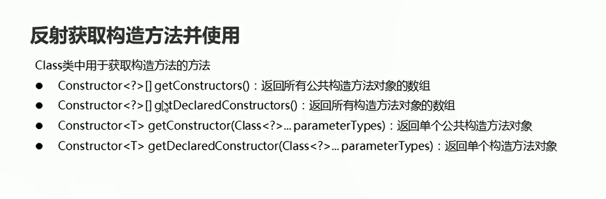

# 反射

## 概述

Java反射机制：是在运行状态中，对于任意一个类，都能够知道这个类中的所有属性和方法，对于任意一个对象，都能调用它的任意属性和方法；这种动态获取信息以及动态调用对象的方法的功能称之为Java语言的反射机制。

  

**使用反射创建对象的时候，不管类中成员变量的修饰符是public还是private，都可以进行直接调用**


**Java反射机制：利用反射可以无视修饰符获取类里面所有的属性和方法。先获取配置文件中的信息，动态获取信息并创建对象和调用方法**


## 获取Class对象的三种方式

```java
package com.hfut.edu.test17;

public class ReflectDemo1 {
    public static void main(String[] args) throws ClassNotFoundException {

        // 获取class对象的三种方式

        // class类中的静态方法forName("全类名“）
        Class clazz = Class.forName("com.hfut.edu.test17.Student");
        System.out.println(clazz);

        // 通过class属性来获取
        Class clazz2 = Student.class;
        System.out.println(clazz2);

        // 利用对象的getClass方法来获取class对象
        Student s = new Student();
        Class clazz3 = s.getClass();

    }
}


```

* Class.forName("全类名");
* 类名.class
* 对象.getClass()

## 反射-获取Constructor对象

```java
package com.hfut.edu.test17;

import java.lang.reflect.Constructor;

public class ReflectDemo1 {
    public static void main(String[] args) throws ClassNotFoundException, NoSuchMethodException {

        // 获取Class对象
        Class clazz = Class.forName("com.hfut.edu.test17.Student");

        // 获取所有公共构造方法对象的数组
        Constructor[] constructors = clazz.getConstructors();

        // 使用增强for循环进行遍历
        for (Constructor constructor : constructors) {
            System.out.println(constructor);
        }

        // 获取所有构造方法的对象数组
        Constructor[] constructors1 = clazz.getDeclaredConstructors();// 私有构造方法也会获取
        for (Constructor constructor : constructors1) {
            System.out.println(constructor);
        }

        // 获取单个构造方法  无参构造方法
        Constructor constructor2 = clazz.getConstructor();
        System.out.println(constructor2);

        // 获取指定参数的有参数构造方法
        Constructor constructor3 = clazz.getConstructor(int.class,String.class);
        System.out.println(constructor3);

    }
}


```
  

## 利用Constructor数组创建对象

  

```java
package com.hfut.edu.test17;

import java.lang.reflect.Constructor;
import java.lang.reflect.InvocationTargetException;

public class ReflectDemo1 {
    public static void main(String[] args) throws ClassNotFoundException, NoSuchMethodException, InvocationTargetException, InstantiationException, IllegalAccessException {

        // 获取Class对象
        Class clazz = Class.forName("com.hfut.edu.test17.Student");

        // 获取有参数的构造方法对象
        Constructor constructor = clazz.getConstructor(int.class,String.class);

        // 使用newInstance创建Stduent对象
        Student stduent = (Student)constructor.newInstance(23,"ehwiuehwiu");

        System.out.println(stduent);
        
    }
}


```

## 获取Field对象

  

```java
package com.hfut.edu.test17;

import java.lang.reflect.Field;

public class test1 {
    public static void main(String[] args) throws ClassNotFoundException {
        // 获取class对象
        Class clazz = Class.forName("com.hfut.edu.test17.Student");
        
        // 获取Fiele对象
        Field[] f = clazz.getFields();// 获得Field对象

        for (Field field : f) {
            System.out.println(field);
        }

        // 返回所有的成员对象
        Field[] f1 = clazz.getDeclaredFields();
        for (Field field : f1) {
            System.out.println(field);
        }
    }
}


```


## 反射获取成员变量并且使用

  

```java

package com.hfut.edu.test17;

import javax.xml.stream.events.StartDocument;
import java.lang.reflect.Field;

public class test1 {
    public static void main(String[] args) throws ClassNotFoundException, NoSuchFieldException {
        // 获取class对象
        Class clazz = Class.forName("com.hfut.edu.test17.Student");
        
        // 获取Fiele对象
        Field f = clazz.getField("name");// 获得Field对象  指定参数

        // 创建一个Student对象
        Student student = (Student) clazz.newInstance();

        // 使用field对指定对象进行赋值
        f.set(student,"zhangds");
        System.out.println(student);


    }
}


```

## 反射获取成员对象
  


## 反射获取成员对象并运行

  

