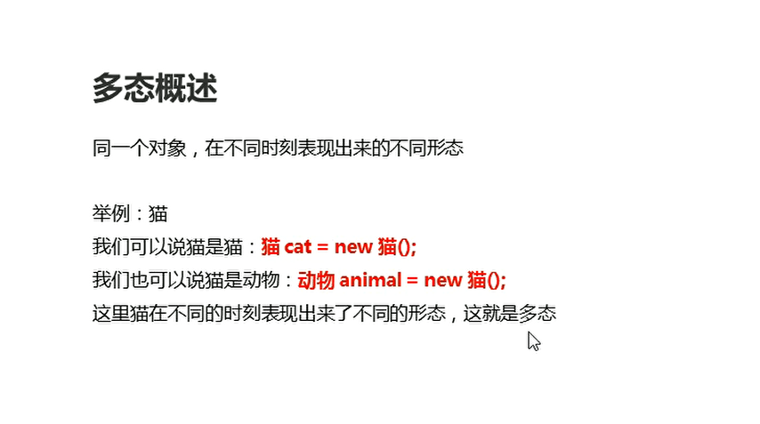

# 多态

## 概述

**同一个对象在不同时刻表现出来的不同形态**

  

多态的前提和体现

* 有继承/实现关系
* 有方法重写。子类对父类进行方法重写
* **有父类引用指向子类对象**

```java
package com.hfut.edu.test1;

public class Test1 {
    public static void main(String[] args) {
        // 多态三个条件
        // 继承/实现关系
//        有方法重写
        // 父类引用指向子类对象

        Animal a = new Cat();
        a.eat();// 调用子类重写之后的方法


    }
}


class Animal{
    public void eat(){
        System.out.println("动物吃饭");
    }
}

class Cat extends Animal{
    public void eat(){
        System.out.println("猫吃鱼");
    }
}

```

## 多态中成员访问的特点

* 构造方法：和继承一样，子类会通过super关键字访问父类构造方法
* 成员变量：编译看左边（父类），执行看左边（父类）
* 成员方法：编译看左边 父类，执行看右边 子类

```java
package com.hfut.edu.test1;

public class Test1 {
    public static void main(String[] args) {
        // 多态三个条件
        // 继承/实现关系
        // 有方法重写
        // 父类引用指向子类对象

        Animal a = new Cat();
        a.eat();// 调用子类重写之后的方法
        System.out.println(a.num);// 调用父类的成员变量
    }
}

class Animal{
    int num  = 10;
    public void eat(){
        System.out.println("动物吃饭");
    }
}

class Cat extends Animal{

    int  num = 20;
    public void eat(){
        System.out.println("猫吃鱼");
    }
}

```

为什么成员变量和成员方法的访问不一样？
* 因为成员方法有重写，但是成员变量没有重写

## 多态的好处和弊端

* 好处：父类引用可以指向不同的子类对象，调用子类重写的父类方法

```java
package com.hfut.edu.test1;

public class Test2 {
    public static void main(String[] args) {
        useAnimal(new Dog());
        useAnimal(new Cat());
    }

    // 多态调用不同子类对象的方法  因为 父类引用可以接受任意的子类对象
    public static void useAnimal(Animal a){
        a.eat();// 子类对象调用方法  必须是子类重写的方法  父类引用才可以进行调用
//        a.watchHome();// 报错  多态的父类引用 在编译期间会查看该方法是否是子类重写的方法
    }
}

abstract class Animal{
    public abstract void eat();

}

class Dog extends Animal{
    public void eat(){
        System.out.println("狗吃肉");
    }

    public void watchHome(){
        System.out.println("看家");
    }
}

class Cat extends Animal{
    public void eat(){
        System.out.println("猫吃鱼");
    }
}

```

多态的好处和弊端：

* 多态的好处：提高了程序的扩展性
  **具体体现：定义方法的时候，使用父类引用作为参数，该方法就可以接受这个父类的任意子类对象**

* 多态的弊端：不能使用子类的特有功能，也就是子类自己的特有的方法，父类引用不可以直接调用


## 多态中转型

* 向上转型：父类引用指向子类对象
* 向下转型：父类引用转为子类对象

```java
package com.hfut.edu.test1;

public class Test2 {
    public static void main(String[] args) {

        Animal a = new Cat();// 向上转型 父类引用指向子类对象
        a.eat();// 弊端 只能调用父类与子类共有的方法

        // 向下转型：从父类类型 转换回子类类型
        Cat c = (Cat)a;// 需要强制类型转换
        c.method();// 转换之后 调用子类对象特有的方法
    }

    // 多态调用不同子类对象的方法  因为 父类引用可以接受任意的子类对象
    public static void useAnimal(Animal a){
        a.eat();// 子类对象调用方法  必须是子类重写的方法  父类引用才可以进行调用
//        a.watchHome();// 报错  多态的父类引用 在编译期间会查看该方法是否是子类重写的方法
    }
}

abstract class Animal{
    public abstract void eat();

}

class Dog extends Animal{
    public void eat(){
        System.out.println("狗吃肉");
    }

    public void watchHome(){
        System.out.println("看家");
    }
}

class Cat extends Animal{
    public void eat(){
        System.out.println("猫吃鱼");
    }

    public void method()
    {
        System.out.println("猫抓老鼠");
    }
}

```

## 多态中转型存在的风险

* 概述：如果被转换的引用类型变量，对应的实际类型和目标类型不是同一种类型，那么在转换的时候就会出现ClassCastException

```java
package com.hfut.edu.test1;

public class Test2 {
    public static void main(String[] args) {
        useAnimal(new Dog());
        useAnimal(new Cat());// 报错 强制类型转换出现错误  类型不匹配

    }

    // 多态调用不同子类对象的方法  因为 父类引用可以接受任意的子类对象
    public static void useAnimal(Animal a){
        a.eat();// 子类对象调用方法  必须是子类重写的方法  父类引用才可以进行调用
//        a.watchHome();// 报错  多态的父类引用 在编译期间会查看该方法是否是子类重写的方法

        Dog d = (Dog)a;// 强制类型转换
        d.watchHome();// 调用子类对象特有的方法

    }
}

abstract class Animal{
    public abstract void eat();

}

class Dog extends Animal{
    public void eat(){
        System.out.println("狗吃肉");
    }

    public void watchHome(){
        System.out.println("看家");
    }
}

class Cat extends Animal{
    public void eat(){
        System.out.println("猫吃鱼");
    }

    public void method()
    {
        System.out.println("猫抓老鼠");
    }
}


```

解决办法：使用关键字instanceof

使用格式：变量名 instanceof 类型

通俗的解释：判断关键字左边的变量 是否是右边的类型 返回boolean类型结果

```java
package com.hfut.edu.test1;

public class Test2 {
    public static void main(String[] args) {
        useAnimal(new Dog());
        useAnimal(new Cat());// 报错 强制类型转换出现错误  类型不匹配

    }

    // 多态调用不同子类对象的方法  因为 父类引用可以接受任意的子类对象
    public static void useAnimal(Animal a){
        a.eat();// 子类对象调用方法  必须是子类重写的方法  父类引用才可以进行调用
//        a.watchHome();// 报错  多态的父类引用 在编译期间会查看该方法是否是子类重写的方法

        if(a instanceof Dog){
            Dog d = (Dog)a;// 强制类型转换
            d.watchHome();// 调用子类对象特有的方法
        }


    }
}

abstract class Animal{
    public abstract void eat();

}

class Dog extends Animal{
    public void eat(){
        System.out.println("狗吃肉");
    }

    public void watchHome(){
        System.out.println("看家");
    }
}

class Cat extends Animal{
    public void eat(){
        System.out.println("猫吃鱼");
    }

    public void method()
    {
        System.out.println("猫抓老鼠");
    }
}
```


