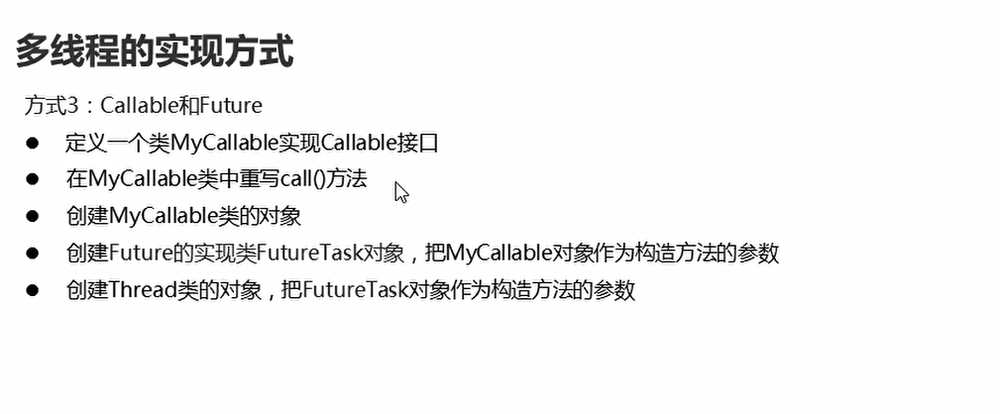

# 多线程

## 概述

* 并发和并行

  

* 进程和线程

  

## 读线程实现方式-继承Thread

  


* 继承Thread类进行实现

  

```java
package com.hfut.edu.test11;

public class MyThread extends Thread{

    // 重写run方法
    @Override
    public void run() {
        super.run();

        for (int i = 0; i < 100; i++) {
            System.out.println("线程开启了" + i);
        }
    }
}


```

```java
package com.hfut.edu.test11;

public class test1 {
    public static void main(String[] args) {
        MyThread  m1 = new MyThread();
        m1.start();// 开启一个线程

        MyThread m2 = new MyThread();
        m2.start();
        // 线程交替执行
    }
}
```

**run方法与start方法的区别：run方法表示的仅仅是创建对象，使用对象去调用方法，并没有开启线程，使用start方法开启线程**

  

**start方法启动线程；然后使用JVM调用此线程的run()方法**

* 开启多线程实现方式-runable接口

  

实现Runable 接口

```java
package com.hfut.edu.test11;

public class MyRunable implements Runnable{

    @Override
    public void run() {
        for (int i = 0; i < 100; i++) {
            System.out.println("第二种多线程的实现" + i);
        }
    }
}


```


```java
package com.hfut.edu.test11;

public class tewts2 {
    public static void main(String[] args) {
        // 创建一个参数对象
        MyRunable mr = new MyRunable();
        // 创建线程对象 将参数传递给这个线程
        Thread t1 = new Thread(mr);
        t1.start();


        MyRunable mr1 = new MyRunable();
        Thread t2 = new Thread(mr1);
        t2.start();

        // 线程交替执行
    }
}


```

## 多线程实现方式-Callable

  

```java
package com.hfut.edu.test11;

import java.util.concurrent.Callable;

public class MyCallable implements Callable<String> {

    // 实现call 方法
    @Override
    public String call() throws Exception {
        for (int i = 0; i < 100; i++) {
            System.out.println("hhhhhhhh" + i);
        }
        return "xxxx";
    }
}


```

```java
package com.hfut.edu.test11;
import java.util.concurrent.ExecutionException;
import java.util.concurrent.FutureTask;

public class Demo {
    public static void main(String[] args) throws ExecutionException, InterruptedException {
        MyCallable mc = new MyCallable();
        FutureTask<String> ft = new FutureTask<>(mc);// 可以获取线程执行完毕之后的结果
        Thread t1 = new Thread(ft);
        t1.start();

        String s = ft.get();// 获取线程执行之后的结果
        System.out.println(s);
    }
}


```

## 三种实现方式的对比

  

## Thread方法

* 获取线程名称

```java
package com.hfut.edu.test11;

public class MyThread extends Thread{

    // 重写run方法
    @Override
    public void run() {
        // 获取线程的名称
        String name = getName();
        System.out.println(name);
    }
}
```

* 获取当前线程

```java
package com.hfut.edu.test11;

public class MyThread extends Thread{

    // 重写run方法
    @Override
    public void run() {
        // 获取线程的名称
        Thread t = Thread.currentThread();// 静态方法调用
        System.out.println(t);
    }
}


```

* 多线程的带参数构造方法

```java
package com.hfut.edu.test11;

public class MyThread extends Thread{

    public MyThread(){}

    public MyThread(String name){
        super(name);// 设置线程的名称
    }

    // 重写run方法
    @Override
    public void run() {
        // 获取线程的名称
        Thread t = Thread.currentThread();// 静态方法调用
        System.out.println(t.getName());// 打印线程的名字
    }
}

```

* Sleep方法

```java
package com.hfut.edu.test11;

public class test3 {
    public static void main(String[] args) throws InterruptedException {
        for (int i = 1; i < 61; i++) {
            System.out.println(i);
            Thread.sleep(1000);// 程序休眠1s
        }


    }
}
```

## 守护线程

* 当守护线程执行完毕，其他线程也就没有执行下去的必要


  

```java
package com.hfut.edu.test11;

public class test4 {
    public static void main(String[] args) {
        MyThread1 m1 = new MyThread1();
        MyThread2 m2 = new MyThread2();

        m1.setName("主线程");
        m2.setName("其他线程");

        m1.setDaemon(true);// 主线程执行完毕 其他线程直接结束

        m1.start();
        m2.start();
    }
}

```

## 线程的优先级

  

* 优先级更高 抢到CPU的几率更高


```java
package com.hfut.edu.test11;

public class test4 {
    public static void main(String[] args) {
        MyThread1 m1 = new MyThread1();
        MyThread2 m2 = new MyThread2();

        m1.setName("主线程");
        m2.setName("其他线程");

        m1.setDaemon(true);// 主线程执行完毕 其他线程直接结束

        m1.start();
        m2.start();

        System.out.println(m1.getPriority());// 打印线程的优先级   默认优先级5
        System.out.println(m2.getPriority());//
        
        m1.setPriority(6);
        m2.setPriority(7);// 设置线程的优先级
    }
}


```

