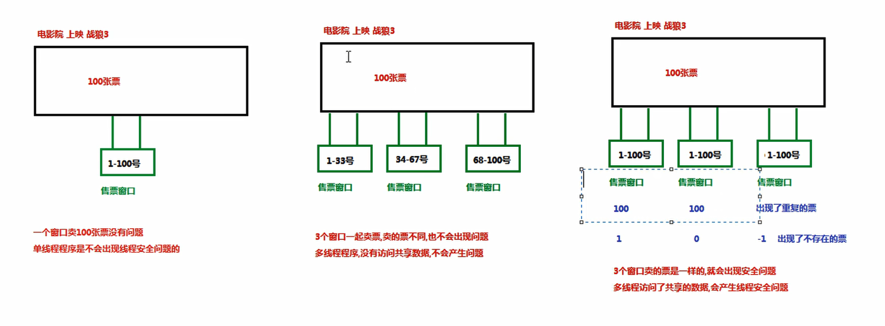
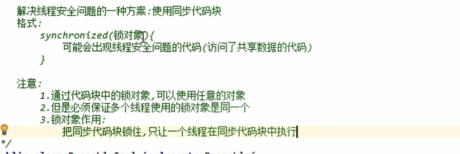
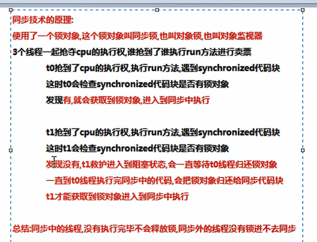
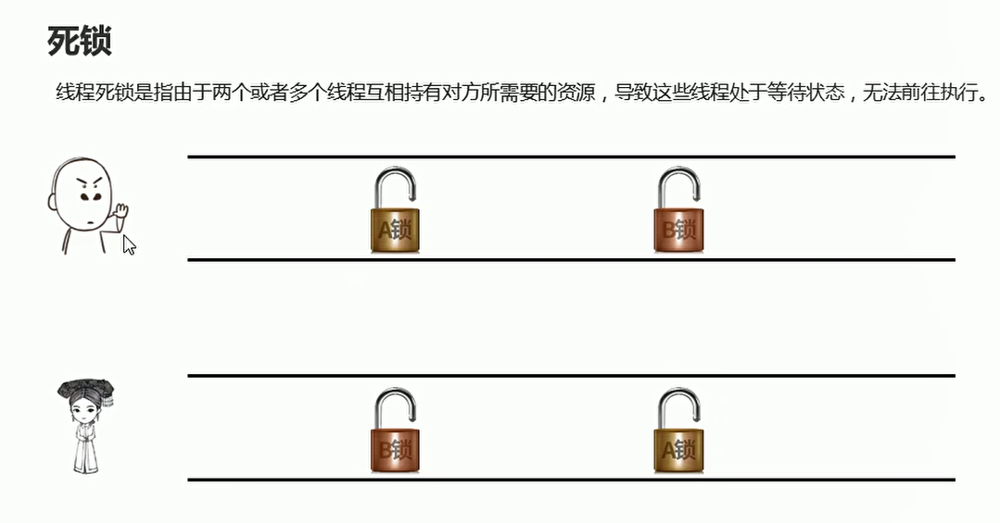

# 多线程的安全问题

## 概述

**多线程访问共享数据，会产生线程安全问题**

  


```java
package com.hfut.edu.test11;

public class test5 implements Runnable{

    // 定义一个多线程共享的资源
    private int ticket = 100;

    // 设置线程任务 买票
    @Override
    public void run() {
        while(true){
            // 先判断票是否存在
            if(ticket > 0){
                System.out.println(Thread.currentThread().getName() + "-->正在卖第" + ticket + "张票");
                ticket--;
            }
        }

    }
}


```


```java
package com.hfut.edu.test11;

public class test6 {
    public static void main(String[] args) {
        test5 t = new test5();// 创建Runable接口的实现类对象
        Thread t0 = new Thread(t);
        Thread t1 = new Thread(t);
        Thread t2 = new Thread(t);
        Thread t3 = new Thread(t);

        t0.start();
        t1.start();
        t2.start();
        t3.start();
    }
}


```

## 线程安全问题解决思路

**线程安全问题是不能产生的，我们可以让一个线程在访问共享数据的时候，无论是否失去了cpu的执行权，让其他的线程只能等待，等待当前线程买完票，其他线程再进行卖票**

## 同步代码块synchronized(锁对象)

  


* 通过代码块中的锁对象，可以使用任意的对象
* 但是多个线程使用的锁对象是同一个
* 锁对象：将同步代码块锁住，只让一个线程再同步代码块中执行

技术原理：

  


## 同步方法

```java
package com.hfut.edu.test11;

public class test5 implements Runnable{

    // 定义一个多线程共享的资源
    private int ticket = 100;

    // 创建一个锁对象
    Object obj = new Object();

    // 设置线程任务 买票
    @Override
    public void run() {
        while(true){

            // 同步代码块
            synchronized (obj){
                // 先判断票是否存在
                if(ticket > 0){
                    System.out.println(Thread.currentThread().getName() + "-->正在卖第" + ticket + "张票");
                    ticket--;
                }
            }
        }
    }

    // 定义同步方法 同步方法也会把方法内部的代码锁住  只让一个线程执行
    public synchronized  void payTicket(){
        // 先判断票是否存在
        if(ticket > 0){
            System.out.println(Thread.currentThread().getName() + "-->正在卖第" + ticket + "张票");
            ticket--;
        }
    }
}


```


## 死锁

  

```java
package com.hfut.edu.test11;

public class test7 {
    public static void main(String[] args) {
        
        // 创建两个锁对象
        Object objA = new Object();
        Object objB = new Object();
        
        // 死锁
        // 线程1 抢到A锁  线程2抢到B锁  下面线程1 无法获取B锁  线程2 无法获取A锁

        // 使用匿名內部类 实现Thread
        new Thread(()->{
            while(true){
                synchronized (objA){
                    synchronized (objB){
                        System.out.println("hhhhhhhhhhhhhhhh");
                    }
                }
            }
        }).start();

        new Thread(()->{
            while(true){
                synchronized (objB){
                    synchronized (objA){
                        System.out.println("xxxxxxxxxxxxxxxxxx");
                    }
                }
            }
        }).start();
    }
}


```


