# 字符流

## 编码表

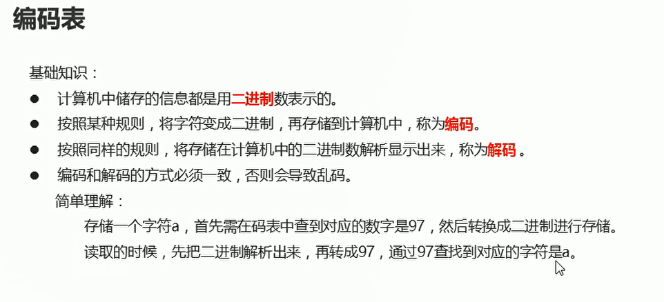  

编码和解码的过程：

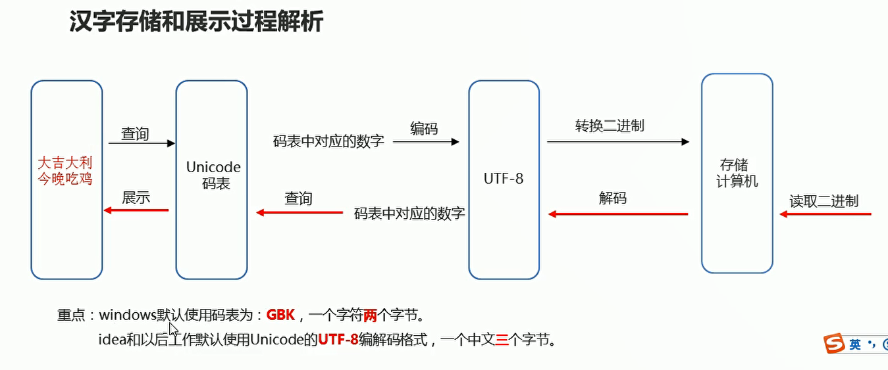  


## 字符串中的编码和解码问题

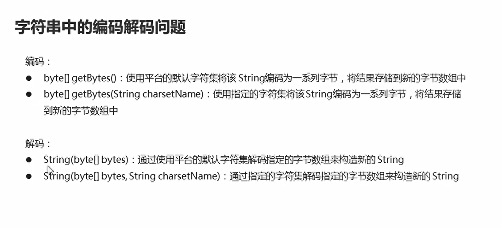  

* 字符串编码

```java
package com.hfut.edu.test10;

import java.io.UnsupportedEncodingException;
import java.util.ArrayList;
import java.util.Arrays;

public class test1 {
    public static void main(String[] args) throws UnsupportedEncodingException {
        // 使用IDEA默认的字符集 UTF-8 将字符串编码为一些字节 然后将结果存储到字节数组中

        String s = "黑马程序员";// 一个UTF-8字符 变为为三个字节
        byte[] bytes = s.getBytes();// 将字符串存入字符数组中
        System.out.println(Arrays.toString(bytes));// 将字节数组 转换为字符串

        // 指定编码格式 GBK windows默认编码  一个字符使用两个字节

        byte[] bytes1 = s.getBytes("GBK");
        System.out.println(Arrays.toString(bytes1));// 将字节数组 转换为字符串
    }
}
```

* 字符串解码

```java
package com.hfut.edu.test10;

import java.io.UnsupportedEncodingException;
import java.util.ArrayList;
import java.util.Arrays;

public class test1 {
    public static void main(String[] args) throws UnsupportedEncodingException {
        // 使用IDEA默认的字符集 UTF-8 将字符串编码为一些字节 然后将结果存储到字节数组中

        method1();
        method2();
    }

    private static void method2() throws UnsupportedEncodingException {
        byte[] bytes1 = {-23, -69, -111, -23, -87, -84, -25, -88, -117, -27, -70, -113, -27, -111, -104};
        byte[] bytes2 = {-70, -38, -62, -19, -77, -52, -48, -14, -44, -79};

        // 使用默认utf-8进行解码
        String s1 = new String(bytes1);
        System.out.println(s1);

        // 使用指定的GBK进行解码
        String s2 = new String(bytes2,"gbk");
        System.out.println(s2);

    }

    private static void method1() throws UnsupportedEncodingException {
        String s = "黑马程序员";// 一个UTF-8字符 变为为三个字节
        byte[] bytes = s.getBytes();// 将字符串存入字符数组中
        System.out.println(Arrays.toString(bytes));// 将字节数组 转换为字符串

        // 指定编码格式 GBK windows默认编码  一个字符使用两个字节

        byte[] bytes1 = s.getBytes("GBK");
        System.out.println(Arrays.toString(bytes1));// 将字节数组 转换为字符串
    }
}

```

## 字节流读取文本文件出现乱码的原因

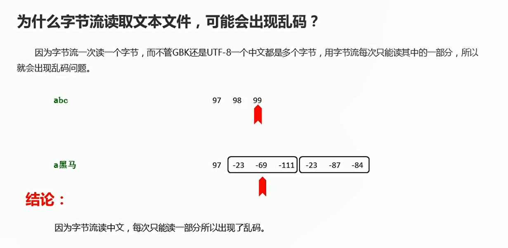  


## 字符流读取中文的过程

**一次性读取多个字节**

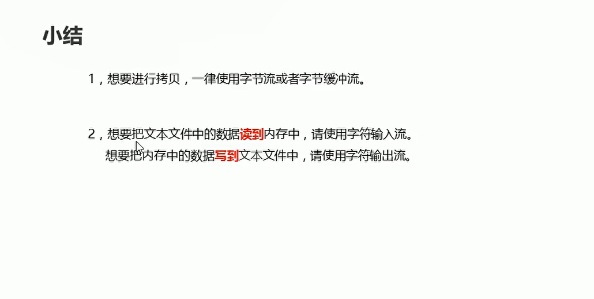  

## 字符流写出数据

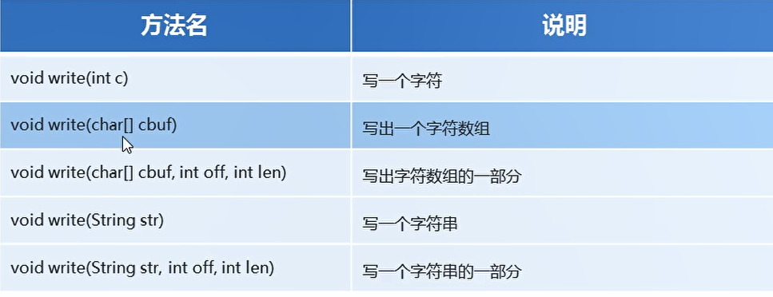  

```java
package com.hfut.edu.test10;

import java.io.File;
import java.io.FileWriter;
import java.io.IOException;

public class test2 {
    public static void main(String[] args) throws IOException {

        // 字符流写出数据 FileWriter
        FileWriter fw = new FileWriter(new File("D:\\heima\\1.txt"));// 传入文件对象

        // 写出数据
        fw.write(97);
        fw.write(98);
        fw.write(99);

        // 传入字符数组
        char[] chars = {97,98,99};
        fw.write(chars);

        // 传入一个字符串数组
        String line = "jcdsahfjdsghb";
        fw.write(line);

        String line1 = "字节跳动";
        fw.write(line1,0,2);// 从0索引开始 读取两个字符

        // 释放资源
        fw.close();
    }
}
```


## 字符流输出数据注意事项

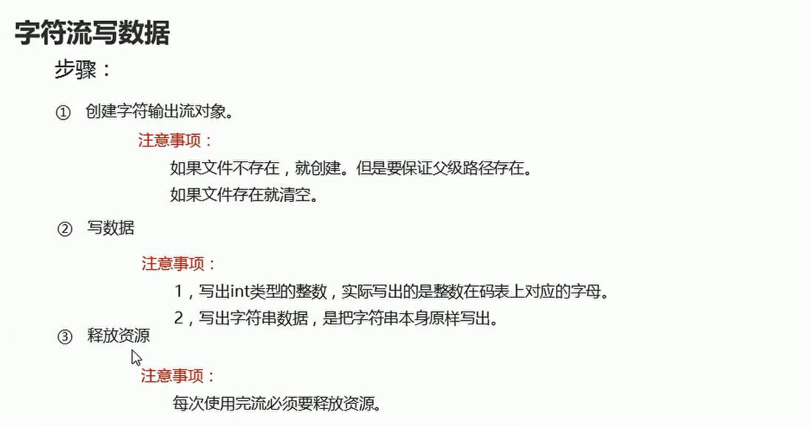  


## flush和close方法

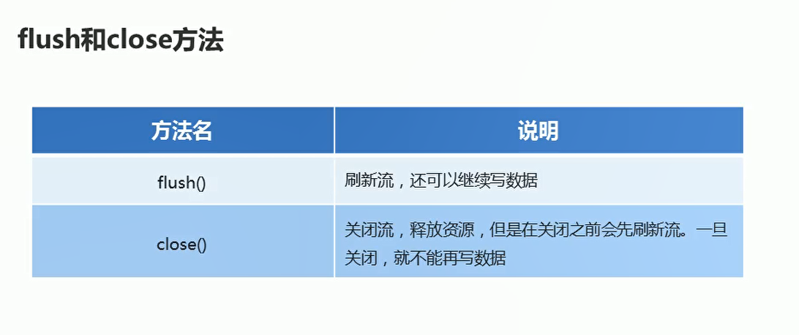  


## 字符流读取数据

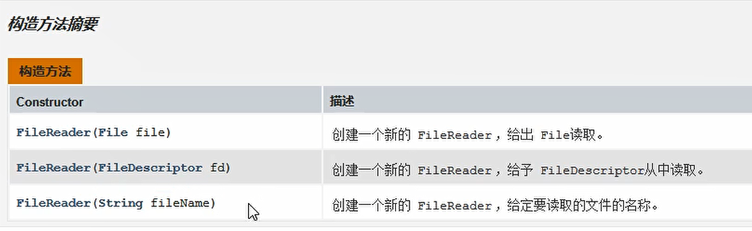  


* 一次性读取一个字符

```java
package com.hfut.edu.test10;

import java.io.File;
import java.io.FileNotFoundException;
import java.io.FileReader;
import java.io.IOException;

public class test3 {
    public static void main(String[] args) throws IOException {

        // 创建字符输入流的对象
        FileReader fr = new FileReader(new File("D:\\heima\\1.txt"));

        // 读取数据

        int ch;
        while((ch = fr.read()) != -1){
            System.out.println((char) ch);// 强制转换成字符
        }

        // 释放资源
        fr.close();
    }
}


```

* 一次性读取多个字节

```java
package com.hfut.edu.test10;
import java.io.File;
import java.io.FileNotFoundException;
import java.io.FileReader;
import java.io.IOException;

public class test4 {
    public static void main(String[] args) throws IOException {
        // 一次性读取多个字符
        // 创建对象
        FileReader fr = new FileReader(new File("D:\\heima\\1.txt"));

        // 一次性读取多个字符
        char[] chars = new char[1024];
        int len;// 每次读取的字符个数

        while((len = fr.read(chars)) != -1){
            // 写入指定个数的字符
            System.out.println(new String(chars,0,len));
        }

        fr.close();

    }
}
```


## 案例-保存键盘录入的数据

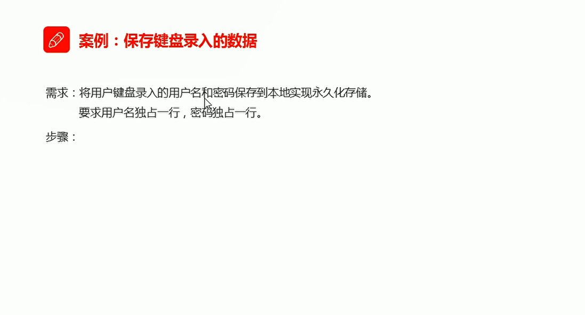  

```java
package com.hfut.edu.test10;

import java.io.File;
import java.io.FileWriter;
import java.io.IOException;
import java.util.Scanner;

public class test5 {
    public static void main(String[] args) throws IOException {
        // 将键盘录入的用户的用户名和密码保存到本地实现永久化存储
        Scanner sc = new Scanner(System.in);
        System.out.println("请输入用户名");
        String username = sc.next();
        System.out.println("请输入密码");
        String password = sc.next();

        // 将用户名和密码写入本地文件
        FileWriter fw = new FileWriter(new File("D:\\heima\\1.txt"));

        // 将用户名和密码写入文件中  参数传入字符串
        fw.write(username);
        fw.write("\r\n");// 添加回车换行
        fw.write(password);

        fw.close();
    }
}


```

## 字符缓冲输入流

```java
package com.hfut.edu.test10;

import java.io.BufferedReader;
import java.io.FileNotFoundException;
import java.io.FileReader;
import java.io.IOException;

public class test6 {
    public static void main(String[] args) throws IOException {
        // 字符缓冲输入流
        BufferedReader br = new BufferedReader(new FileReader("D:\\heima\\1.txt"));

        // 读取数据
        char chars[] = new char[1024];
        int len;// 每次读取的字符数据

        while((len = br.read(chars)) != -1){
            System.out.println(new String(chars,0,len));// 打印输出的字符
        }
    }
}


```


## 字符缓冲输出流

```java
package com.hfut.edu.test10;

import java.io.*;

public class test7 {
    public static void main(String[] args) throws IOException {
        // 字符缓冲输出流
        BufferedWriter bw = new BufferedWriter(new FileWriter("D:\\heima\\1.txt"));

        // 将数据写入缓冲流
        bw.write(97);

        // 换行符
        bw.write("\r\n");

        char[] chars = {97,98,99,101};
        bw.write(chars);

        bw.flush();
        bw.close();
    }
}
```


## 缓冲流的特有方法

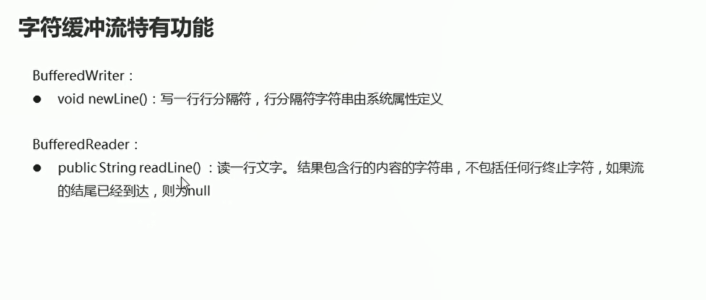  

* newLine() 换行符
```java
package com.hfut.edu.test10;

import java.io.*;

public class test7 {
    public static void main(String[] args) throws IOException {
        // 字符缓冲输出流
        BufferedWriter bw = new BufferedWriter(new FileWriter("D:\\heima\\1.txt"));

        // 将数据写入缓冲流
        bw.write(97);

        // 换行符
        bw.newLine();

        char[] chars = {97,98,99,101};
        bw.write(chars);

        bw.newLine();

        bw.flush();
        bw.close();
    }
}


```

* readLine() 读取一整行的数据

```java
package com.hfut.edu.test10;

import java.io.*;

public class test8 {
    public static void main(String[] args) throws IOException {
        // readline 读取一整行数据

        BufferedReader br = new BufferedReader(new FileReader("D:\\heima\\1.txt"));

        // 使用循环读取数据
        String line;// 读不到数据 返回null
        while((line = br.readLine()) != null){
            System.out.println(line);
        }

        br.close();
    }
}

```

## 案例-读取文件中的数据排序之后 写入本地

```java
package com.hfut.edu.test10;

import java.io.*;
import java.nio.Buffer;
import java.util.Arrays;

public class test9 {
    public static void main(String[] args) throws IOException {
        // 读取文件中的数据排序之后写入本地文件
        // 首先将文件中的数据读入到缓冲流中
        BufferedReader br = new BufferedReader(new FileReader("D:\\heima\\1.txt"));

        // 文件中只有一行数据
        String line = br.readLine();
        System.out.println(line);

        // 将数据字符串 按照空格进行分割  获得数组
        String [] splits = line.split(" ");// 分割字符串数组

        // 将字符串数组 转换成整数型数组
        int[] arr = new int[splits.length];
        
        // 遍历split数组 可以进行类型转换
        for (int i = 0; i < splits.length; i++) {
            String smallStr = splits[i];
            int number = Integer.parseInt(smallStr);// 将字符串转换成 Integer对象 然后自动拆箱操作
            arr[i] = number;// 存入数组
            
        }

        // 将整数进行排序
        Arrays.sort(arr);
        System.out.println(Arrays.toString(arr));

        BufferedWriter bw = new BufferedWriter(new FileWriter(new File("D:\\heima\\2.txt")));

        for (int i = 0; i < arr.length; i++) {
            bw.write(arr[i] + " ");
            bw.flush();

        }


    }
}


```


