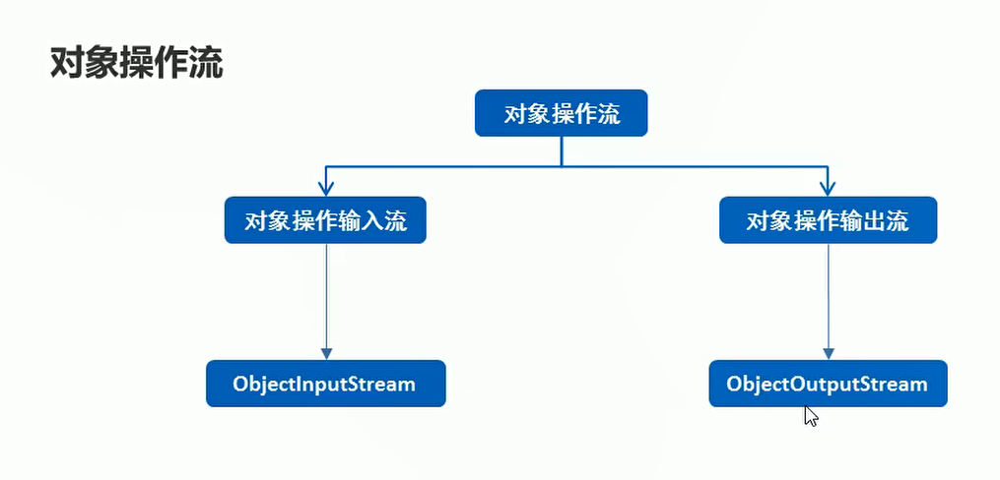
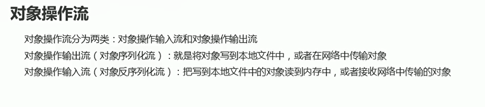

# 对象操作流


## 概述

  

  

## 对象序列化流-将对象写入文件中

```java
package com.hfut.edu.test10;

import java.io.*;

public class test11 {
    public static void main(String[] args) throws IOException {
        User user = new User("张三","geduawghedfucawgh");
        ObjectOutputStream oos = new ObjectOutputStream(new FileOutputStream("D:\\heima\\1.txt"));
        oos.writeObject(user);// 将对象写入目标文件中
        oos.close();
    }
}


```

**注意：对象类需要实现Serializable接口**

```java
package com.hfut.edu.test10;

import java.io.BufferedWriter;
import java.io.FileWriter;
import java.io.Serializable;

public class User implements Serializable {
    private  String name;
    private String password;

    public User(String name, String password) {
        this.name = name;
        this.password = password;
    }

    public String getName() {
        return name;
    }

    public void setName(String name) {
        this.name = name;
    }

    public String getPassword() {
        return password;
    }

    public void setPassword(String password) {
        this.password = password;
    }
}

```

## 对象操作流-反序列化

```java
package com.hfut.edu.test10;

import java.io.*;

public class test11 {
    public static void main(String[] args) throws IOException, ClassNotFoundException {
        ObjectInputStream ois = new ObjectInputStream(new FileInputStream("D:\\heima\\1.txt"));// 读取文件中的对象
        User o = (User)ois.readObject();
        System.out.println(o);

        ois.close();


    }
}


```

 

