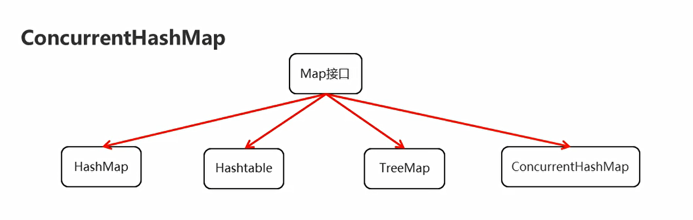
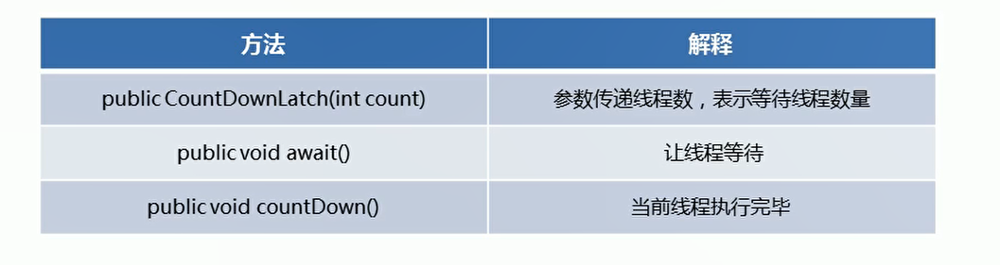

# 并发工具类

## HashMap在多线程下的问题

```java
package com.hfut.edu.test14;

import com.sun.jdi.request.StepRequest;

import java.util.HashMap;

public class test2 {
    public static void main(String[] args) throws InterruptedException {
        HashMap<String, String> hm = new HashMap<>();
        Thread t1 = new Thread(()->{
            for (int i = 0; i < 25; i++) {
                hm.put(i + "",i + "");
            }
        });

        Thread t2 = new Thread(()->{
            for (int i = 25; i < 51; i++) {
                hm.put(i + "", i+ "");
            }
        });

        t1.start();
        t2.start();

        System.out.println("------------------------------");
        Thread.sleep(1000);// 主线程休眠一秒
        for (int i = 0; i < 51; i++) {
            System.out.println(hm.get(i + ""));
        }
    }
}


```

* HashMap是线程不安全的 多线程环境下可能会存在问题
* 为了保证数据的安全性 我们可以使用Hashtable,但是Hashtable效率低下


使用Hashtable

```java
package com.hfut.edu.test14;

import com.sun.jdi.request.StepRequest;

import java.util.HashMap;
import java.util.Hashtable;

public class test2 {
    public static void main(String[] args) throws InterruptedException {
        Hashtable<String, String> hm = new Hashtable<>();
        Thread t1 = new Thread(()->{
            for (int i = 0; i < 25; i++) {
                hm.put(i + "",i + "");
            }
        });

        Thread t2 = new Thread(()->{
            for (int i = 25; i < 51; i++) {
                hm.put(i + "", i+ "");
            }
        });

        t1.start();
        t2.start();

        System.out.println("------------------------------");
        Thread.sleep(1000);// 主线程休眠一秒
        for (int i = 0; i < 51; i++) {
            System.out.println(hm.get(i + ""));
        }
    }
}


```


关于Hashtable：

* Hashtable采取悲观锁synchronsized的形式保证数据的安全性
* 只要有线程进行访问，会将整张表全部锁起来，所以Hashtable的效率低下


  

## ConcurrentHashMap

* HashMap是线程不安全的，多线程环境下会有数据安全问题
* Hashtable是线程安全的，但是会将整张表锁起来，效率低下
* ConcurrentHashMap也是线程安全的，效率较高


```java
package com.hfut.edu.test14;

import com.sun.jdi.request.StepRequest;

import java.util.ConcurrentModificationException;
import java.util.HashMap;
import java.util.Hashtable;
import java.util.concurrent.ConcurrentHashMap;

public class test2 {
    public static void main(String[] args) throws InterruptedException {
        ConcurrentHashMap<String, String> hm = new ConcurrentHashMap<>();
        Thread t1 = new Thread(()->{
            for (int i = 0; i < 25; i++) {
                hm.put(i + "",i + "");
            }
        });

        Thread t2 = new Thread(()->{
            for (int i = 25; i < 51; i++) {
                hm.put(i + "", i+ "");
            }
        });

        t1.start();
        t2.start();

        System.out.println("------------------------------");
        Thread.sleep(1000);// 主线程休眠一秒
        for (int i = 0; i < 51; i++) {
            System.out.println(hm.get(i + ""));
        }
    }
}
```

## CountDownLatch

  

使用场景：让某一条线程等待其他线程执行完毕之后再执行

* CountDownLatch(int count):参数写等待线程的数量不。并定义了一个计数器
* await()：让线程等待，当计数器为0，会唤醒等待的线程
* countDown():线程执行完毕 调用，计数器减一

