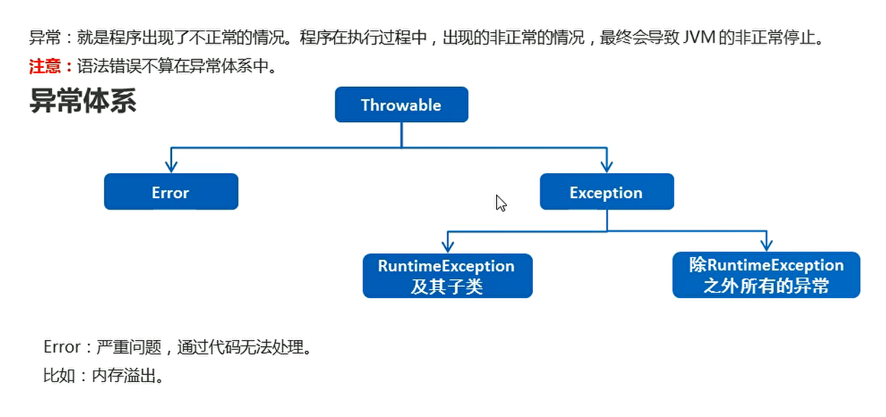
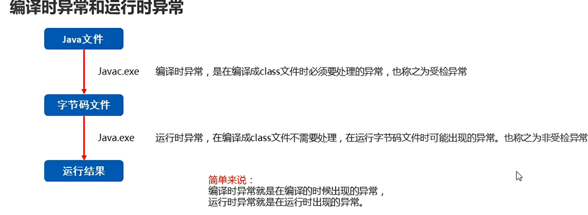
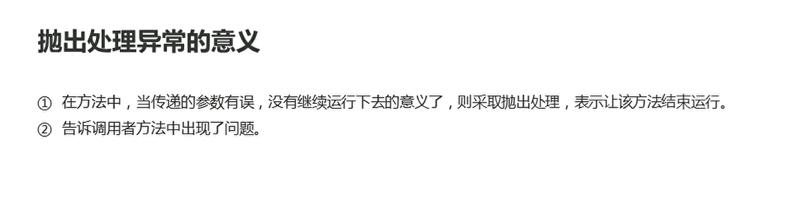
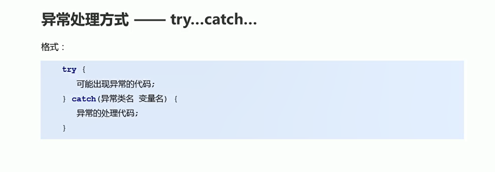

# 异常

## 异常概述

  

Exception:称之为异常类，他表示程序本身可以处理的问题

* RuntimeException及其子类：运行时异常。（空指针异常，数组索引越界异常）
* 除了RuntimeException之外的所有异常:编译期间必须处理的，否则程序不能通过编译（日期格式化异常）

  

**异常：就是程序出现了不正常的情况。程序在执行过程中，出现的非正常的情况，最终会导致JVM的非正常停止**

注意：语法错误不算在异常体系中

JVM的默认处理方案

如果程序出现了问题，**我们没有做任何处理，最终JVM会做默认的处理**，如果自己写出异常处理的代码，将执行自己写的异常处理语句

* 将异常的名称，异常的原因以及异常出现的位置等信息输出在控制台
* 程序停止执行


## throws声明异常

格式: throws 异常类名

注意：这个格式是写在方法的定义处，表示声明一个异常。

* 出现空指针异常

```java
package com.hfut.edu.test3;

public class test7 {
    public static void main(String[] args) {
        method1();
    }

    private static void method1() throws  NullPointerException{
        int[] arr = null;// 爆出空指针异常
        for (int i = 0; i < arr.length; i++) {
            System.out.println(arr[i]);
        }
    }


}
```

* 出现了解析异常

```java
package com.hfut.edu.test3;

import java.text.ParseException;
import java.text.SimpleDateFormat;
import java.util.Date;

public class test7 {
    public static void main(String[] args) throws ParseException {
        method1();
        method2();
    }

    private static void method1() throws  NullPointerException{
        int[] arr = null;// 爆出空指针异常
        for (int i = 0; i < arr.length; i++) {
            System.out.println(arr[i]);
        }
    }
    // 告诉调用者 可能会出现异常
    // 如果方法中没有出现异常 那么正常执行
    // 如果方法中真的出现了异常 其实也是将这个异常交给了调用者处理
    private static void method2() throws ParseException {
        SimpleDateFormat sdf = new SimpleDateFormat("yyyy年MM月dd日");
        Date parse = sdf.parse("2048年10月10日");// 将指定的时间字符串按照指定格式解析成Date对象
    }
}
```

**注意：** **声明的异常是一个运行时的异常，那么声明的代码可以省略，如果声明的异常是一个编译时的异常，那么声明异常的代码必须手动写出**

```java
package com.hfut.edu.test3;

import java.text.ParseException;
import java.text.SimpleDateFormat;
import java.util.Date;

public class test7 {
    public static void main(String[] args) throws ParseException {
        method1();
        method2();
    }
    
    // 运行时异常 声明异常的代码不需要写出
    private static void method1() throws  NullPointerException{
        int[] arr = null;// 爆出空指针异常
        for (int i = 0; i < arr.length; i++) {
            System.out.println(arr[i]);
        }
    }
    // 告诉调用者 可能会出现异常
    // 如果方法中没有出现异常 那么正常执行
    // 如果方法中真的出现了异常 其实也是将这个异常交给了调用者处理
    // 编译时异常 声明异常的代码必须手动写出
    private static  void method2() throws ParseException {
        SimpleDateFormat sdf = new SimpleDateFormat("yyyy年MM月dd日");
        Date parse = sdf.parse("2048年10月10日");// 将指定的时间字符串按照指定格式解析成Date对象
    }
}

```

## throw抛出异常

throws：

* 用在方法声明后面，跟的是异常类名
* 表示声明异常，调用该方法有可能会出现这样的异常

throw:

* 用在方法体内部，跟的是异常对象名
* 表示手动抛出异常对象，由方法体内的语句处理

  

```java
package com.hfut.edu.test3;

public class test8 {
    public static void main(String[] args) {
        int[] arr= null;
        printArr(arr);// 接收到异常 将异常丢给JVM虚拟机
    }

    private static void printArr(int[] arr) {

        if(arr == null){
            // 手动 创建异常对象 抛给调用者  让该方法停止
            throw new NullPointerException();// 抛出空指针异常
        }
        else{
            for (int i = 0; i < arr.length; i++) {
                System.out.println(arr[i]);
            }
        }
    }
}


```


## try-catch 抛出异常

  

好处：为了能让代码继续运行下去

```java
package com.hfut.edu.test3;

public class test8 {
    public static void main(String[] args) {
        int[] arr= null;
//        printArr(arr);// 接收到异常 将异常丢给JVM虚拟机

        // 使用try-catch 可以让代码继续运行下去
        try{
            printArr(arr);
        }catch(NullPointerException e){
            // 捕获到空指针异常 进行的操作
            System.out.println("参数不能是NULL");
        }

        System.out.println("代码可以正常执行下去");
    }

    private static void printArr(int[] arr) {

        if(arr == null){
            // 手动 创建异常对象 抛给调用者  让该方法停止
            throw new NullPointerException();// 抛出空指针异常
        }
        else{
            for (int i = 0; i < arr.length; i++) {
                System.out.println(arr[i]);
            }
        }
    }
}

```

```java
package com.hfut.edu.test3;

import java.util.Scanner;

public class test9 {
    public static void main(String[] args) {

        try {
            Scanner sc = new Scanner(System.in);
            System.out.println("请输入你的年龄");
            String line = sc.nextLine();// 输入字符串
            // 将字符串转换成整数
            int age = Integer.parseInt(line);// 将整数字符串转换成Integer对象 然后自动拆箱成int整数

            System.out.println(age);
            System.out.println("测试123");
        } catch (NumberFormatException e) {
            // 捕获到异常
//            throw new RuntimeException(e);
            System.out.println("出现了异常 但是代码正常执行下去");
        }

        System.out.println("代码正常执行下去");
    }
}
```

注意：

* 如果try中没有遇到异常，指定try中的代码
* 如果try中遇到问题，执行catch中的代码
* 如果出现的问题没有被捕获，程序报错，默认交给JVM处理
* 出现多个异常 写出多个catch进行捕获即可,如果多个异常之间存在子父类关系，那么父类一定要写在下面

```java
package com.hfut.edu.test3;

import java.util.Scanner;

public class test9 {
    public static void main(String[] args) {

        try {
            Scanner sc = new Scanner(System.in);
            System.out.println("请输入你的年龄");
            String line = sc.nextLine();// 输入字符串
            // 将字符串转换成整数
            int age = Integer.parseInt(line);// 将整数字符串转换成Integer对象 然后自动拆箱成int整数
            System.out.println(age);
            System.out.println("测试123");
            System.out.println(2 / 0);
        } catch (NumberFormatException e) {
            // 捕获到异常
//            throw new RuntimeException(e);
            System.out.println("出现了异常 但是代码正常执行下去");
        }catch(ArithmeticException e){
            System.out.println("数学运算异常 捕获多个异常");
        }

        System.out.println("代码正常执行下去");
    }
}

```

## throwable的成员方法

* getMessage():返回此throwable的详细消息字符串
* toString():返回此可抛出的简短描述
* printStackTrace():将异常的错误信息输出在控制台

```java
package com.hfut.edu.test3;

public class test10 {
    public static void main(String[] args) {
        int[] arr = {1,2,3,45};

        try {
            System.out.println(arr[11]);
        } catch (ArrayIndexOutOfBoundsException e) {
            // 数组越界异常
            e.getMessage();
            e.toString();
            e.printStackTrace();// 将异常的错误信息输出在控制台中
        }

        System.out.println("xxxxxxxxxxxx");
    }
}
```


