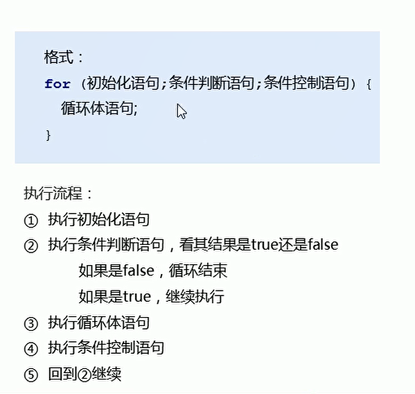
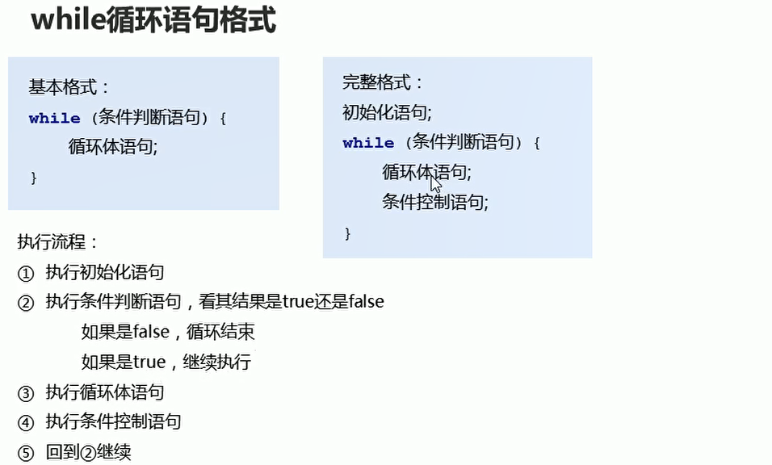

# 循环

## for循环

  

```java
package com.ustc.base.DataFormat;

import java.util.Scanner;

public class test4 {
    public static void main(String[] args) {
        int sum = 0;
        for (int i = 1; i <= 100 ; i++) {
            if(i % 2 == 0)
            {
                sum += i;
            }
            
            // System.out.println(i);
        }

        System.out.println(sum);

    }
}

```

## while循环

  

## 跳转控制语句continue

```java
package com.ustc.base.DataFormat;

public class test5 {
    public static void main(String[] args) {
        // 输出所有的水仙花数
        for (int i = 100; i <= 999; i++) {
            if(i == 101)
            {
                continue;
            }
            System.out.println(i);
        }
    }
}

```

## 产生随机数

```java
package com.ustc.base.DataFormat;

import java.util.Random;

public class test6 {
    public static void main(String[] args) {
        // 产生随机数
        Random r = new Random();
        for (int i = 0; i < 11; i++) {
            // 产生0 - 9 数字 加上1 产生 1 - 10 数字
            int num = r.nextInt(10) + 1;
            System.out.println(num);
        }
    }
}


```

