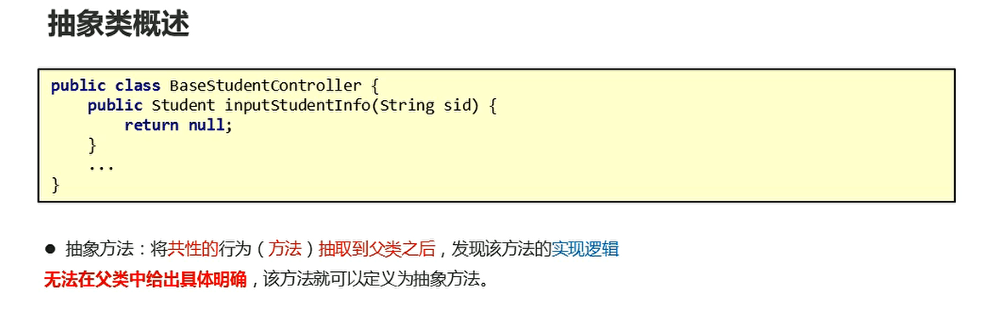
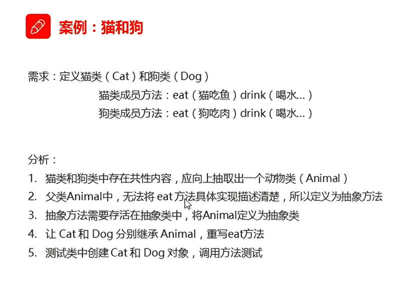
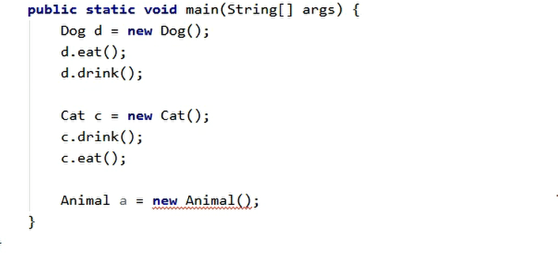
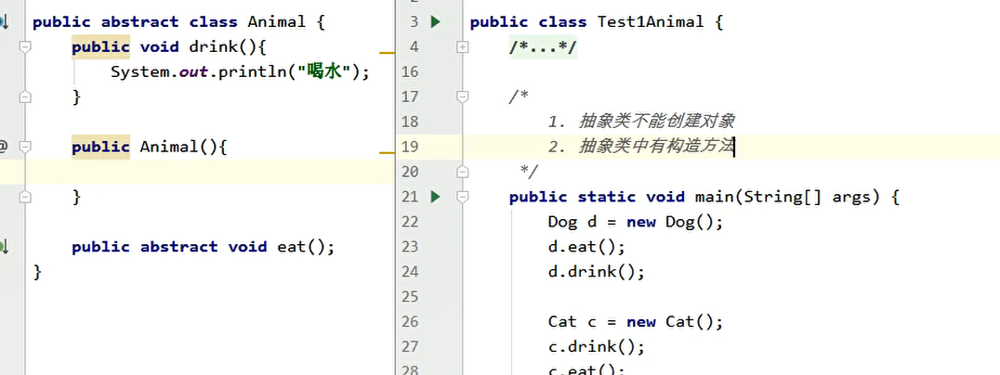
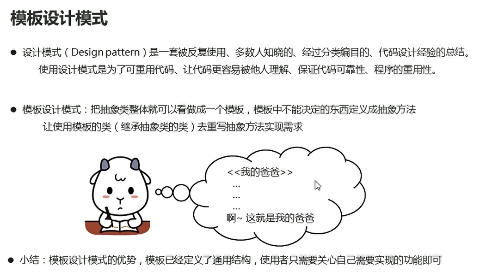
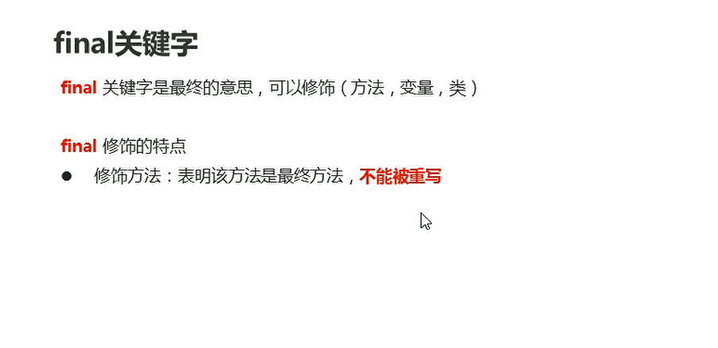
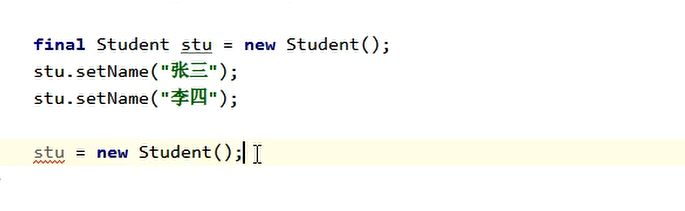
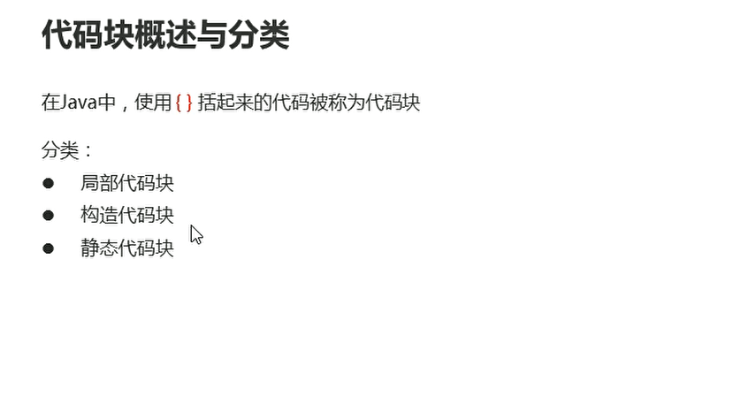
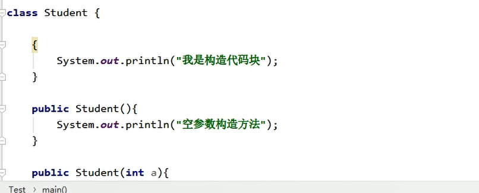
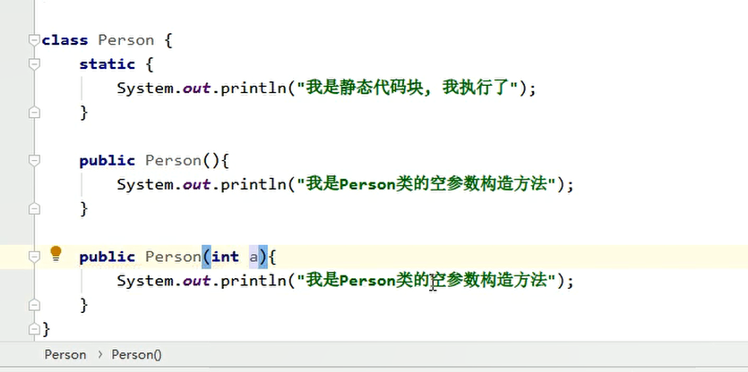

# 抽象类

## 一、概述

  

* 抽象方法：将共性的方法抽取到父类之后，发现该方法的实现逻辑无法在父类中给出具体明确，该方法就可定义为抽象方法
* 抽象类：如果一个类中存在抽象方法，该类必须声明为抽象类

  


Animal抽象类：
```java
package com.hfut.test;

public abstract class Animal {
    // 动物抽象类

    public void drink(){
        System.out.println("喝水");
    }

    public abstract void eat();// 将eat方法抽象成 抽象方法 抽象方法只存在于抽象类中

}


```

cat
```java
package com.hfut.test;

public class Cat extends Animal{
    @Override
    public void eat() {
        System.out.println("猫吃鱼");
    }
}


```


dog
```java
package com.hfut.test;

public class Dog extends Animal{
    @Override
    public void eat() {
        // 继承抽象类 必须实现抽象方法
        System.out.println("狗吃肉");
    }
}

```

## 二、抽象类注意事项

* 抽象类不可创建对象

  

* 抽象类中存在构造方法

  

* 抽象类的子类
  * 必须重写父类中所有抽象方法
  * 自己也可以变成抽象方法


* 抽象类中可以没有抽象方法 有抽象方法的一定是抽象类

## 三、模板设计模式

  

```java
package com.hfut.Template;

public abstract class Composition {

    public void write(){
        System.out.println("xxxxxxxxx");

        body();// 抽象方法

        System.out.println("xxxxxxxxxxx");
    }

    public abstract void body();// 抽象方法
}


```

  


## 四、final关键字

  

* 使用该关键字修饰的方法是最终的方法，不可以被重写

* 修饰常量，子类不可进行重新赋值

* 修饰类：该类是最终类 不可以被继承

对于final修饰的变量：

* 基本数据类型变量：不可以被重新赋值
* 引用数据类型变量：地址值不可以被更改 但是可以修改属性值
    


* final修饰的成员变量：初始化时机
  * 在创建的时候 直接给值  推荐
  * 在构造方法结束之前 完成赋值

## 五、代码块

  

* 局部代码块：在方法中定义，限定变量的声明周期，尽早释放，提高内存利用率

* 构造代码块：类中方法外定义，每次构造方法执行的时候，都会执行该代码块中的代码，并且在构造方法执行前执行，作用：将多个重载的构造方法中相同的代码，抽取到构造代码块中，提高代码的复用性

  

静态代码块：位置：类中方法外部定义，特点：需要通过static 关键字进行修饰，随着类的加载而加载，并且只执行一次  作用：在类加载的时候做一些数据初始化的操作

  


