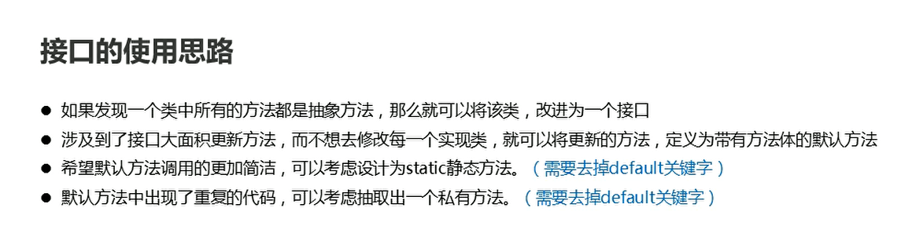
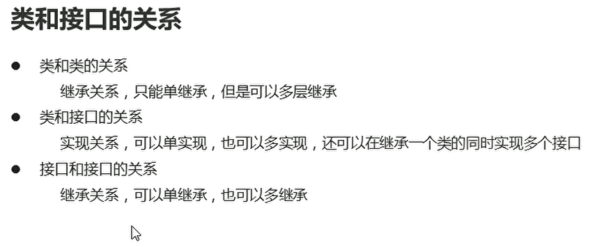

# 接口

## 接口的介绍

&emsp；当一个类中的所有方法都是抽象方法的时候，我们就可以将其定义为接口，接口也是一种引用数据类型，他比抽象类还要抽象

&emsp;接口存在的两个重要意义
* 规则的定义
* 程序的扩展性

## 接口的定义和特点

* 接口使用关键字interface来定义  public interface 接口名{}
* 接口不能实例化
* 接口和类之间是实现关系，通过implements关键字来表示 public class 类名 implements 接口名{}
* 接口的子类(实现类)  要么重写接口所有抽象方法 要么是抽象类

**接口不允许创建对象，接口和类的实现关系，可以是单实现，也可以是多实现**


## 接口中的成员特点

* 成员变量
  * 只能是常量 使用final关键字修饰
  * 默认修饰符：public static final
* 构造方法
  * 接口没有构造方法
* 成员方法
  * 只能是抽象方法
  * 默认修饰符 public abstract

```java
package com.hfut.test;

public interface Inter {
    // 接口中没有构造方法 实现类的构造方法 访问的是Object
//    public Inter(){
//
//    }

    public static final int NUM = 10;// 默认添加 public static final 静态成员变量
    public abstract void st();// 接口中的抽象方法

    void show();// 默认添加public abstract 两个关键字  也就是接口中的方法只能是抽象方法
}


```

```java
package com.hfut.test;

public interface InterA {
    public abstract void print1();
    public abstract void print2();
    public abstract void st();


}

```

```java
package com.hfut.test;

// 可以实现多个接口  但是继承 只可以是单继承
public class InterImpl implements Inter,InterA {

    public InterImpl(){
        super();// super实现的是Object类
    }

    public void methd(){
        System.out.println(NUM);// 只能使用接口中的成员变量  不可以修改
//        NUM = 20;// 不可以修改 因为接口的成员变量使用了final关键字进行修饰  常量不可以进行修改
    }

    // 多个接口都存在该方法  代码不会出现冲突
    @Override
    public void st() {
        System.out.println("实现接口中的方法");
    }

    @Override
    public void show() {

    }

    @Override
    public void print1() {

    }

    @Override
    public void print2() {

    }
}

```

```java
package com.hfut.test;

public class InterMain {
    public static void main(String[] args) {
        InterImpl i = new InterImpl();
        i.st();

        System.out.println(Inter.NUM);// 接口的成员变量是静态成员变量
    }
}

```

## JDK8 接口中的成员特点

问题：接口升级，添加若干方法，它的实现类就需要重写这些方法

解决思路：允许接口中定义带有方法体的方法 但是需要使用关键字default进行修饰，这些方法就是默认方法，作用：解决接口升级问题

接口中默认方法的定义格式：
* 格式：public default 返回值类型  方法名(参数列表){}
* 例子：public default void show(){}  

**作为实现类，可以直接使用接口中的默认方法**

```java
package com.hfut.test1;

public interface Inter {
    public default void showA(){
        System.out.println("接口中自带的方法  实现类不需要重写该方法");
    }
}


```

```java
package com.hfut.test1;

public class InterImp implements Inter{

    // 实现类重写接口中的自定义方法  不可以添加default关键字  会报错
    @Override
    public void showA() {
        System.out.println("实现类重写的showA方法");
    }
}


```

```java
package com.hfut.test1;
import com.hfut.test.InterImpl;

public class Main {
    public static void main(String[] args) {
        InterImp i = new InterImp();
        i.showA();// 接口中的默认方法可以直接进行调用
    }
}
```

接口中默认方法的注意事项：
* 默认方法不是抽象方法，所以不强制被重写，但是可以被重写，重写的时候去掉default关键字
* public可以省略，default不能被省略
* 如果实现多个接口 多个接口中存在相同的方法声明，子类就必须对该方法进行重写


**接口中允许定义static静态方法**
* public static 返回值类型  方法名(参数列表){}
* public static void show(){}
  
```java
package com.hfut.test1;

public interface Inter {
    public static void showA(){
        System.out.println("接口中自带的方法  实现类不需要重写该方法");
    }
}

```

```java
package com.hfut.test1;

public class InterImp implements Inter{

}

```


```java
package com.hfut.test1;

import com.hfut.test.InterImpl;

public class Main {
    public static void main(String[] args) {
        InterImp i = new InterImp();
//        i.showA();// 接口中的静态方法不可以使用 实现类对象进行调用
        Inter.showA();// 接口中的静态方法 只能通过接口类名.方法进行调用
    }
}

```


**接口中静态方法的注意事项**
* 静态方法只能通过接口名进行调用，不能通过实现类名或者对象名进行调用
* public可以省略，static不能省略

## JDK9 接口中的成员特点

允许定义私有方法：

格式1：private 返回值类型  方法名（参数列表）{}
范例1：private void show()

格式2：private static 返回值类型 方法名(参数列表){}
范例2：private static void method()


```java
package com.hfut.test2;

public interface Inter {

    // 定义接口中的default方法
    public default void start(){
        System.out.println("start方法执行...");
        log();
    }

    public default void end(){
        System.out.println("end方法执行...");
        log();
    }

    // JDK9之后 接口中允许定义私有方法  只为该接口进行服务
    private void log(){
        System.out.println("日志记录");
    }

    private static void check(){
        System.out.println("静态方法只能调用静态方法");
    }

    public static void open(){
        check();
        System.out.println("open方法执行了");
    }

    public static void close(){
        check();
        System.out.println("check方法执行了");
    }

}


```

```java
package com.hfut.test2;

import com.hfut.test1.InterImp;

public class TestInter {
    public static void main(String[] args) {

        InterImpl ii = new InterImpl();
        ii.start();
        ii.end();

        // 接口中的静态方法需要通过接口类名直接进行调用
        Inter.open();
        Inter.close();

    }
}

// 接口的实现类
class InterImpl implements Inter{

}

```
  


## 类和接口的关系

  

* 类和类之间的关系：继承关系 只能是单继承 但是可以多层继承
* 类和接口的关系：实现关系，可以单实现，也可以是多实现，还可以在继承一个类的同时实现多个接口
* 接口和接口的关系：继承关系，可以单继承，也可以多继承


问题：一个类实现一个接口，同时继承一个类，接口和父类都有相同的方法，到底调用那个方法

答：调用父类的方法

```java
package com.hfut.test3;

public interface  Inter {
    // 接口中的默认方法
    public default void show(){
        System.out.println("接口中的默认方法");
    }
}

```

```java
package com.hfut.test3;

public class Fu {
    public void show(){
        System.out.println("父类的show方法");
    }
}


```

```java
package com.hfut.test3;

import com.hfut.test2.Inter;

public class Main {
    public static void main(String[] args) {
        Inm i = new Inm();
        i.show();// 调用父类的show方法
    }
}

// 继承父类的同时  又实现接口
class Inm  extends Fu implements Inter{

}

```

**接口和接口之间可以进行多继承，但是父接口之间存在相同的方法，这时候就会出现冲突，子接口需要将重名的方法进行重写，实现类需要将以上的所有接口的抽象方法都实现**

```java
package com.hfut.test4;

public interface InterA {

    public abstract void m1();// 抽象方法

    public default void show(){
        System.out.println("InterA的实现方法");
    }

}


```

```java
package com.hfut.test4;

public interface InterB {
    public abstract void m2();// 抽象方法
    public default void show(){
        System.out.println("InterB的实现方法");
    }
}

```

```java

package com.hfut.test4;

// 接口之间可以多继承
public interface Inter extends InterA,InterB{
    // 父接口中存在多个相同的方法  子接口需要进行重写
    public default void show(){
        System.out.println("重写show方法");
    }
}

```

```java
package com.hfut.test4;

public class M {
    public static void main(String[] args) {
        Imp i = new Imp();
        i.show();// 调用子接口的show方法  重写之后的方法
    }
}

// 实现子接口 同时需要将所有的父接口中的抽象方法都实现
class Imp implements Inter{

    @Override
    public void m1() {

    }

    @Override
    public void m2() {

    }
}

```


