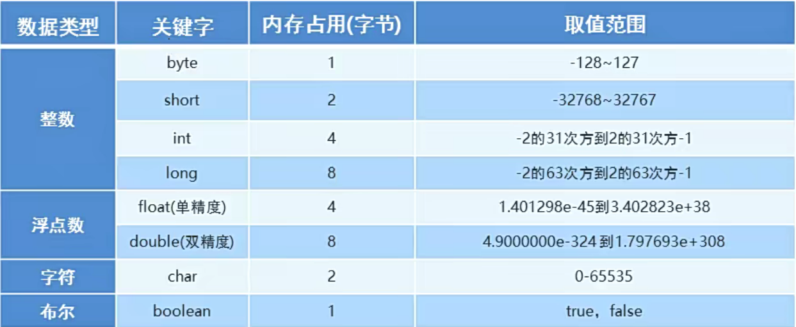

# Java数据类型以及转换


## 一、关键字

含义：java 中被赋予特定含义和特点的单词

## 二、强制转换

* 数据范围大变量赋给一个数据范围小的变量
* int 到byte 会产生精度损失  小数点之后的东西全部被舍弃
* byte a = (byte)b; 

## 三、常量

* 程序执行过程中不发生改变的量

  

## 四、隐式转换的问题

* byte\short\char 会自动转换成int

```java

package com.ustc.base.DataFormat;

public class test2 {
    public static void main(String[] args) {
        byte a = 3;
        byte b = 4;
        byte c = (byte)(a + b);// 错误 a 和b 会自动转换成int类型 从int转换成byte可能会有精度损失
        System.out.println(c);
    }
}
```

* java常量优化机制

```java
package com.ustc.base.DataFormat;

public class test2 {
    public static void main(String[] args) {
        byte a = 3;
        byte b = 4;
        byte c = (byte)(a + b);// 错误 a 和b 会自动转换成int类型 从int转换成byte可能会有精度损失
        System.out.println(c);

        byte d = 3 + 4;// 3 和 4 默认是int数据类型  java中存在常量优化机制：计算的结果7 会自动判断结果是否在byte范围内 在的话编译通过
    }
}


```

## 五、变量

* 变量就是内存中的存储空间，空间中存储着经常发生改变的量

  

* 默认数据类型
  * 整数默认都是int类型
  * 浮点数默认都是double类型

* 变量注意事项
  * 变量名不允许重复定义
  * 一条语句可以定义多个变量 但还是需要逗号进行分割
  * 变量在使用之前一定要赋值
  * 定义float和long变量的注意事项 float类型一定要加上f long 类型必须加上L
  * 变量的作用域范围 变量的作用范围旨在大括号中有效

## 六、程序输入

```java
package com.ustc.base.DataFormat;

import java.util.Scanner;

public class test3 {
    public static void main(String[] args) {

        // 创建对象 只有sc可以改变 其他属于固定格式
        Scanner sc = new Scanner(System.in);

        // 使用变量接受数据
        int c = sc.nextInt();

        System.out.println(c);
    }
}

```

## 七、标识符

  

  

## 八、类型转换

* 隐式转换：取值范围小的转换成取值范围大的
  

* 小的数据类型和大的数据类型一起运算 ，先提升为大的数据类型

