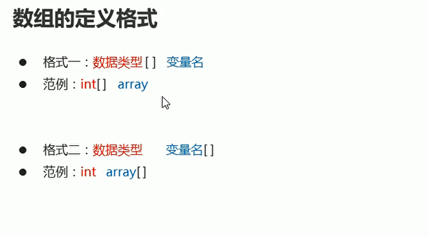
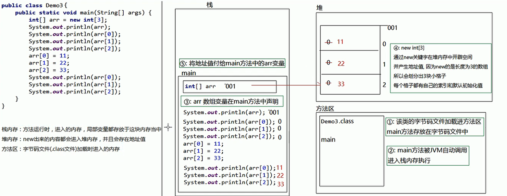
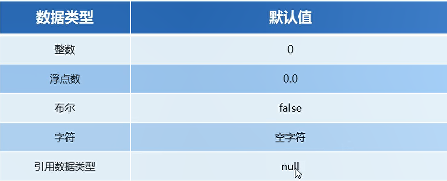
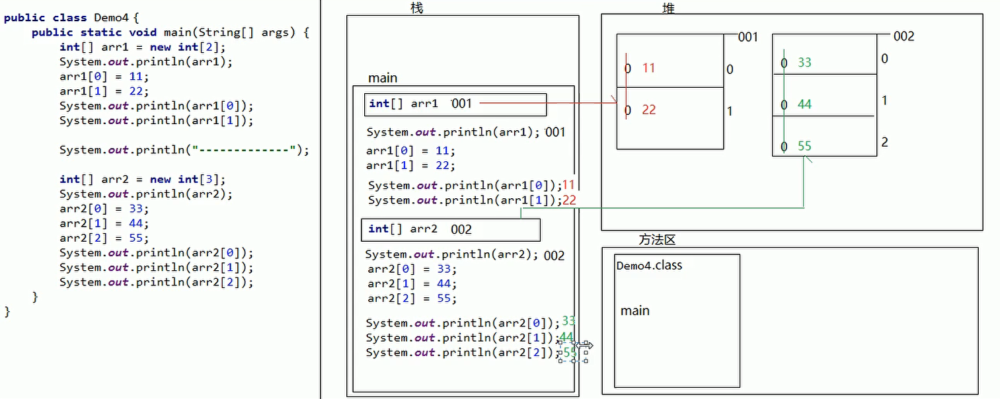
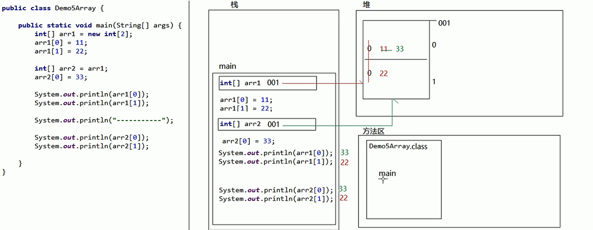

# 数组

## 一、定义

数组是一个容器，存储一种数组类型的多个值

## 二、定义格式
  

* int [] a;
* int a[];

## 三、数组动态初始化

```java
package com.ustc.base.DataFormat;

public class test7 {
    public static void main(String[] args) {
        int[] a = new int[5];// 创建一个int类型的数组容器

        System.out.println(a);// 打印数组地址
        // [I@10f87f48
        // @ 分隔符
        // [ 当前的空间是一个数组类型
        // 当前数组容器所存储的数据类型 int 类型
        // 10f87f48 表示十六进制内存地址

        byte[] bArr = new byte[3];// 创建一个byte数组
        System.out.println(bArr);
    }
}
```
## 四、数组元素访问

```java
package com.ustc.base.DataFormat;

public class test7 {
    public static void main(String[] args) {
        int[] a = new int[5];// 创建一个int类型的数组容器

        System.out.println(a);// 打印数组地址
        // [I@10f87f48
        // @ 分隔符
        // [ 当前的空间是一个数组类型
        // 当前数组容器所存储的数据类型 int 类型
        // 10f87f48 表示十六进制内存地址

        // 系统自动分配的默认初始化值
        System.out.println(a[0]);
        System.out.println(a[1]);

        a[0] = 1;
        a[1] = 2;
        a[3] = 3;

        System.out.println(a[0]);
        System.out.println(a[1]);
        System.out.println(a[3]);
    }
}


```

## 五、内存分配

* 栈内存：方法运行时，进入的内存，局部变量都存放于这块内存中
* 堆内存：new出来的内容都会进入堆内存，并且会存在地址值
* 方法区：字节码文件class 加载时进入的内存
* 本地方法栈：调用操作系统相关资源
* 寄存器：交给cpu去使用

  

* 程序运行 该类的字节码文件加载进入方法区
* main方法存放在字节码文件中
* main方法被JVM自动调用 进入栈内存
* arr数组变量在Main方法中声明
* 将地址值交付给main方法中的arr变量
* 通过new关键字在堆内存中开辟空间 并产生地址值 因为new的事长度为3的数组，所以会划分为三个小块，每一个格子有他的索引和默认值
* 将地址值付给Main方法中的arr变量
* 数组名相当于地址 所以相当于位置

数组类型的默认值：

  

引用数据类型：引用、记录了地址值的变量，所对应的数据类型，就是引用数据类型

多个数组的不同内存图：不同的数组名，在堆中开辟不同的数组地址

  

数组内存图：每new一次，在堆内存中都是一块新的空间，堆内存中的空间地址不会出现重复的现象。

## 六、多个数组的不同内存图

```java
package com.ustc.base.DataFormat;

public class test8 {
    public static void main(String[] args) {
        int[] arr1 = new int[2];
        arr1[0] = 11;
        arr1[1] = 12;

        int[] arr2 = arr1;// 引用数据类型 两个数组名指向相同的内存
        arr2[0] = 33;

        System.out.println(arr1[0]);
        System.out.println(arr1[1]);
        System.out.println("---------------");
        System.out.println(arr2[0]);
        System.out.println(arr2[1]);

    }
}


```

  


## 七、数组的静态初始化

* int [] arr = new int[]{1,2,3,4,5}; // 静态初始化 方法一
* int [] arr = {1,2,3,4,5};// 静态初始化 方法二

```java
package com.ustc.base.DataFormat;

public class test9 {
    public static void main(String[] args) {
        int[] arr = new int[]{1,2,3,4};
        System.out.println(arr[0]);
        System.out.println(arr[1]);
        System.out.println(arr[2]);
        
        int[] arr1 = {1,2,3,4,5};
        System.out.println(arr1[2]);
        System.out.println(arr1[3]);
    }
}


```

两种初始化的区别：

* 动态初始化：手动指定数组长度，由系统给出默认初始化值
* 静态初始化：手动指定数组元素，系统会根据元素个数，计算数组的长度


使用场景：

* 动态初始化：只明确元素个数，不明确具体数值，推荐使用动态初始化
* 静态初始化：需求中已经明确了要操作的具体数据，直接静态初始化即可

## 八、数组操作的两个小问题

* 数组越界问题
* 空指针异常  null 找不到数组内存地址
  
## 九、求数组的最大值

```java
package com.ustc.base.DataFormat;

public class test9 {
    public static void main(String[] args) {
        int[] arr = new int[]{1,2,3,4};
        System.out.println(arr[0]);
        System.out.println(arr[1]);
        System.out.println(arr[2]);

        int[] arr1 = {1,2,3,4,5};
        System.out.println(arr1[2]);
        System.out.println(arr1[3]);

        int max = arr[0];
        for (int i = 1; i < arr.length; i++) {
            if(arr[i] > max)
            {
                max = arr[i];
            }
        }

        System.out.println(max);
    }
}
```

## 十、查找数组的特定值
```java
package com.ustc.base.DataFormat;

import java.util.Scanner;

public class test10 {
    public static void main(String[] args) {
        Scanner sc = new Scanner(System.in);
        System.out.println("请输入一个要查找的数字");
        int num = sc.nextInt();
        
        int arr[] = {1,2,3,4,5};
        for (int i = 0; i < arr.length; i++) {
            if(arr[i] == num)
            {
                System.out.println("找到了");
            }
        }
    }
}

```

