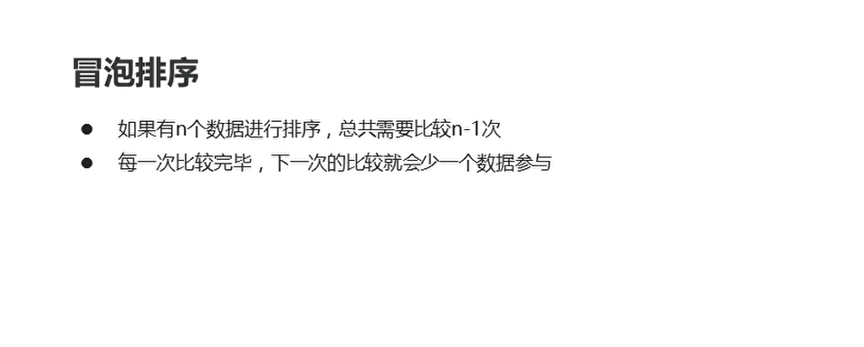
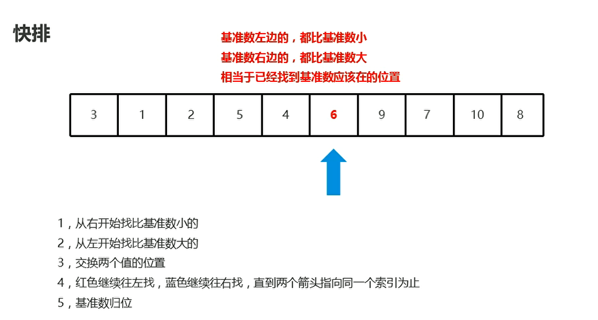

# 数组的高级操作二分查找、冒泡排序、快速排序

## 二分查找

  

```java
package com.hfut.edu.test1;

public class test8 {
    public static void main(String[] args) {
        int[] arr = {1,2,3,4,5,6,7,8,9};
        int number = 3;

        int index = binarySearch(arr,number);// 返回数组的索引
        System.out.println(index);
    }

    private  static int binarySearch(int[] arr,int number){
        // 定义查找范围
        int min = 0;
        int max = arr.length - 1;

        while(min <= max){
            int mid = (min + max) >> 1;// 除以2
            if(arr[mid] > number){
                max = mid -1;
            }
            else if(arr[mid] < number){
                min = mid + 1;
            }
            else{
                return mid;
            }
        }

        return -1;// 没有查找到
    }
}


```


## 冒泡排序

  

```java
package com.hfut.edu.test1;

public class test9 {
    public static void main(String[] args) {

        // 冒泡排序
        int[] arr = {3,5,1,4,2};

        for(int i = 0; i < arr.length - 1; i++)
        {
            // 外层循环控制总的趟数
            for(int j = 0; j < arr.length - 1 - i; j++)
            {
                // 内层循环控制每一趟的比较次数
                // 交换数据
                if(arr[j] > arr[j + 1])
                {
                    int temp = arr[j];
                    arr[j] = arr[j + 1];
                    arr[j + 1] = temp;
                }
            }
        }

        for (int i = 0; i < arr.length; i++) {
            System.out.println(arr[i]);
        }

    }
}


```

## 递归算法

  

```java
package com.hfut.edu.test1;

public class test10 {
    public static void main(String[] args) {
        int result = getJC(5);
        System.out.println(result);
    }

    private static int getJC(int i) {
        if(i == 1){
            return 1;
        }else{
            // 阶乘
            return i * getJC(i - 1);
        }
    }
}
```


## 快速排序

  

  


这里参考Acwing 快速排序的模板

```java
package com.hfut.edu.test1;

public class test11 {
    public static void main(String[] args) {
        int[] arr = {6,1,2,7,9,3,4,5,10,8};
        
        // 快速排序
        quickSort(arr,0,arr.length - 1);

        for (int i = 0; i < arr.length; i++) {
            System.out.println(arr[i]);
        }
    }

    private static void quickSort(int[] arr, int left, int right) {
        // 快速排序的模板
        if(left >= right)
        {
            return;
        }
        int x = arr[(left + right) / 2];// 定义标杆

        // 因为后面的do while操作
        int i = left - 1;
        int j = right + 1;

        while (i < j){
            do i++; while(arr[i] < x);// 遇到大于或者等于x的时候 指针i停止运动
            do j--; while(arr[j] > x);// 遇到小于或者等于x的时候 指针j停止运动

            if(i < j)
            {
                // 交换指针指向的数字
                int temp = arr[i];
                arr[i] = arr[j];
                arr[j] = temp;
            }
        }

        quickSort(arr,left,j);
        quickSort(arr,j + 1,right);

    }
}


```


