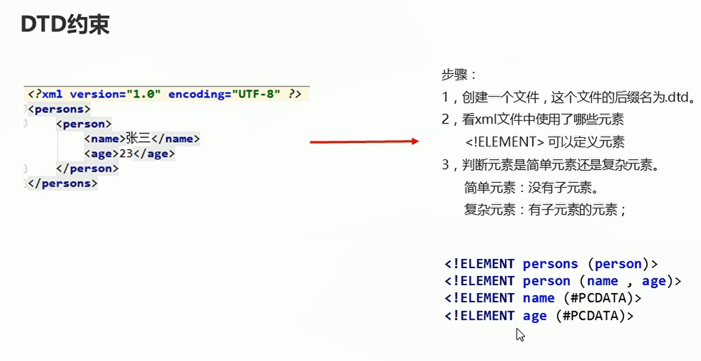

# XML文件的文档约束DTD


## 概述

**用来限定XML文件中可使用的标签以及属性，告诉程序员xml文件该怎么写**

## DTD约束

  

```java
<!ELEMENT persons (person)>
<!ELEMENT person (name,age)>
<!ELEMENT name (#PCDATA)>
<!ELEMENT age (#PCDATA)>

```

## XML文件引入dtd约束

```java

<?xml version="1.0" encoding="UTF-8" ?>
<!DOCTYPE persons SYSTEM 'personDTD.dtd'>
<persons>
    <person>
        <name>张三</name>
        <age>23</age>
    </person>
</persons>
```
**SYSTEM 表示引入本地的dtd文件**

## DTD约束的三种引入方式

* 引入本地dtd
* 在xml文件内部引入
* 引入网络dtd


* 引入本地dtd文件
```java
<?xml version="1.0" encoding="UTF-8" ?>
<!DOCTYPE persons SYSTEM 'personDTD.dtd'>
<persons>
    <person>
        <name>张三</name>
        <age>23</age>
    </person>
</persons>

```

* 在xml文件内部引入

```java
<?xml version="1.0" encoding="UTF-8" ?>
<!DOCTYPE persons [<!ELEMENT persons (person)>
        <!ELEMENT person (name,age)>
        <!ELEMENT name (#PCDATA)>
        <!ELEMENT age (#PCDATA)>]>
<persons>
    <person>
        <name>张三</name>
        <age>23</age>
    </person>
</persons>

```

* 引入网络dtd

```java
<?xml version="1.0" encoding="UTF-8" ?>
<!DOCTYPE persons PUBLIC "dtd的文件名称" "dtd文档的URL">
<persons>
    <person>
        <name>张三</name>
        <age>23</age>
    </person>
</persons>

```

## DTD的语法规则

  

* #REQUIRED表示id这个属性是可以进行修改的

```java
<!ELEMENT persons (person)>
<!ELEMENT person (name,age)>
<!ELEMENT name (#PCDATA)>
<!ELEMENT age (#PCDATA)>
<!ATTLIST person id CDATA #REQUIRED>

```

```java
<?xml version="1.0" encoding="UTF-8" ?>
<!DOCTYPE persons PUBLIC "dtd的文件名称" "dtd文档的URL">
<persons>
    <person id = "1">
        <name>张三</name>
        <age>23</age>
    </person>
</persons>

```

