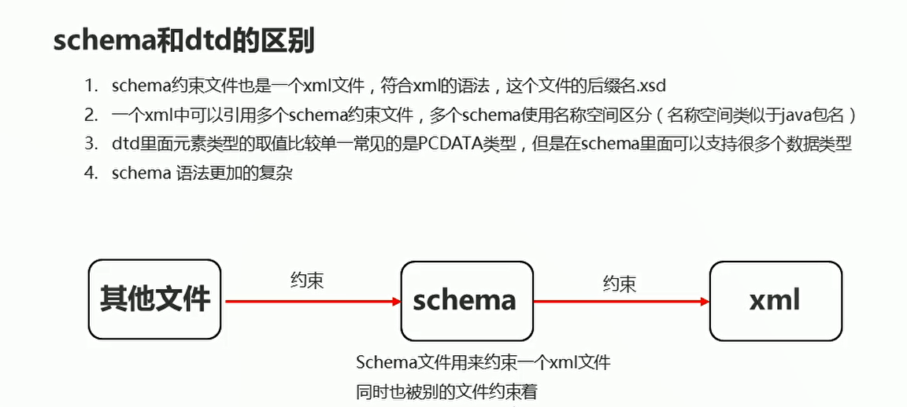

# 文档约束schema

## schema与DTD之间的区别
  

## schema的入门案例

  

```java
<?xml version="1.0" encoding="UTF-8" ?>
<schema
        xmlns="http://www.w3.org/2001/XMLSchema"
        targetNamespace="http://www.baidu.com"
        elementFormDefault="qualified">

<!--    定义persons复杂元素-->
    <element name="persons">
        <complexType>
            <sequence>
<!--                定义person复杂元素-->
                <element name = "person">
                    <complexType>
                        <sequence>
<!--                            定义name和age元素  定义简单元素-->
                            <element name = "name" type = "string"></element>
                            <element name = "age" type = "string"></element>
                        </sequence>
                    </complexType>
                </element>

            </sequence>
        </complexType>

    </element>


</schema>

```

person.xml
```java
<?xml version="1.0" encoding="UTF-8" ?>

<persons>
    <person id = "1">
        <name>张三</name>
        <age>23</age>
    </person>
</persons>
```

## 引入schema约束文件

```java
<?xml version="1.0" encoding="UTF-8" ?>

<persons
    xmlns:xsi="http://www.w3.org/2001/XMLSchema-instance"
    xmlns="http://www.baidu.com"
    xsi:schemaLocation="http://www.baidu.com person.xsd"
>
    <person>
        <name>张三</name>
        <age>23</age>
    </person>
</persons>

```

## schema定义属性


  

```java
<?xml version="1.0" encoding="UTF-8" ?>
<schema
        xmlns="http://www.w3.org/2001/XMLSchema"
        targetNamespace="http://www.baidu.com"
        elementFormDefault="qualified">

<!--    定义persons复杂元素-->
    <element name="persons">
        <complexType>
            <sequence>
<!--                定义person复杂元素-->
                <element name = "person">
                    <complexType>
                        <sequence>
<!--                            定义name和age元素  定义简单元素-->
                            <element name = "name" type = "string"></element>
                            <element name = "age" type = "string"></element>
                        </sequence>
<!--                        添加一个属性-->
                        <attribute name = "id" type = "string" use = "required"></attribute>
                    </complexType>
                </element>

            </sequence>
        </complexType>

    </element>


</schema>
```

person.xml

```java
<?xml version="1.0" encoding="UTF-8" ?>

<persons
    xmlns:xsi="http://www.w3.org/2001/XMLSchema-instance"
    xmlns="http://www.baidu.com"
    xsi:schemaLocation="http://www.baidu.com person.xsd"
>
    <person id = "1">
        <name>张三</name>
        <age>23</age>
    </person>
</persons>

```
