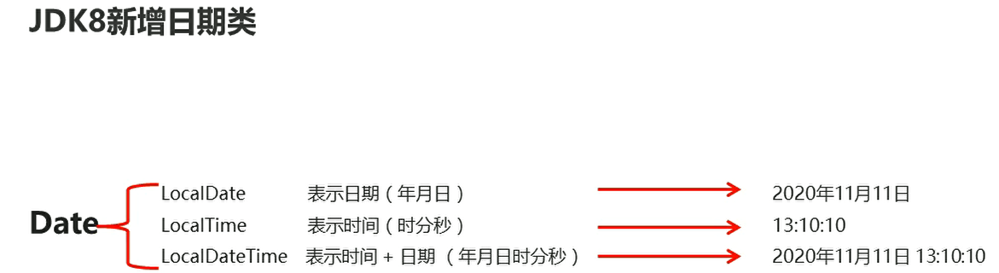
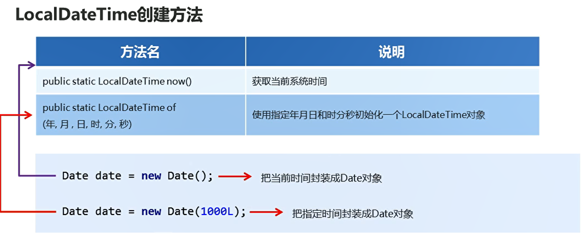

# 日期类

## Date概述

  


```java
package com.hfut.edu.test2;

import java.util.Date;

public class test1 {
    public static void main(String[] args) {
        Date date1 = new Date();
        System.out.println(date1);// 表示电脑中的当前时间

        Date date2 = new Date(0L);
        System.out.println(date2);
        // 从计算机的时间原点开始 过了指定毫秒的那个时间
        // 从时间远点开始 过了0毫秒

        Date date3 = new Date(3600L * 1000);// 上午九点
        System.out.println(date3);
    }
}
```

## Date类常用成员方法

  

```java
package com.hfut.edu.test2;
import java.util.Date;

public class test2 {
    public static void main(String[] args) {
        // 将当前时间封装成一个date对象
        Date date1 = new Date();
        // 获取该对象的毫秒值
        System.out.println(date1.getTime());

        // 也是获取当前时间的毫秒值
        long l = System.currentTimeMillis();
        System.out.println(l);
        
        // 修改时间
        date1.setTime(0L);// 设置成时间原点
        System.out.println(date1);

    }
}
```

## SimpleDateFormat

&emsp;SimpleDateFormat可以对Date对象进行格式化和解析

  

  

  


* 将指定日期对象按照指定格式转换成字符串 format
```java
package com.hfut.edu.test2;

import java.text.SimpleDateFormat;
import java.util.Date;
import java.util.SimpleTimeZone;

public class test3 {
    public static void main(String[] args) {
        Date date = new Date();
        SimpleDateFormat sdf = new SimpleDateFormat("yyyy年MM月dd日 HH:mm:ss");// 指定字符串格式 简化Date对象

        String result1 = sdf.format(date);// 将指定的日期对象转换成指定格式的字符串
        System.out.println(result1);
    }
}
```

* 将日期字符串按照指定格式转换成日期对象 parse

```java
package com.hfut.edu.test2;
import java.text.ParseException;
import java.text.SimpleDateFormat;
import java.util.Date;

public class test4 {
    public static void main(String[] args) throws ParseException {
        String s = "2048-01-01";
        SimpleDateFormat sdf = new SimpleDateFormat("yyyy-MM-dd");// 日期字符串使用- 间隙格式也必须使用-
        // 将指定日期字符串按照指定格式转换成日期对象
        Date d = sdf.parse(s);
        System.out.println(d);
    }
}
```

## 案例:秒杀活动

  

```java
package com.hfut.edu.test2;

import java.text.ParseException;
import java.text.SimpleDateFormat;
import java.util.Date;

public class test5 {
    public static void main(String[] args) throws ParseException {
        String start = "2020年11月11日 0:0:0";
        String end = "2020年11月11日 0:10:0";
        String jia = "2020年11月11日 0:03:0";
        String pi = "2020年11月11日 0:10:22";

        SimpleDateFormat sdf = new SimpleDateFormat("yyyy年MM月dd日 HH:mm:ss");

        // 使用指定格式进行解析  然后获取毫秒值
        long StartTime = sdf.parse(start).getTime();
        long EndTime = sdf.parse(end).getTime();
        
        // 全部转换成毫秒值 方便进行转换
        long JTime  = sdf.parse(jia).getTime();
        long PTime  = sdf.parse(pi).getTime();

        if(JTime >= StartTime && JTime <= EndTime){
            System.out.println("参加上了秒杀活动");
        }
        else{
            System.out.println("没有参加上秒杀活动");
        }

        if(PTime >= StartTime && PTime <= EndTime){
            System.out.println("参加上了秒杀活动");
        }
        else{
            System.out.println("没有参加上秒杀活动");
        }

    }
}
```

## 案例：在当前时间加上一天时间

```java

package com.hfut.edu.test2;

import java.sql.SQLOutput;
import java.text.ParseException;
import java.text.SimpleDateFormat;
import java.util.Date;

public class test6 {
    public static void main(String[] args) throws ParseException {

        // 案例在指定时间字符串上面  加上一天 再返回时间字符串
        String s = "2020年11月11日 00:00:00";
        SimpleDateFormat sdf = new SimpleDateFormat("yyyy年MM月dd日 HH:mm:ss");

        // 将时间字符串进行解析 解析成日期对象 然后转换成时间
        Date d = sdf.parse(s);
        long time = d.getTime();
        System.out.println(time);

        // 在当前时间的基础上  添加一天
        time = time + (1000 * 60 * 60 * 24);

        // 包装成日期Date对象
        Date newDate = new Date(time);


        // 将Date对象转换成时间字符串
        String result = sdf.format(newDate);

        System.out.println(result);

    }
}

```

## JDK8新增日期类

  

  

* LocalDateTime.now() 获取当前的系统时间
* LocalDateTime.of(指定时间) 按照指定时间初始化一个Date对象

```java
package com.hfut.edu.test2;

import java.time.LocalDateTime;

public class test7 {
    public static void main(String[] args) {
        // 打印当前时间
        LocalDateTime now = LocalDateTime.now();
        System.out.println(now);

        //指定当前时间

        LocalDateTime localDateTime = LocalDateTime.of(2023,1,1,1,1,1);
        System.out.println(localDateTime);
    }
}

```

## 获取时间中的一个值

  

```java
package com.hfut.edu.test2;
import java.time.DayOfWeek;
import java.time.LocalDateTime;

public class test8 {
    public static void main(String[] args) {
        LocalDateTime localDateTime = LocalDateTime.of(2020,11,11,1,1,1);

        int year = localDateTime.getYear();// 获取年份
        System.out.println("年份y "+ year);
        int month = localDateTime.getMonthValue();
        System.out.println("月份" + month);

        // 获取分钟
        int minute = localDateTime.getMinute();
        System.out.println(minute);

        // 获取小时
        int hour = localDateTime.getHour();
        System.out.println(hour);

        int dayOfYear = localDateTime.getDayOfYear();// 获取一年中的第几天
        System.out.println(dayOfYear);

        int dayOfMonth = localDateTime.getDayOfMonth();
        System.out.println(dayOfMonth);// 获取一个月中的第几天

        DayOfWeek dayOfWeek = localDateTime.getDayOfWeek();// 获取星期
        System.out.println(dayOfWeek);

    }
}

```

## LocalDateTime转换方法

  


```java
package com.hfut.edu.test3;

import java.time.LocalDate;
import java.time.LocalDateTime;
import java.time.LocalTime;

public class test1 {
    public static void main(String[] args) {
        LocalDateTime localDateTime = LocalDateTime.of(2020,12,12,1,1,1);

        // 转换成LocalDate对象
        LocalDate localDate = localDateTime.toLocalDate();// 转换成日期对象  去掉时分秒
        System.out.println(localDate);

        // 转换成为一个LocalTime对象
        LocalTime localTime = localDateTime.toLocalTime();// 打印时分秒  去掉年月日
        System.out.println(localTime);
    }
}
```

## LocalDateTime格式化和解析

  


* 将LocalDateTime按照指定格式转换成日期对象

```java
package com.hfut.edu.test3;

import java.time.LocalDateTime;
import java.time.format.DateTimeFormatter;

public class test2 {
    public static void main(String[] args) {
        // 指定日期 设置时间对象
        LocalDateTime localDateTime = LocalDateTime.of(2020,1,1,1,1,1);
        System.out.println(localDateTime);

        // 将日期对象 解析成指定格式的时间字符串
        DateTimeFormatter pattern = DateTimeFormatter.ofPattern("yyyy年MM月dd日 HH:mm:ss");

        // 将指定日期对象按照指定格式进行转换
        String s = localDateTime.format(pattern);
        System.out.println(s);
    }
}
```

* 将日期对象解析成LocalDateTime对象

```java

package com.hfut.edu.test3;
import java.time.LocalDateTime;
import java.time.format.DateTimeFormatter;

public class test3 {
    public static void main(String[] args) {
        String s = "2023年11月12日 13:12:11";// 准备解析的字符串
        DateTimeFormatter pattern = DateTimeFormatter.ofPattern("yyyy年MM月dd日 HH:mm:ss");
        LocalDateTime parse = LocalDateTime.parse(s,pattern);// 将字符串按照指定格式解析成 LocalDateTime对象
        System.out.println(parse);
    }
}


```

## LocalDateTime 增加或者减少时间的方法

  

  

```java
package com.hfut.edu.test3;

import java.time.LocalDateTime;

public class test4 {
    public static void main(String[] args) {

        LocalDateTime localDateTime = LocalDateTime.of(2020,11,11,1,1,1);
        // 增加一年
        LocalDateTime newlocalDateTime = localDateTime.plusYears(1);// 增加一年  不是静态方法
        LocalDateTime newlocalDateTime1 = localDateTime.plusYears(-1);// 减少一年 不是静态方法

        System.out.println(newlocalDateTime);
        System.out.println(newlocalDateTime1);
        
    }
}
```

  


  

```java
package com.hfut.edu.test3;

import java.time.LocalDateTime;

public class test4 {
    public static void main(String[] args) {

        LocalDateTime localDateTime = LocalDateTime.of(2020,11,11,1,1,1);
        // 增加一年
        LocalDateTime newlocalDateTime = localDateTime.plusYears(1);// 增加一年  不是静态方法
        LocalDateTime newlocalDateTime1 = localDateTime.plusYears(-1);// 减少一年 不是静态方法

        System.out.println(newlocalDateTime);
        System.out.println(newlocalDateTime1);

        LocalDateTime new1 = newlocalDateTime1.minusYears(1);// 减少一年
        System.out.println(new1);

    }
}
```


## 修改时间的方法
  

```java
package com.hfut.edu.test3;

import java.time.LocalDateTime;

public class test5 {
    public static void main(String[] args) {

        LocalDateTime localDateTime = LocalDateTime.of(2020,1,1,1,1,1);

        // 修改时间方法  不是静态方法
        LocalDateTime localDateTime1 = localDateTime.withYear(2048);
        System.out.println(localDateTime1);// 将时间对象中的年份 修改成2048


    }
}
```

## 时间间隔对象

  


```java
package com.hfut.edu.test3;

import java.time.LocalDate;
import java.time.LocalDateTime;
import java.time.Period;

public class test6 {
    public static void main(String[] args) {
        LocalDate localDate1 = LocalDate.of(2020,1,1);
        LocalDate localDate2 = LocalDate.of(2021,11,11);

        // 计算时间间隔
        Period between = Period.between(localDate1, localDate2);
        System.out.println(between);

        System.out.println(between.getYears());
        System.out.println(between.getMonths());


    }
}
```


