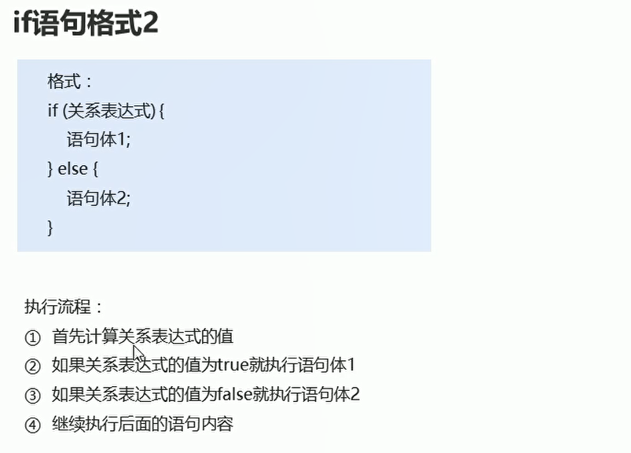

# 条件控制语句

## if条件语句

* 条件控制格式1
  

* 条件控制格式2
  

* 条件控制格式3
  


## switch语句

```java
package com.ustc.base.DataFormat;

import java.util.Scanner;

public class test4 {
    public static void main(String[] args) {
        Scanner sc = new Scanner(System.in);
        System.out.println("请输入星期数");
        int week = sc.nextInt();
        switch (week)
        {
            case 1:
                System.out.println("周一");
                break;
            case 2:
                System.out.println("周二");
                break;
            default:
                System.out.println("周日");
                break;
        }

    }
}


```


