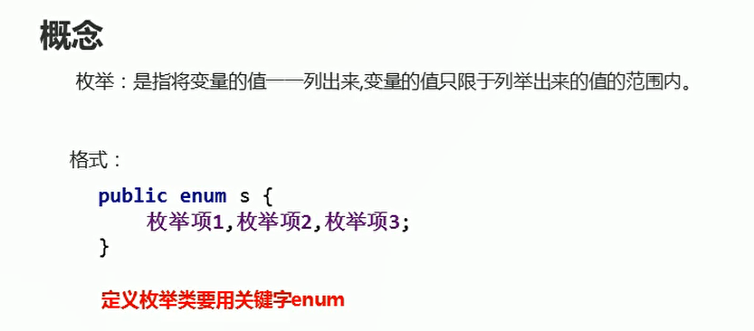
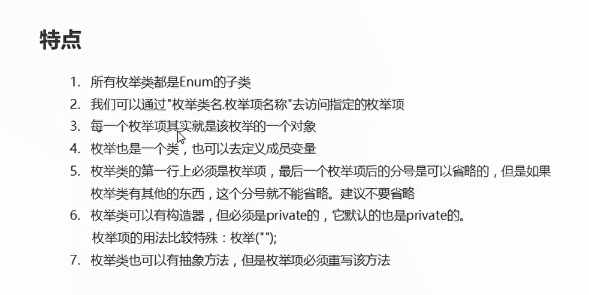

# 枚举

## 概述

**JAVA为了表示一些固定的值**

  

## 简单使用-定义格式

```java
package com.hfut.edu.test17;

public enum Season {
    SPRING,SUMMER,AUTUMN,WINTER;// 定义枚举类型
}
```

## 枚举的特点
  

```java
package com.hfut.edu.test17;

public class SemonDemo {
    public static void main(String[] args) {
        // 通过枚举类名.枚举项 去访问指定项
        System.out.println(Season.SPRING);
        System.out.println(Season.SUMMER);
        System.out.println(Season.AUTUMN);
        System.out.println(Season.WINTER);

        // 每一个枚举项其实就是该枚举的一个对象
        Season spring = Season.SPRING;
    }
}
```

```java
package com.hfut.edu.test17;

public enum Season {

    // 枚举项只能放在第一行 每一个枚举项 都是一个对象 默认调用无参构造
    SPRING,SUMMER,AUTUMN,WINTER;// 定义枚举类型

    // 枚举也是一个类 可以定义成员变量
    private int age;

    // 无参数构造
    private Season(){}

    // 有参数构造
    private Season(int age){
        this.age = age;
    }

}

```

**枚举类也可以有抽象方法，但是枚举项必须要有抽象方法**

```java
package com.hfut.edu.test17;

public enum Season {

    // 枚举项只能放在第一行 每一个枚举项 都是一个对象 默认调用无参构造

    // 枚举项构造
    SPRING(3){
        public void show(){
            System.out.println(this.age);
        }
    },SUMMER(4){
        @Override
        public void show() {
            System.out.println(this.age);
        }
    },AUTUMN(5){
        @Override
        public void show() {
            System.out.println(this.age);
        }
    },WINTER(6){
        @Override
        public void show() {
            System.out.println(this.age);
        }
    };// 定义枚举类型

    // 枚举也是一个类 可以定义成员变量
    public int age;

    // 无参数构造
    private Season(){}

    // 有参数构造
    private Season(int age){
        this.age = age;
    }

    // 抽象方法
    public abstract void show();// 枚举类中有抽象方法
}


```


## 枚举的方法

```java
package com.hfut.edu.test17;

public class SemonDemo {
    public static void main(String[] args) {
        // 获取枚举项的名称
        String name = Season.SPRING.name();
        System.out.println(name);
        System.out.println("------------------------------");

        int index1 = Season.SPRING.ordinal();// 获取索引项的索引值
        int index2 = Season.SUMMER.ordinal();
        System.out.println(index1);
        System.out.println(index2);

        // compareTo(E o) 比较两个枚举项 返回的是索引值的差值
        int result = Season.SPRING.compareTo(Season.WINTER);
        System.out.println(result);// 输出 -3

        // 返回枚举常量的名称
        String s = Season.SPRING.toString();
        System.out.println(s);

        // 获取指定枚举类中的指定名称的枚举值
        Season spring = Enum.valueOf(Season.class,"SPRING");
        System.out.println(spring);
        System.out.println(Season.SPRING == spring);
        System.out.println("----------------------------------------------");

        // 获取所有的枚举项
        Season[] values = Season.values();
        for (Season value : values) {
            System.out.println(value);
        }

    }
}


```


