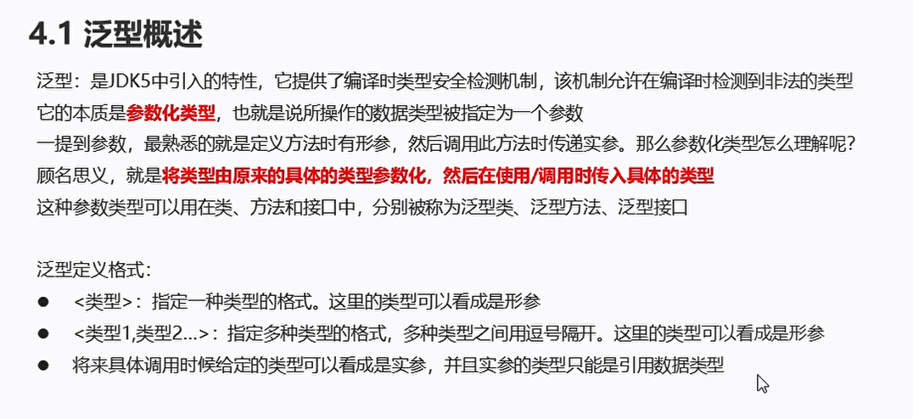
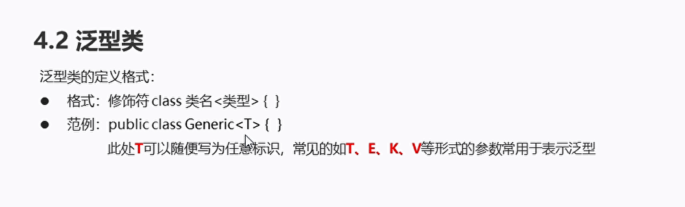
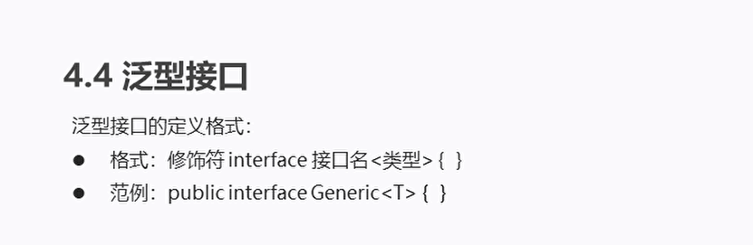
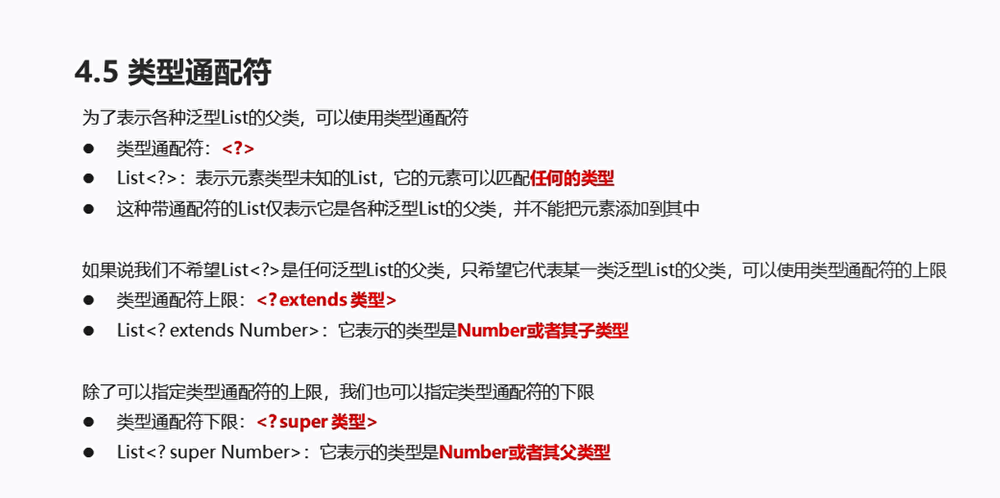
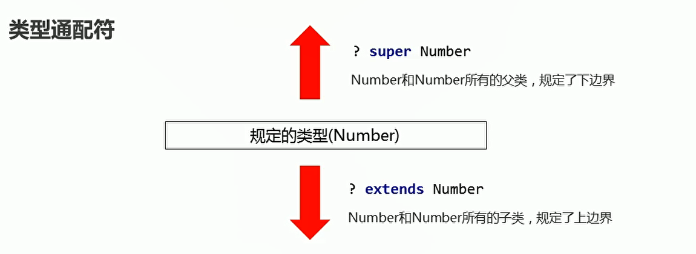

# 泛型

## 概述

  


```java
package com.hfut.edu.test4;

import java.util.ArrayList;
import java.util.Collection;
import java.util.Iterator;

public class test9 {
    public static void main(String[] args) {
        // 创建集合对象  泛型：String类型
        Collection<String> c = new ArrayList<>();// 父类引用指向子类对象

        // 添加元素
        c.add("xxx");
        c.add("xxx1");
        c.add("xx2x1");
        c.add("xxx2");

        // 遍历集合
        Iterator<String> it = c.iterator();
        
        // 遍历集合每一个元素
        while(it.hasNext()){
            String s = it.next();
            System.out.println(s);
        }

    }

}

```

泛型的好处：

* 把运行时期的问题提前到编译期间
* 避免了强制类型转换

## 泛型类


  


```JAVA
package com.hfut.edu.test5;

public class test1 {
    public static void main(String[] args) {
        Student s = new Student();
        s.setName("林青霞");
        System.out.println(s.getName());

        Teacher t= new Teacher();
        t.setAge(30);
        System.out.println(t.getAge());

        // 使用泛型类来完成  String类型
        Generic<String> g1 = new Generic<>();
        g1.setT("fhdjiawsfhrciuksa");
        System.out.println(g1.getT());

        // 使用泛型类来完成  Integer类型
        Generic<Integer> g2 = new Generic<>();
        g2.setT(111);
        System.out.println(g2.getT());


    }
}


```

定义的泛型类

```java
package com.hfut.edu.test5;

// 创建泛型类
public class Generic<T> {
    private T t;

    public T getT() {
        return t;
    }

    public void setT(T t) {
        this.t = t;
    }
}
```


## 自定义泛型类

泛型类
```java
package com.hfut.edu.test6;

// 泛型类改进
public class test1<T>{

    // 不需要写成重载函数的形式
    public void show(T t){
        System.out.println(t);
    }
}

```

```java
package com.hfut.edu.test6;

public class Main {
    public static void main(String[] args) {
        test1<String> t = new test1<>();// 泛型类 String
        t.show("xxxxxxxxx");
        t.show("61479878");
        test1<Integer> h = new test1<>();
        h.show(11);
    }
}


```


**使用泛型方法进行改进，使得该方法可以接受任意的数据类型**

```java
package com.hfut.edu.test6;

public class test1{

    // 使用泛型方法 传递任意参数
    public <T> void show(T t){
        System.out.println(t);
    }
}

```

```java
package com.hfut.edu.test6;

public class Main {
    public static void main(String[] args) {
        test1 t = new test1();

        t.show("xxx");
        t.show(1111);


    }
}
```

## 泛型接口

  

* 泛型接口
```java
package com.hfut.edu.test7;

public interface testInterface<T> {
    void show(T t);// 创建 泛型接口
}


```

* 泛型接口的实现类

```java
package com.hfut.edu.test7;

public class Imp<T> implements testInterface<T> {
    // 泛型接口的实现类
    // 重写泛型方法

    @Override
    public void show(T t) {
        System.out.println(t);
    }
}

```

* 主方法
```java
package com.hfut.edu.test7;

public class Main {
    public static void main(String[] args) {
        Imp<String> i = new Imp<>();
        i.show("xxxxxxxxx");

        testInterface<Integer> s = new Imp<>();// 父类引用指向子类对象
        s.show(50);
    }
}


```

## 类型通配符

  

  

```java
package com.hfut.edu.test7;

import java.util.ArrayList;
import java.util.Objects;

public class test {
    public static void main(String[] args) {
        ArrayList<Integer> list1 = new ArrayList<>();
        ArrayList<Number> list2 = new ArrayList<>();
        ArrayList<Objects> list3 = new ArrayList<>();

        printlist(list1);
        printlist(list2);

        // object Number Integer
        method1(list1);
        method1(list2);
//        method1(list3);// 报错 因为传入的类型 不是Number或者是Number的子类型
    }

    // 表示传递进来的集合类型 可以是Number类型  也可以是Number所有子类类型
    private static void method1(ArrayList<? extends Number> list){

    }

    // 表示传递进来的集合的类型 可以是NUmber类型 也可以是Number的所有父类类型
    private static void method2(ArrayList<? super Number> list){

    }


    private static void printlist(ArrayList<?> list) {
        System.out.println("类型通配符");
    }
}

```


