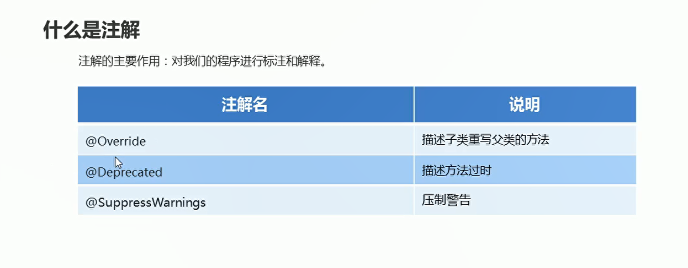
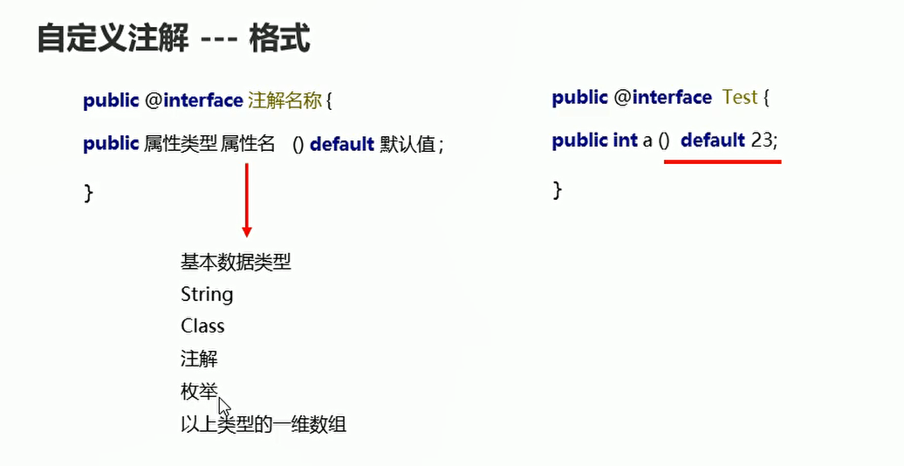
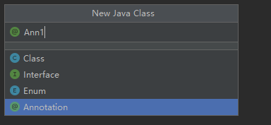

# 注解

## 概述

作用：对我们的程序进行标注和解释

  

```java
package com.hfut.edu.test18;

public class test2 extends test1{

    // 注解：表示已经过时的方法
    @Deprecated
    public void method(){
        System.out.println("过时的方法-------------");
    }

    // 注解：表示已经重写的方法
    @Override
    public void show() {
        super.show();
        // 重写show方法
        System.out.println("子类的方法");
    }

    // 注解：表示压制该方法中所有的警告
    @SuppressWarnings(value = "all")
    public void method1(){
        int a = 10;
        int b = 10;
    }
}


```

## 自定义注解

  


* 定义一个注解

  

```java
package com.hfut.edu.test18;

public @interface Ann1 {
    // 定义一个基本类型的属性
    int a() default 23;

    // 定义一个String 类型的属性
    public String name(); // 没有给出默认值

    // 定义一个Class类型的属性  字节码类型  默认也是Ann2的字节码
    public Class clazz() default Ann2.class;

    // 定义一个注解类型的属性
    public Ann2 anno() default @Ann2;

    // 定义一个枚举类型的属性
    public Season season() default Season.SPRING;

    // 以上类型的一维数组
    public int[] arr() default {1,2,3,4,5};

    // 枚举数组
    public Season[] seasons() default {Season.SPRING,Season.SUMMER};
}
```

## 自定义注解练习

* 包含注解的类

```java
package com.hfut.edu.test19;

public class UseTest {
    // 没有使用Test注解
    public void show(){
        System.out.println("没有使用Test注解");
    }

    // 使用Test注解
    @Test
    public void method(){
        System.out.println("使用Test注解");
    }
}
```

* 测试
```java
package com.hfut.edu.test19;

import java.lang.reflect.InvocationTargetException;
import java.lang.reflect.Method;

public class Main {
    public static void main(String[] args) throws ClassNotFoundException, InstantiationException, IllegalAccessException, InvocationTargetException {
        // 通过反射获取UseTest类的字节码文件对象
        Class clazz = Class.forName("com.hfut.edu.test19.UseTest");

        // 通过反射获取这个类里面所有的方法对象
        Method[] methods = clazz.getDeclaredMethods();

        // 创建对象
        UseTest useTest = (UseTest) clazz.newInstance();// 使用字节码文件对象来创建对象
        
        // 增强for循环遍历数组
        for (Method method : methods) {
            // method表示每一个方法对象
            // 判断当前方法上是否有指定的注解
            if(method.isAnnotationPresent(Test.class)){
                method.invoke(useTest);
            }
        }
    }
}


```
