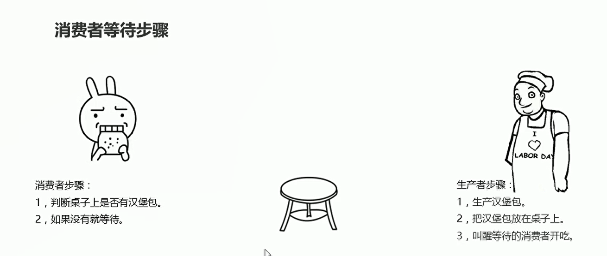
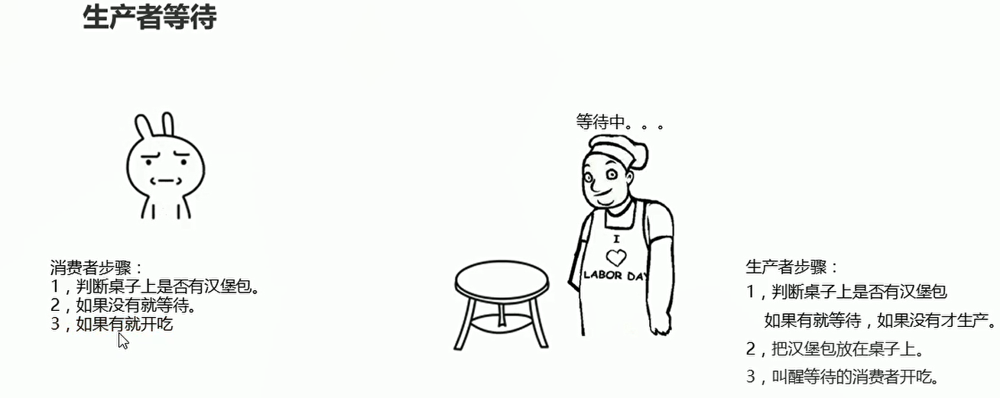
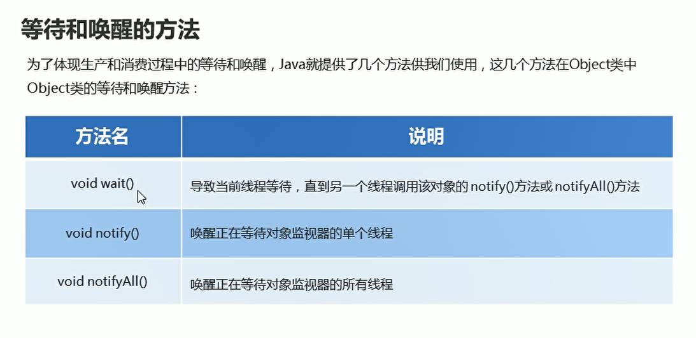

# 生产者与消费者

## 概述

* 消费者等待

  

* 生产者等待

  

## 代码实现

* 等待和唤醒的方法
  


## 生产者消费者代码

* 消费者

```java
package com.hfut.edu.test11;

public class foodie extends Thread{
    // 重写run方法
    public void run(){
        // 判断桌子上是否有汉堡
        // 如果没有就等待
        // 如果有就开吃
        // 吃完 唤醒生产者
        // 汉堡数量建议
        while(true){
            synchronized (Desk.lock){
                if(Desk.count == 0){
                    break;
                }else{
                    if(Desk.flag == true){
                        System.out.println("吃货正在吃汉堡");
                        Desk.flag = false;// 桌子上没有汉堡
                        Desk.lock.notifyAll();// 唤醒其他线程
                        Desk.count--;// 汉堡数量减一
                    }else{
                        // 没有等待 使用对象锁去唤醒
                        try {
                            Desk.lock.wait();
                        } catch (InterruptedException e) {
                            throw new RuntimeException(e);
                        }
                    }
                }
            }
        }

    }
}


```

* 生产者

```java
package com.hfut.edu.test11;

public class Cooker extends Thread{
    @Override
    public void run() {
//        super.run();
        while(true){
            synchronized (Desk.lock){
                if(Desk.count == 0){
                    break;
                }else{
                    if(!Desk.flag){
                        // 进行生产
                        System.out.println("厨师正在生产汉堡");
                        Desk.flag = true;
                        Desk.lock.notifyAll();// 唤醒消费者
                    }else{
                        // 生产者进行等待
                        try {
                            Desk.lock.wait();
                        } catch (InterruptedException e) {
                            throw new RuntimeException(e);
                        }
                    }
                }
            }
        }

    }
}


```

* 桌子

```java
package com.hfut.edu.test11;

public class Desk {
    public static  boolean flag = false;// 标记 true表示桌子上有汉堡包  此时允许消费者执行 false 表示桌子上没有汉堡 允许生产者执行

    public static int count = 10;// 汉堡的总数

    // 锁对象
    public static final Object lock = new Object();// 静态常量对象 直接使用类名进行修改

}
```

* 主函数
```java
package com.hfut.edu.test11;

public class test8 {
    public static void main(String[] args) {
        foodie f = new foodie();
        Cooker c = new Cooker();

        f.start();
        c.start();
    }
}

```


