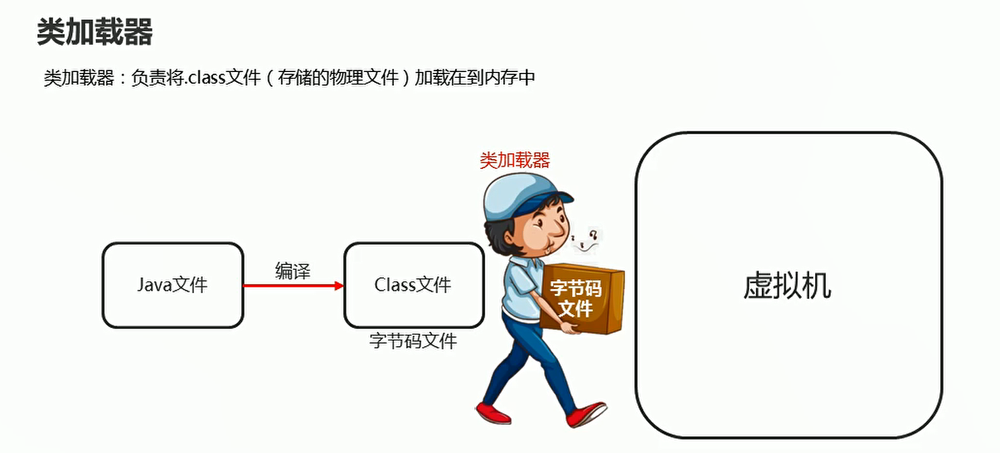
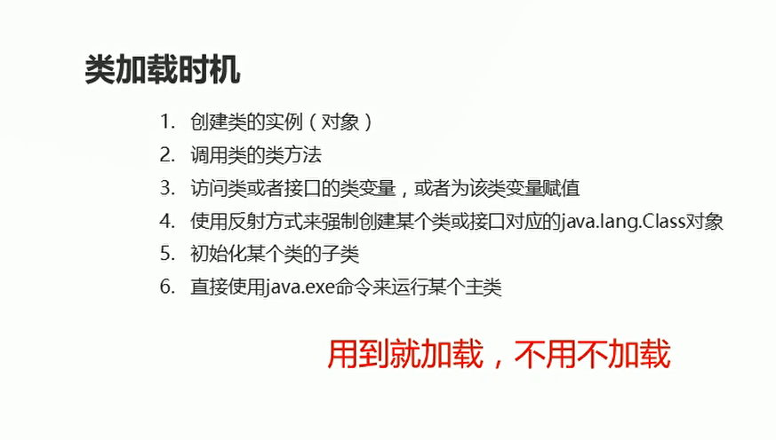
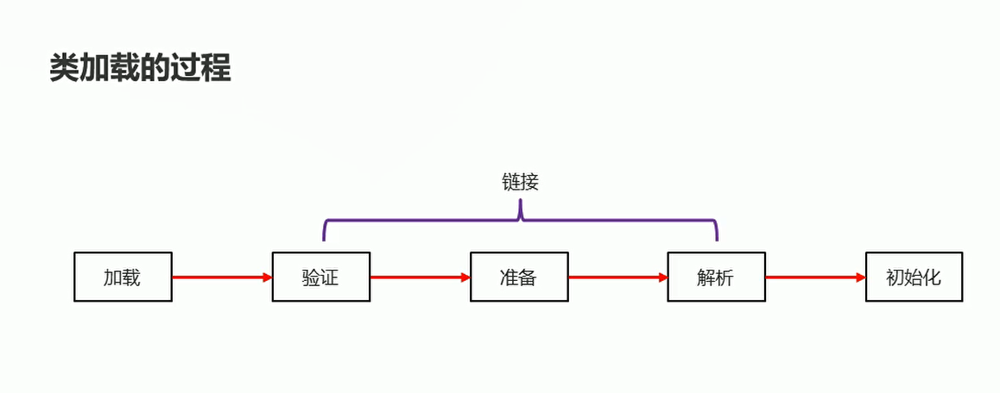
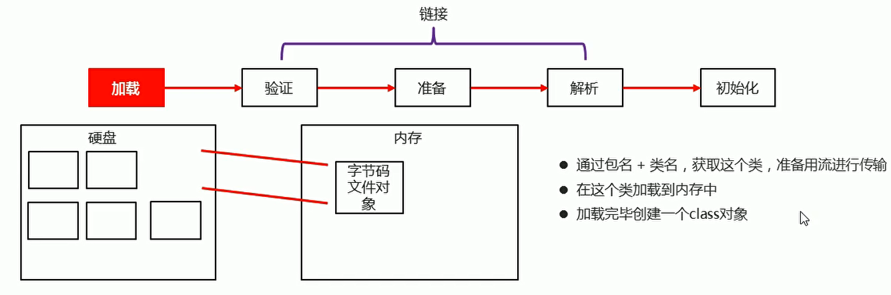
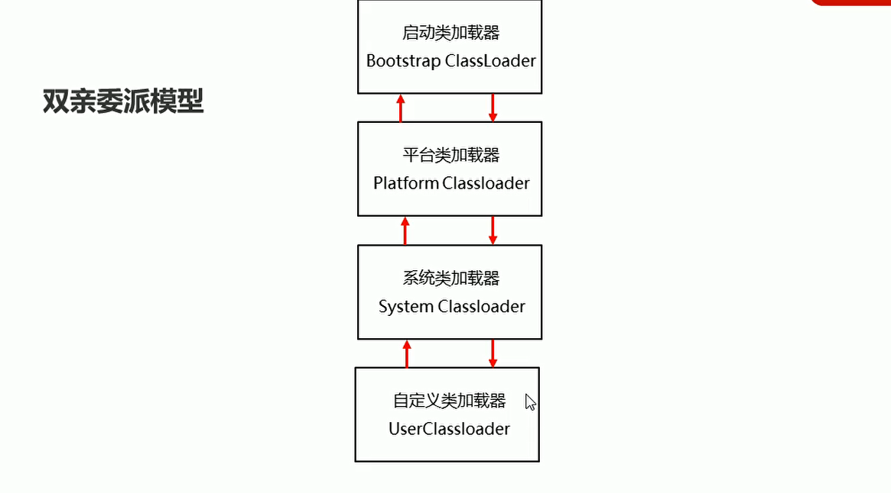
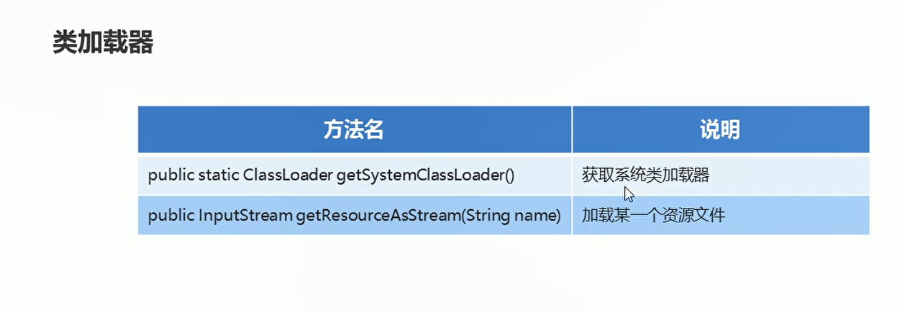

# 类加载器

## 概述

**负责将字节码文件加载到内存中**
  

## 类加载时机

* 创建类的实例对象
* 调用类的类方法
* 访问类或者接口的类变量，或者为该类变量赋值
* 使用反射方式来强制创建某个类或者接口对应的java.lang.Class对象
* 初始化某个类的子类
* 直接使用java.exe命令来吧运行某一个主类


  

## 类加载的过程-加载

  

* 通过一个类的全限定名来获取定义此类的二进制字节流，通过包名 + 类名，获取这个类，准备用流进行传输
* 将这个字节流所代表的静态存储结构转换为运行时的数据结构，在这个类加载到内存中
* 在内存中生成一个代表这个类的java.lang.Class对象，任何类被使用时，系统都会为之建立一个java.lang.class对象，加载完毕创建一个class对象
  


## 类加载的过程-链接

* 链接第一步验证：确保Class文件字节流中包含的信息符合当前虚拟机的要求，并且不会危害虚拟机自身的安全
* 准备：负责为类的类变量(被static修饰的变量)分配内存，并设置默认初始化值。
* 解析：将类的二进制数据流中的符号引用替换为直接引用

## 类加载的过程-初始化

* 根据程序员通过程序指定的主观计划去初始化类变量和其他资源：静态变量赋值以及初始化其他资源

## 类加载器的分类

  

## 类加载器-双亲委派模型

  

```java
package com.hfut.edu.test17;

public class ClassLoader1 {
    public static void main(String[] args) {
        // 获取系统类加载器
        ClassLoader systemClassLoader = ClassLoader.getSystemClassLoader();

        // 获取系统类加载器的父类加载器  平台类加载器
        ClassLoader classLoader1 = systemClassLoader.getParent();

        // 获取平台类的父类加载器 启动类加载器
        ClassLoader classLoader2 = classLoader1.getParent();

        System.out.println("系统类加载器"+systemClassLoader);
        System.out.println("平台类加载器" + classLoader1);
        System.out.println("启动类加载器"+ classLoader2);
    }
}
```

## 类加载器-常用方法

  

```java
package com.hfut.edu.test17;

import java.io.IOException;
import java.io.InputStream;
import java.util.Properties;

public class ClassLoader2 {
    public static void main(String[] args) throws IOException {
        // 获取系统类加载器
        ClassLoader systemClassLoader = ClassLoader.getSystemClassLoader();
        // 使用加载器去加载一个指定的文件  返回一个字节输入流
        // 该文件建立在src文件夹下面
        InputStream is = systemClassLoader.getResourceAsStream("prop.properties");
        Properties prop = new Properties();
        prop.load(is);// 从输入流中加载文件
        System.out.println(prop);
        is.close();
    }
}
```
