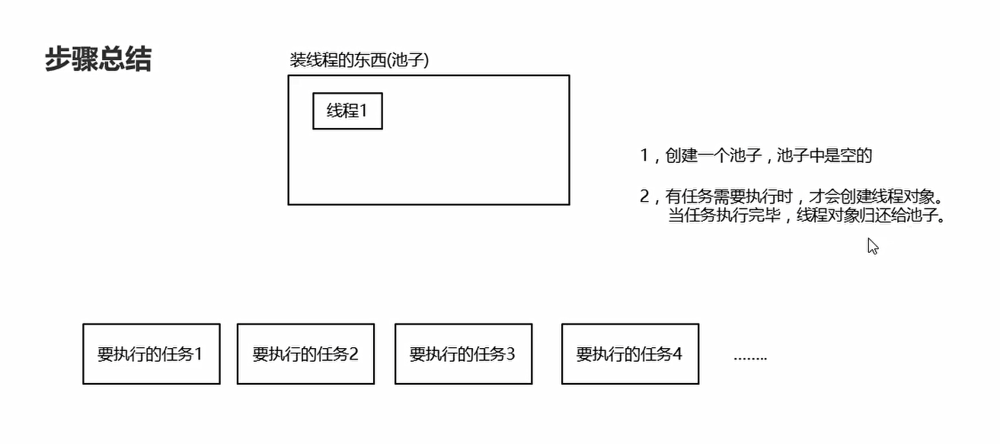
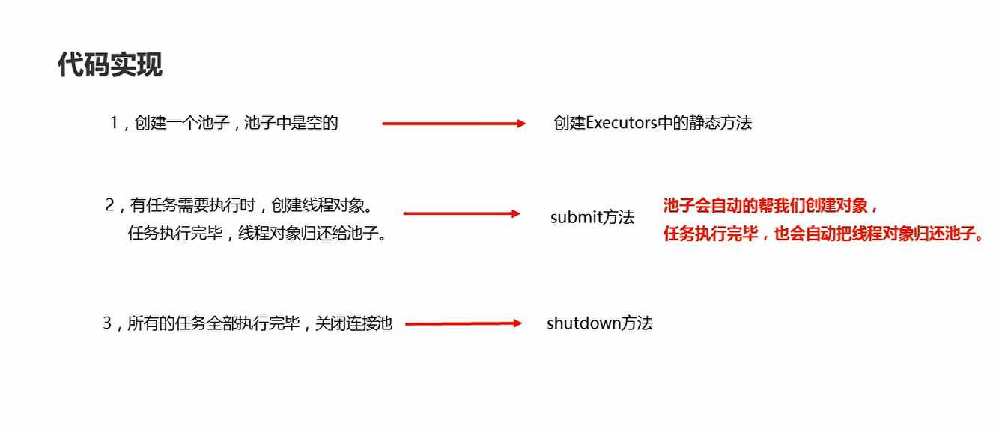
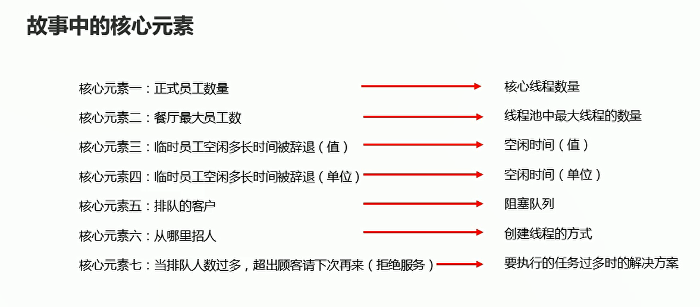
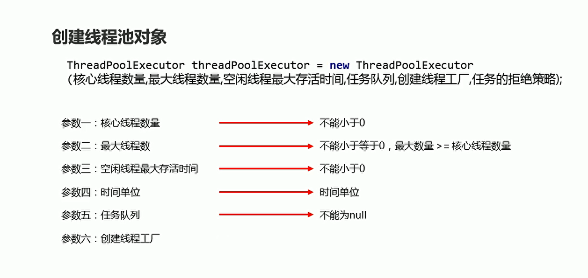
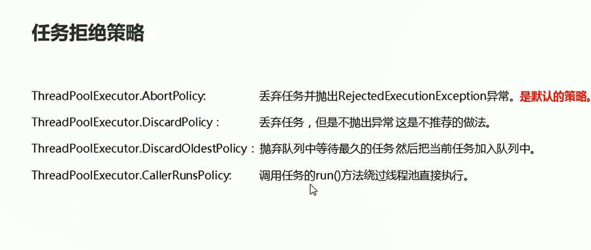
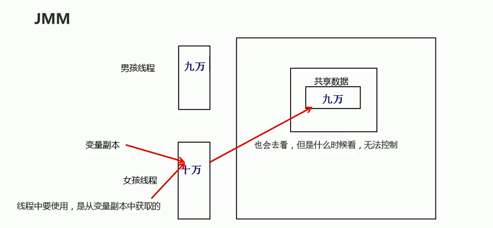
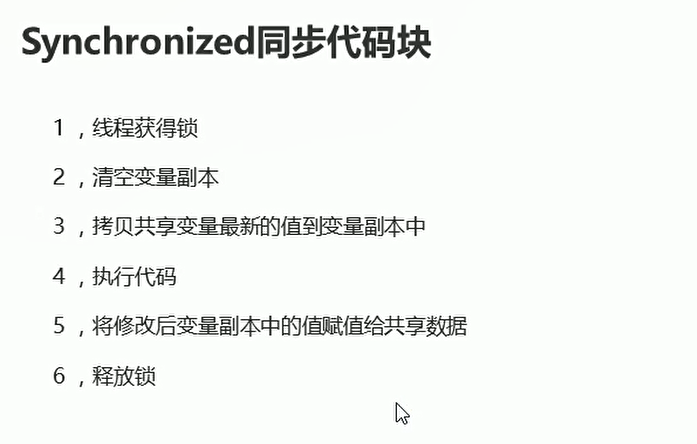

# 线程池


## 概述

  

## 基本使用

  

```java
package com.hfut.edu.test12;

import java.util.concurrent.ExecutorService;
import java.util.concurrent.Executors;

public class test1 {
    public static void main(String[] args) throws InterruptedException {
        // 创建一个默认的线程池对象 池子默认是空的
        ExecutorService executorService = Executors.newCachedThreadPool();

        // Executors 创建线程池对象
        // ExecutorService 帮助我们控制线程池
        // 线程池自动创建线程对象 提交任务
        executorService.submit(()->{
            System.out.println(Thread.currentThread().getName() + "在执行了");
        });

        Thread.sleep(2000);// 主线程休眠2s

        // 创建第二个线程
        executorService.submit(()->{
            System.out.println(Thread.currentThread().getName() + "在执行了");
        });

        executorService.shutdown();// 线程池关闭

    }
}


```

## Executors创建指定上限的线程对象

```java
package com.hfut.edu.test12;

import java.util.concurrent.Executor;
import java.util.concurrent.ExecutorService;
import java.util.concurrent.Executors;
import java.util.concurrent.ThreadPoolExecutor;

public class test2 {
    public static void main(String[] args) {
        ExecutorService executorService = Executors.newFixedThreadPool(10);// 指定最大容量

        ThreadPoolExecutor pool = (ThreadPoolExecutor) executorService;//
        System.out.println(pool.getPoolSize());// 输出池子的容量

        executorService.submit(()->{
            System.out.println(Thread.currentThread().getName() + "在执行了");
        });

        executorService.submit(()->{
            System.out.println(Thread.currentThread().getName() + "在执行了");
        });

        System.out.println(pool.getPoolSize());// 输出2

    }
}


```

## 线程池-ThreadPoolExecutor

  

  

```java
package com.hfut.edu.test12;

import java.util.concurrent.ArrayBlockingQueue;
import java.util.concurrent.Executors;
import java.util.concurrent.ThreadPoolExecutor;
import java.util.concurrent.TimeUnit;

public class test3 {
    public static void main(String[] args) {
        // 参数一：核心线程数量
        // 参数二：最大线程数量
        // 参数三：空闲线程最大的存活时间
        // 参数四：时间单位
        // 参数五：任务队列
        // 参数六：创建线程工厂
        // 参数七：任务的拒绝策略

        ThreadPoolExecutor threadPoolExecutor = new ThreadPoolExecutor(2,5,2, TimeUnit.SECONDS,new ArrayBlockingQueue<>(10), Executors.defaultThreadFactory(),new ThreadPoolExecutor.AbortPolicy());

        threadPoolExecutor.submit(new MyRunable());
    }
}


```

参数讲解：

```
参数一：核心线程数量
参数二：最大线程数量
参数三：空闲线程最大的存活时间
参数四：时间单位 ---- TimeUnit
参数五：任务队列 --- 让任务在队列中等待 等着有空闲线程 再从队列中获取任务并且执行
参数六：创建线程工厂 ---------- 按照默认的方式创建线程对象
参数七：任务的拒绝策略  -----  什么时候拒绝任务 当提交的任务 > 池子中最大的线程数量 + 队列容量
如何拒绝：任务拒绝策略

```


任务拒绝策略：

  


## volatile

  

下面的程序会陷入死循环：


MyThread1
```java
package com.hfut.edu.test13;

public class MyThread1 extends  Thread{

    @Override
    public void run() {
        super.run();
        //不能及时获取共享资源的修改 使用的是变量的副本
        while(Money.money == 10000){

        }
        System.out.println("结婚基金已经不是一万");
    }
}


```

MyThread2

```java
package com.hfut.edu.test13;

public class MyThread2 extends Thread{
    @Override
    public void run() {
        super.run();


        try {
            Thread.sleep(10);
        } catch (InterruptedException e) {
            throw new RuntimeException(e);
        }

        Money.money = 90000;// 修改公共资源

    }
}


```

Money
```java
package com.hfut.edu.test13;

public class Money {
    public static int money = 10000;
}


```

  


小结：

* 堆内存是唯一地，每一个线程都有自己的线程栈
* 每一个线程在使用堆中变量的时候，都会先拷贝一份到变量的副本中
* 在线程中，每一次使用是从变量的副本中获取的


上述死循环的解决办法1：在变量前面添加volatile关键字

```java

package com.hfut.edu.test13;

public class Money {
    public static volatile  int money = 10000;
}

```


上述死循环的解决办法2：使用同步代码块synchronsized

**同步代码块强制线程更新变量副本**

  

```java
package com.hfut.edu.test13;

public class Money {

    public static  Object lock = new Object();// 创建锁对象
    public static volatile  int money = 10000;
}


```

MyThread1

```java
package com.hfut.edu.test13;

public class MyThread1 extends  Thread{

    @Override
    public void run() {
        super.run();

        while(true){
            // 同步代码块
            synchronized (Money.lock){
                if(Money.money != 10000){
                    System.out.println("结婚基金已经不是一万");
                    break;
                }
            }
        }
    }
}


```

MyThread2

```java
package com.hfut.edu.test13;

public class MyThread2 extends Thread{
    @Override
    public void run() {
        super.run();
        synchronized (Money.lock) {
            try {
                Thread.sleep(10);
            } catch (InterruptedException e) {
                throw new RuntimeException(e);
            }
        }

        Money.money = 90000;// 修改公共资源

    }
}


```

