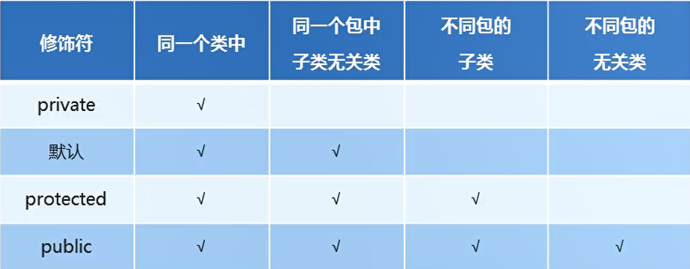

# 继承

## 一、继承的好处和弊端

* 继承的好处
 * 提高了代码的复用性
 * 提高了代码的维护性
 * 让类和类之间产生了关系 是多态的前提

* 继承的弊端
  * 继承是侵入性的
  * 降低代码的灵活性（继承关系，导致子类必须拥有父类非私有属性和方法 让子类自由的世界中多了一些约束)
  * 增强了代码的耦合性（代码与代码之间存在关联都可以将其称之为耦合）

* JAVA 不支持多继承 但是支持多层继承

## 二、继承的成员变量访问特点

* 先在子类局部范围寻找
* 子类成员范围寻找
* 父类成员范围寻找

注意：如果子父类中，出现了重名的成员变量，通过就近原则，会优先使用子类的成员变量，如果一定要使用父类的变量，通过super关键字进行区分。

子类：

```java
package com.ustc.base.DataFormat;

public class B extends A{
    int a  =20;
    public void aa()
    {
        int a = 30;
        System.out.println(a);// 打印30
        System.out.println(this.a);//打印20  子类的成员变量
        System.out.println(super.a);// 打印10 父类的成员变量
    }
}

```

父类：

```java
package com.ustc.base.DataFormat;

public class A {
    int a = 10;
}


```

  


继承中成员方法的访问特点：

* 先在子类对象访问一个方法
* 然后在父类成员范围找

子类：

```java
package com.ustc.base.DataFormat;

public class B extends A{
    int a  =20;
    public void aa()
    {
        int a = 30;
        System.out.println(a);// 打印30
        System.out.println(this.a);//打印20  子类的成员变量
        System.out.println(super.a);// 打印10 父类的成员变量
    }
    public void method()
    {
        System.out.println("子类的方法");
    }

    public void test()
    {
        super.method();
        this.method();
    }

}


```


父类：

```java
package com.ustc.base.DataFormat;

public class A {
    int a = 10;

    public void method()
    {
        System.out.println("父类的方法");
    }
}

```

## 三、重写方法

方法重写的使用场景：当子类需要父类的功能，而功能主体子类有自己特有的内容，可以重写父类中的方法，这样，即沿袭了父类的功能，有定义了子类特有的内容。

父类：

```java
package com.ustc.base.DataFormat;

public class fu {

    public void A()
    {
        System.out.println("父类的方法");
    }
}


```

子类：

```java
package com.ustc.base.DataFormat;

public class zi extends fu{

    // 重写父类的方法
    @Override
    public void A() {
        super.A();// 首先调用父类的方法
        System.out.println("子类的扩展部分");// 子类的扩展部分
    }
}


```


重写与重载的区别：

* 方法重写：在继承体系中，子类出现了和父类一摸一样的方法声明（方法名，参数列表，返回值类型）
* 方法重载：在同一个类中，方法名相同，参数列表不同，与返回值无关
  
## 四、方法重写的注意事项

* 父类的私有方法子类不可以进行重写
* 父类的静态方法必须是子类的静态方法改写，非静态方法必须是非静态方法进行重写
* 其实静态方法不可以被重写，如果子类中也存在一个方法声明一摸一样的方法，可以理解为，子类将父类中同名的方法，隐藏起来，并非是方法重写
* 子类重写父类方法时，访问权限必须大于等于父类


## 五、权限修饰符

  


## 六、构造方法

  


Person:
```java

package com.ustc.base.sup;

public class Person {
    private String name;
    private int age;

    public Person(String name, int age) {
        this.name = name;
        this.age = age;
        System.out.println("父类有参数构造方法");
    }

    public Person(){
        System.out.println("父类无参数构造方法");
    }

    public String getName() {
        return name;
    }

    public void setName(String name) {
        this.name = name;
    }

    public int getAge() {
        return age;
    }

    public void setAge(int age) {
        this.age = age;
    }
}


```

Student
```java
package com.ustc.base.sup;

import java.util.stream.StreamSupport;

public class Student extends Person{
    private int score;

    public Student()
    {
        // 子类在初始化之前，一定要先完成父类数据额初始化
        // 子类在初始化之前 一定要先访问父类的构造方法  完成父类数据的初始化
        // 系统在每一个构造方法中 默认隐藏一句代码super()
        super();
        System.out.println("子类的构造方法");
    }

    public Student(String name,int age,int score)
    {
        super(name,age);
        this.score = score;
        System.out.println("子类带参数的构造方法");
    }

    public int getScore() {
        return score;
    }

    public void setScore(int score) {
        this.score = score;
    }
}

```

```java
package com.ustc.base.sup;

public class test {
    public static void main(String[] args) {
        Student s = new Student("xxx",9,9);
    }
}


```

  


