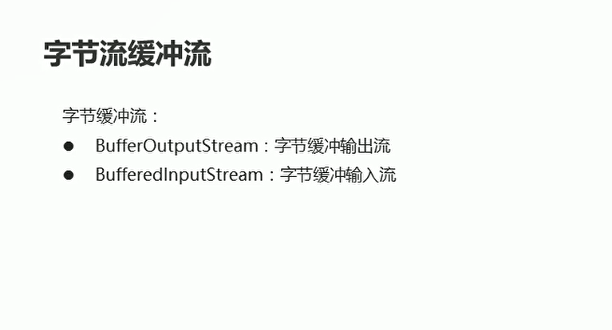
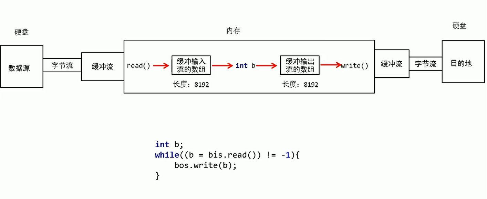

# 字节缓冲流

## 概述

  

* 字节缓冲输入流是指：将源文件中的数据输入到缓冲区中
* 字节缓冲输出流是指：将缓冲区内容输出到目标文件中

```java
package com.hfut.edu.test9;

import java.io.*;

public class test16 {
    public static void main(String[] args) throws IOException {
        // 使用缓冲流去拷贝文件

        // 字节缓冲输入流  将文件中的内容 输入到缓冲区中
        BufferedInputStream bis = new BufferedInputStream(new FileInputStream("D:\\heima\\1.txt"));

        // 字节缓冲输出流  将缓冲区中的内容输出到 目标文件中
        BufferedOutputStream bos = new BufferedOutputStream(new FileOutputStream(new File("D:\\heima\\2.txt")));

        int b;// 接受读取的每一个字符

        while((b = bis.read()) != -1){
            bos.write(b);
        }
        
        bis.close();
        bos.close();
    }
}
```

## 字节缓冲流的原理

  


## 缓冲流一次读取一个字节数组

```java
package com.hfut.edu.test9;

import java.io.*;

public class test16 {
    public static void main(String[] args) throws IOException {
        // 使用缓冲流去拷贝文件

        // 字节缓冲输入流  将文件中的内容 输入到缓冲区中
        BufferedInputStream bis = new BufferedInputStream(new FileInputStream("D:\\heima\\1.txt"));

        // 字节缓冲输出流  将缓冲区中的内容输出到 目标文件中
        BufferedOutputStream bos = new BufferedOutputStream(new FileOutputStream(new File("D:\\heima\\2.txt")));


        int len;// 记录每次读取文件的字节个数
        byte[] bytes = new byte[1024];// 表示一次性读取1024个字节

        while((len = bis.read(bytes)) != -1){
            bos.write(bytes,0,len);
        }

        bis.close();
        bos.close();


    }
}


```


