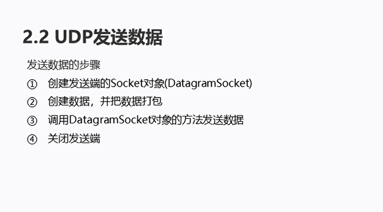

# 网络编程UDP和TCP

## 网络编程的三要素

  

## 网络编程的常见命令

* ipconfig 查看本机IP地址
* ping IP地址： 检查网络是否联通
* 127.0.0.1是回送地址，可以代表本机地址，一般用来测试使用

## InetAddress类

InetAddress类是JAVA方便对ip地址的使用


  


```java
package com.hfut.edu.test14;
import java.net.InetAddress;
import java.net.UnknownHostException;

public class test3 {
    public static void main(String[] args) throws UnknownHostException {
        InetAddress address = InetAddress.getByName("DESKTOP-49VK0HU");// 获取改主机 通过主机名称

        // 获取此IPD地址的主机名
        String name = address.getHostName();

        // 获取IP地址的字符串
        String ip = address.getHostAddress();

        System.out.println("主机名" + name);
        System.out.println("IP地址" + ip);
    }
}
```

## 端口

  


## 协议

  

## UDP发送数据

  

```java
package com.hfut.edu.test14;

import java.io.IOException;
import java.net.*;

public class SendDemo {
    public static void main(String[] args) throws IOException {
        // 创建发送端的Socket对象
        // 创建数据 将数据打包
        // 调用DatagramSocket对象的方法发送数据
        // 关闭发送端
        DatagramSocket ds = new DatagramSocket();// 创建发送端对象

        //创建数据 将数据打包
        byte[] bys = "hello world".getBytes();
        int length = bys.length;// 计算字符串的长度
        InetAddress address = InetAddress.getByName("DESKTOP-49VK0HU");// 根据主机名获取

        // 设置端口
        int port = 10086;
        DatagramPacket dp = new DatagramPacket(bys,length,address,port);

        // 调用DatagramSocket对象的方法发送数据
        ds.send(dp);

        // 关闭发送端
        ds.close();// 关闭数据包套接字
    }
}


```

## UDP接受数据

  


```java
package com.hfut.edu.test14;

import java.io.IOException;
import java.net.DatagramPacket;
import java.net.DatagramSocket;
import java.net.SocketException;

public class receiveDemo {
    public static void main(String[] args) throws IOException {
        // 创建接收端对象Socket  绑定本机的指定端口
        DatagramSocket ds = new DatagramSocket(10086);

        // 创建数据包用于接受数据
        byte[] bys = new byte[1024];
        DatagramPacket dp = new DatagramPacket(bys,bys.length);

        // 调用ds对象接受数据
        ds.receive(dp);

        // 接收数据
        byte[] datas = dp.getData();

        // 限制接受的字符串长度
        String s = new String(datas,0,dp.getLength());// 将字节数组作为参数  构造字符串

        System.out.println(s);

        ds.close();

    }
}

```

## UDP通信程序的练习

  


发送端：
```java
package com.hfut.edu.test15;
import java.io.BufferedReader;
import java.io.IOException;
import java.io.InputStreamReader;
import java.net.DatagramPacket;
import java.net.DatagramSocket;
import java.net.InetAddress;
import java.net.SocketException;

public class Send {
    public static void main(String[] args) throws IOException {
        // 创建发送端Socket对象
        DatagramSocket ds = new DatagramSocket();
        // 将键盘录入的数据封装成缓冲流数据
        BufferedReader br = new BufferedReader(new InputStreamReader(System.in));
        String line;
        while((line = br.readLine()) != null){
            // 输入数据时886 结束循环
            if(line.equals("886")){
                break;
            }
            byte[] bys = line.getBytes();//将输入的字符串转换成字节数组
            // 封装数据
            DatagramPacket dp = new DatagramPacket(bys,bys.length, InetAddress.getByName("DESKTOP-49VK0HU"),1234);
            ds.send(dp);
        }
        ds.close();// 关闭发送端
    }
}


```

接收端：

```java
package com.hfut.edu.test15;

import java.io.IOException;
import java.net.DatagramPacket;
import java.net.DatagramSocket;
import java.net.SocketException;

public class Receive {
    public static void main(String[] args) throws IOException {
        // 创建接收端的Socket对象
        DatagramSocket ds = new DatagramSocket(1234);

        while(true){
            // 创建数据包
            byte[] bys = new byte[1024];
            DatagramPacket dp= new DatagramPacket(bys,bys.length);// 接收数据包

            ds.receive(dp);// 接受数据

            // 解析数据包
            System.out.println("数据：" + new String(dp.getData(),0,dp.getLength()));
        }
//        ds.close();// 关闭接收端

    }
}


```

## TCP通信程序-发送数据

  


  


```java
package com.hfut.edu.test16;
import java.io.IOException;
import java.io.OutputStream;
import java.net.InetAddress;
import java.net.Socket;
import java.net.UnknownHostException;
import java.nio.charset.StandardCharsets;

public class ClientDemo {
    public static void main(String[] args) throws IOException {
        // TCP 发送端数据

        // 创建客户端的套接字
        Socket s = new Socket(InetAddress.getByName("DESKTOP-49VK0HU"),10000);

        // 获取输出流  写数据
        OutputStream os = s.getOutputStream();
        os.write("hello world".getBytes());// 将字符串转换为字节数组  写入输出流

        // 释放资源
        s.close();
    }
}


```

## TCP通信程序-接受数据

  

```java
package com.hfut.edu.test16;

import java.io.IOException;
import java.io.InputStream;
import java.io.InputStreamReader;
import java.net.ServerSocket;
import java.net.Socket;

public class ServerDemo {
    public static void main(String[] args) throws IOException {
        // 创建服务器的Socket对象
        ServerSocket ss = new ServerSocket(10000); 

        Socket s = ss.accept();// 侦听要连接到此套接字并且接受他

        // 获取输入流 读取数据 并把数据显示在控制台
        InputStream is = s.getInputStream();
        byte[] bys = new byte[1024];
        int len = is.read(bys);// 将输入流中的数据读入字节数组
        String data = new String(bys,0,len);
        System.out.println("数据：" + data);

        // 释放资源
        s.close();
        ss.close();

    }
}
```


