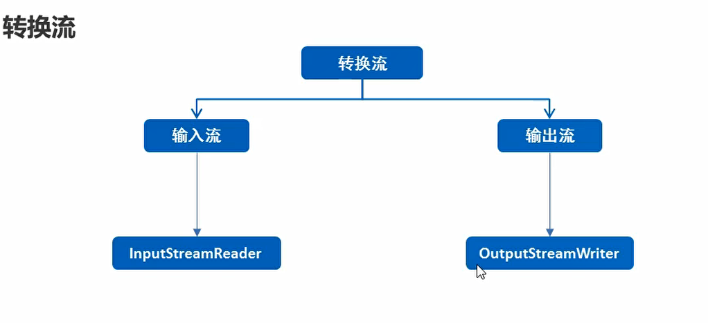
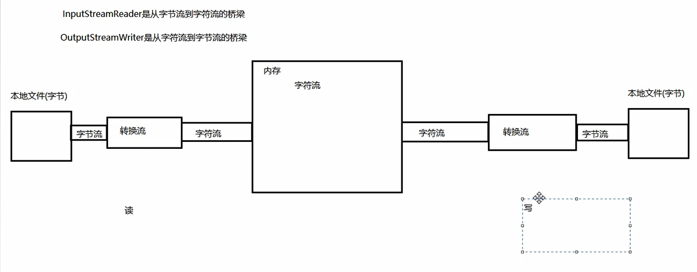

# 转换流

## 概述

  

  

## 转换流-指定编码进行读写

* 转换流读取文件

```java
package com.hfut.edu.test10;

import java.io.*;

public class test10 {
    public static void main(String[] args) throws IOException {
        // 指定GBK码表去读取文件

        InputStreamReader isr = new InputStreamReader(new FileInputStream("D:\\heima\\1.txt"),"GBK");

        // 使用转换流读取文件
        int ch;

        while((ch = isr.read()) != - 1){
            System.out.println((char)ch);
        }
        
        isr.close();
    }
}
```


* 转换流写入文件

```java
package com.hfut.edu.test10;

import java.io.*;

public class test10 {
    public static void main(String[] args) throws IOException {
        // 指定GBK码表去读取文件

        InputStreamReader isr = new InputStreamReader(new FileInputStream("D:\\heima\\1.txt"),"GBK");

        // 使用转换流读取文件
        int ch;

        while((ch = isr.read()) != - 1){
            System.out.println((char)ch);
        }

        isr.close();

        OutputStreamWriter osw = new OutputStreamWriter(new FileOutputStream("D:\\heima\\2.txt"));
        osw.write("gcjhasghdfrcjdsagbcfrvhjsabhf");
        osw.close();

    }
}


```


