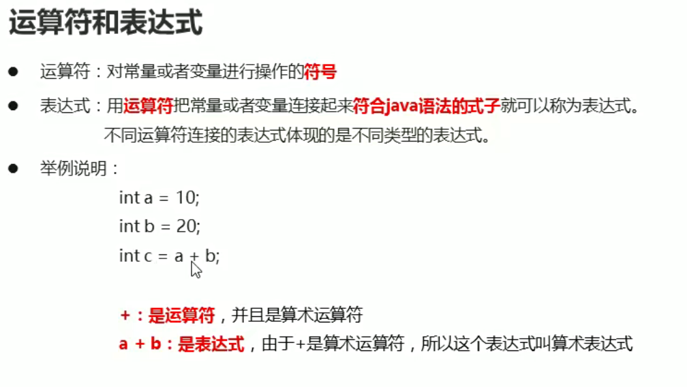
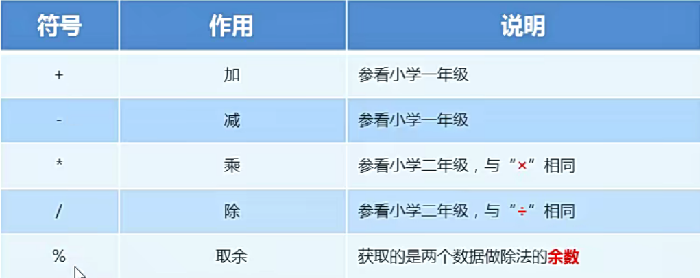
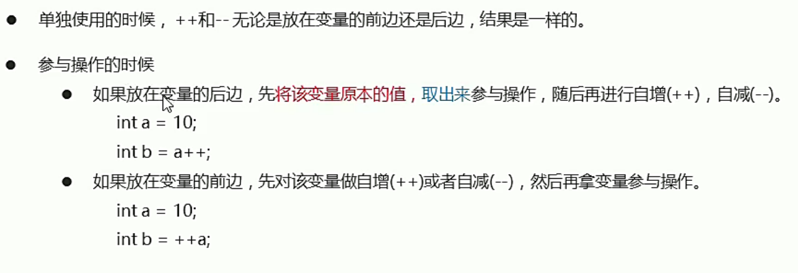
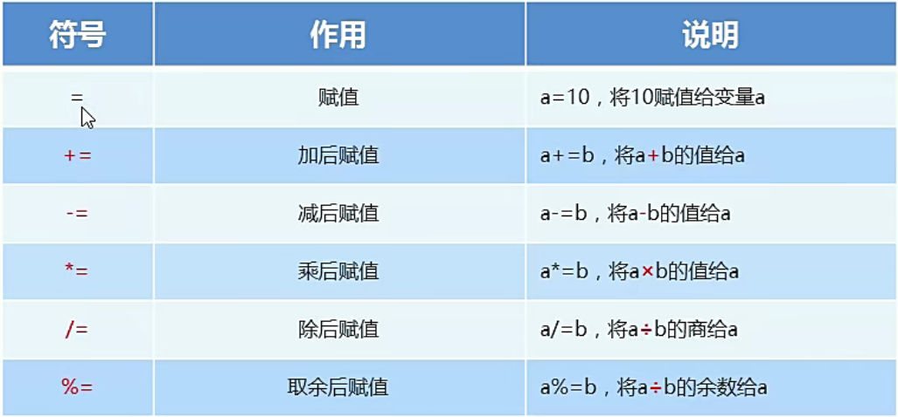
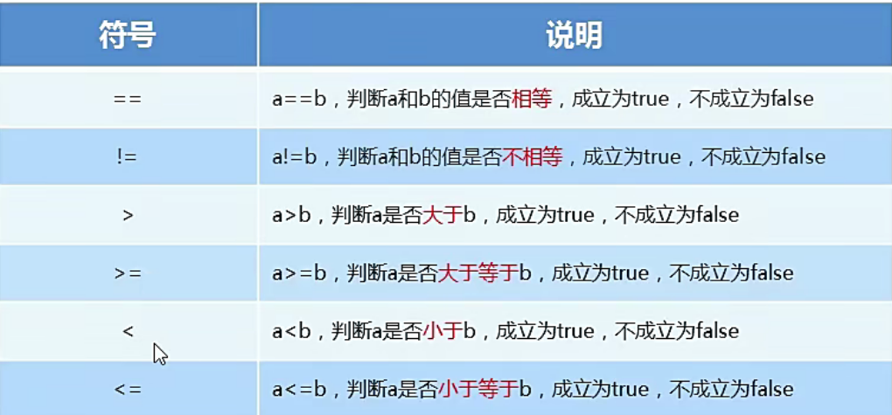
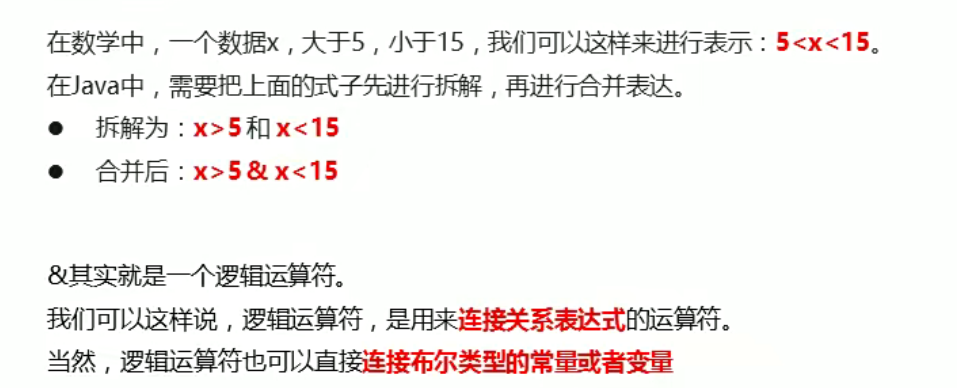
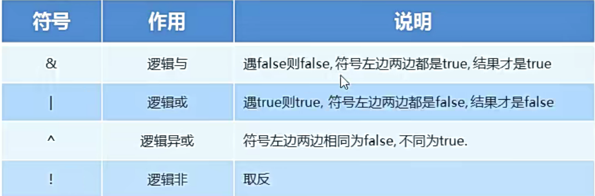
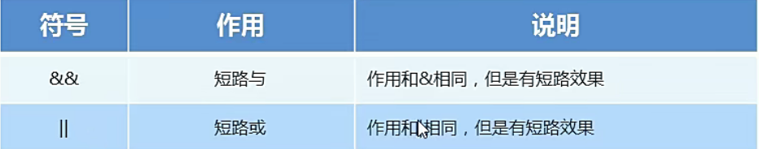
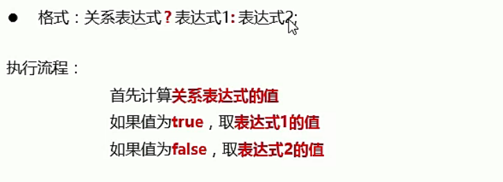

# 运算符

## 一、运算符和表达式

  

  

* 两个整数相除 结果只能是整数 要得到小数的结果必须加入小数

## 二、+ 操作

* 字符的+操作 字符对应数值进行转换 然后再进行运算
```java
package com.ustc.base.DataFormat;

public class test4 {
    public static void main(String[] args) {
        int a = 1;
        char b = 'a';
        System.out.println(a + b);
    }
}

```

* 字符串+操作
字符串的+操作表示连接符

* ++运算符

  

* 赋值运算符

  


* 关系运算符
  


* 逻辑运算符
  

  

* 短路逻辑运算符
  

* 三元运算符
  


