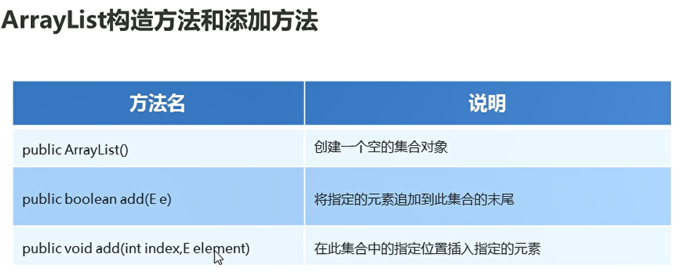
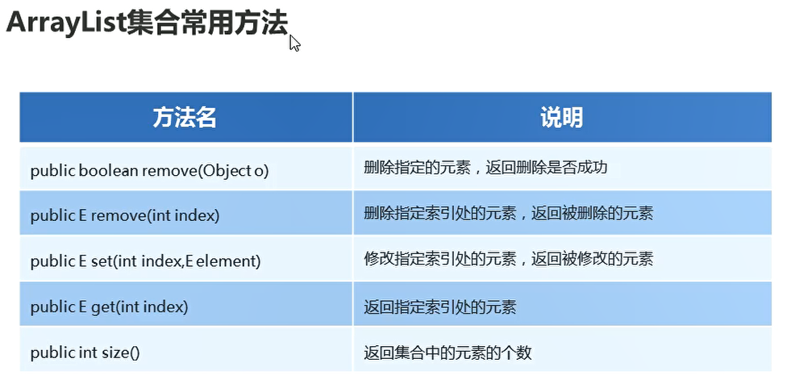

# 集合ArrayList


## 一、集合与数组

集合：提供一种存储空间可变的存储模型，存储的数据容量可以发生改变

集合与数组之间的区别：

* 共同点：都是存储数据的容器
* 不同点：数组容量是固定的，集合容量是可变的


## 二、集合构造方法

* 不指定元素类型的集合

```java
package com.ustc.base.DataFormat;

import java.util.ArrayList;

public class test26 {
    public static void main(String[] args) {
        // 创建集合容器对象
        ArrayList list = new ArrayList();// 没有指定元素类型

        list.add("abc");
        list.add(123);

        list.add(true);

        System.out.println(list);
    }
}


```


* 指定元素类型的集合

<> 泛型：对集合容器存储的数据类型进行限制

```java
package com.ustc.base.DataFormat;

import java.util.ArrayList;

public class test26 {
    public static void main(String[] args) {
        // 创建集合容器对象
        ArrayList<String> list = new ArrayList();// 没有指定元素类型

        list.add("abc");// 该集合只能添加字符串
//        list.add(123);

//        list.add(true);

        System.out.println(list);
    }
}


```

* 指定索引位置插入元素

```java
package com.ustc.base.DataFormat;

import java.util.ArrayList;

public class test26 {
    public static void main(String[] args) {
        // 创建集合容器对象
        ArrayList<String> list = new ArrayList();// 没有指定元素类型

        list.add("abc");// 该集合只能添加字符串
//        list.add(123);

//        list.add(true);
        list.add("xxxx");

        // 在0号索引处 插入元素
        list.add(0,"666");// 插队

        System.out.println(list);
    }
}

```

  


## 三、集合常用的方法

  

```java
package com.ustc.base.DataFormat;

import java.util.ArrayList;

public class test26 {
    public static void main(String[] args) {
        // 创建集合容器对象
        ArrayList<String> list = new ArrayList();// 没有指定元素类型

        list.add("abc");// 该集合只能添加字符串
        list.add("xxxx");
        list.add("xxxx1");
        list.add("xxxx2");
        list.add("xxxx3");

        // 在0号索引处 插入元素
        list.add(0,"666");// 插队

        // 删除指定元素
        boolean b1 = list.remove("abc");
        list.remove(0);// 删除指定索引处元素

        System.out.println(b1);

        System.out.println(list);

        // 修改指定位置的元素
        String s = list.set(0,"999");
        System.out.println(s);
        System.out.println(list);

        // 根据索引 返回指定位置数据
        System.out.println(list.get(0));

    }
}


```

* 集合删除元素remove方法

根据元素删除的方法，只删除第一个

* 集合删除元素一定要加上i--

```java
package com.ustc.base.DataFormat;

import java.util.ArrayList;

public class test27 {
    public static void main(String[] args) {
        ArrayList<String> list = new ArrayList<>();
        list.add("test");
        list.add("张三");
        list.add("test");
        list.add("test");
        list.remove("test");// 只删除第一个元素
        System.out.println(list);

        for (int i = 0; i < list.size(); i++) {
            String s = list.get(i);// 取出元素

            // 根据元素内容进行比较
            if("test".equals(s)){
                list.remove(i);// 删除指定位置的元素
                i--;
            }
        }

        System.out.println(list);

    }
}


```

## 四、集合筛选方法

```java
package com.ustc.base.DataFormat;

import java.util.ArrayList;

public class test27 {
    public static void main(String[] args) {
        // 创建学生类型的集合
        ArrayList<Student> arr = new ArrayList<Student>();

        Student s1 = new Student("xxx",1);
        Student s2 = new Student("xxx",11);
        Student s3 = new Student("xxx",111);
        arr.add(s1);
        arr.add(s2);
        arr.add(s3);
        // 调用方法 删选年龄在18岁以下的学生

        ArrayList<Student> w = shaixuan(arr);
//        System.out.println(w);
        for (int i = 0; i < w.size(); i++) {
            System.out.println(w.get(i).getName() + w.get(i).getAge());
        }

    }

    public static ArrayList<Student> shaixuan(ArrayList<Student> list)
    {
        // 创建一个接受的list
        ArrayList<Student> newArr = new ArrayList<Student>();

        for (int i = 0; i < list.size(); i++) {
            // 取出每一个学生对象
            Student stu = list.get(i);
            if(stu.getAge() < 18)
            {
                newArr.add(stu);// 添加数据
            }
        }

        return newArr;
    }

}


```

