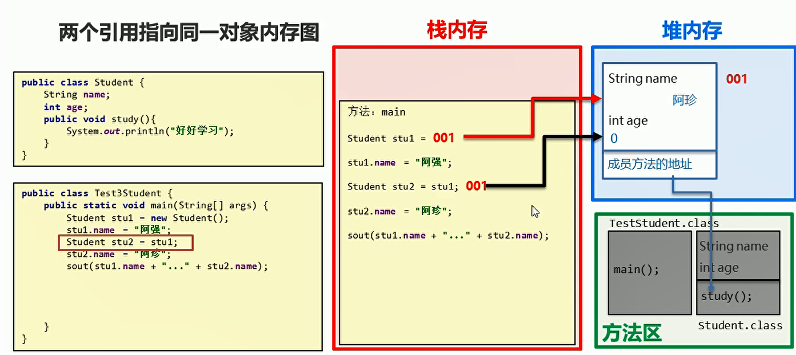

# 面向对象


## 一、面向对象和面相过程

  

对象：客观存在的任何事物

类：现实生活中一类具有相同属性和行为的事物的抽象

  

## 二、类的定义

```java
public class Phone{
    // 成员变量
    String brand;
    int price;

    // 成员方法
    public void call(){
        System.out.println("打电话");
    }

    public void sendMessage(){
        System.out.println("发短信");
    }
}

```

## 三、对象的使用

* 创建对象
  类名 对象名 = new 类名()

* 使用成员变量
  对象名.变量名


* 使用成员方法
  对象名.方法名()

```java
package com.ustc.base.DataFormat;

public class test18 {
    public static void main(String[] args) {
        // 创建对象
        Phone p = new Phone();

        // 使用成员变量
        System.out.println(p.brand);
        System.out.println(p.price);

        // 成员变量赋值
        p.brand = "苹果";
        p.price = 111111;
        System.out.println(p.brand);
        System.out.println(p.price);

        // 调用成员方法
        p.call();
        p.sendMessage();
    }

}
```


## 四、手机类的创建和使用

```java

public class Phone{
    // 成员变量
    String brand;
    int price;

    // 成员方法
    public void call(String name){
        System.out.println("打电话"+ name);
    }

    public void sendMessage(){
        System.out.println("发短信");
    }
}


```

```java
package com.ustc.base.DataFormat;

public class test19 {
    public static void main(String[] args) {
        Phone p = new Phone();

        p.brand = "xxxxx";
        p.price = 1111;

        p.call("xhsajfrdehsiu");
        p.sendMessage();
    }
}


```


## 五、单个对象的内存图

  

  


## 六、两个引用指向同一内存图

  

```java
package com.ustc.base.DataFormat;

public class test19 {
    public static void main(String[] args) {
        Phone p = new Phone();

        p.brand = "xxxxx";
        p.price = 1111;

        Phone p1 = p; // 创建引用数据类型  p1和p指向同一块内存空间

        p1.price = 9999;
        System.out.println(p.price);
        System.out.println(p1.price);
    }
}


```

两个引用指向同一块内存空间，改变的是同一块内容

将引用置为null ,引用将找不到内存空间,不影响其他引用

```java
package com.ustc.base.DataFormat;

public class test19 {
    public static void main(String[] args) {
        Phone p = new Phone();

        p.brand = "xxxxx";
        p.price = 1111;

        Phone p1 = p; // 创建引用数据类型  p1和p指向同一块内存空间

        p1.price = 9999;
        System.out.println(p.price);
        System.out.println(p1.price);

        p = null;// 地址置为null 找不到内存
        System.out.println(p.price);// 出现异常
    }
}


```

垃圾回收机制：

  

## 七、成员变量和局部变量

成员变量：类中方法外变量 随着对象消失而消失
局部变量：方法中变量  随着方法消失而消失

  

## 八、priavte

&emsp;由于类中成员变量很容易被修改，所以需要private关键字进行保护

private关键字：

* 是一个权限修饰符
* 可以修饰成员 成员变量和成员方法
* 作用是保护成员不被别的类使用 被priavte修饰的成员只在本类中进行访问

  


```java
package com.ustc.base.DataFormat;

public class Student {
    private String name;

    private int age;// 私有成员变量

    // 提供set和get方法接口
    public void setAge(int a)
    {
        age = a;
    }

    // get方法获取数据
    public int getAge(){
        return age;
    }

    // set方法  设置成员变量
    public void setName(String a)
    {
        name = a;
    }

    public String getName()
    {
        return name;// 获取name
    }

    // 成员方法
    public void show(){
        System.out.println(name + " " + getAge());
    }
}

```

```java
package com.ustc.base.DataFormat;

public class StudentDemo {
    public static void main(String[] args) {
        Student s = new Student();
//        System.out.println(s.name);// 报错 私有成员不可以直接获取

        // 打印成员变量
        System.out.println(s.getName());// 输出null
        System.out.println(s.getAge());// 输出0

        //设置成员变量
        s.setAge(99);
        s.setName("hdjashdj");
        System.out.println(s.getName());
        System.out.println(s.getAge());
    }
}


```

  

**一个成员变量使用private关键字修饰 提供对应的get和set方法**

## 九、this关键字

  

```java
package com.ustc.base.DataFormat;

public class Student {
    private String name;

    private int age;// 私有成员变量

    // 提供set和get方法接口
    public void setAge(int age)
    {
//        age = a;
        this.age = age;
    }

    // get方法获取数据
    public int getAge(){
        return age;
    }

    // set方法  设置成员变量
    public void setName(String name)
    {
//        name = a;
        this.name = name;
    }

    public String getName()
    {
        return name;// 获取name
    }

    // 成员方法
    public void show(){
        System.out.println(name + " " + getAge());
    }
}


```

使用set函数进行赋值，this指代的是成员变量，不带this修饰的变量指的是形参

  


## 十、封装

  

## 十一、构造方法

生成对象一开始就调用有参数构造方法，如果没有指明构造方法，系统会自动调用默认构造方法


```java
package com.ustc.base.DataFormat;

public class Student {
    private String name;

    private int age;// 私有成员变量
    
    // 有参数构造方法
    public Student(String name,int age)
    {
        this.name = name;
        this.age = age;
        System.out.println("Student的有参数构造方法");
    }

    // 提供set和get方法接口
    public void setAge(int age)
    {
//        age = a;
        this.age = age;
    }

    // get方法获取数据
    public int getAge(){
        return age;
    }

    // set方法  设置成员变量
    public void setName(String name)
    {
//        name = a;
        this.name = name;
    }

    public String getName()
    {
        return name;// 获取name
    }

    // 成员方法
    public void show(){
        System.out.println(name + " " + getAge());
    }
}


```


构造方法的注意事项：

* 如果没有定义构造方法，系统会给出一个默认的无参构造方法
* 如果定义了构造方法，系统将不再提供默认的构造方法
* 如果自定义带参构造方法，还要使用无参构造方法，就必须再写一个无参数构造方法
* 推荐每一个类都手写无参构造方法


## 十二、标准类

* 所有成员变量私有化
* 私有成员变量设置get和set方法
* 

```java
package com.ustc.base.DataFormat;

public class Student {
    private String name;

    private int age;// 私有成员变量

    // 有参数构造方法
    public Student(String name,int age)
    {
        this.name = name;
        this.age = age;
        System.out.println("Student的有参数构造方法");
    }

    // 提供set和get方法接口
    public void setAge(int age)
    {
//        age = a;
        this.age = age;
    }

    // get方法获取数据
    public int getAge(){
        return age;
    }

    // set方法  设置成员变量
    public void setName(String name)
    {
//        name = a;
        this.name = name;
    }

    public String getName()
    {
        return name;// 获取name
    }

    // 成员方法
    public void show(){
        System.out.println(name + " " + getAge());
    }
}


```

