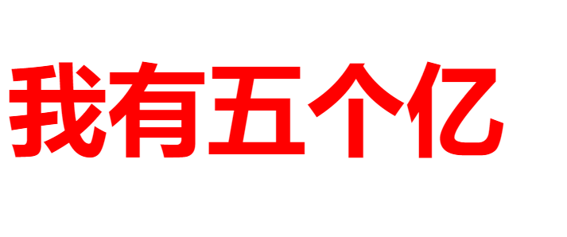
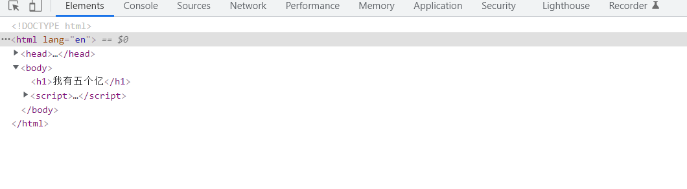
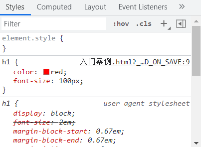

# CSS初步认识

## CSS的介绍
* CSS ：层叠样式表
* 用于设置和布局网页的一种计算机语言，告知浏览器如何渲染解析页面元素


## CSS的组成
* 选择器：选择HTML元素的方式，可以使用标签名、class属性值、id值等多种方式
* 样式声明：用于给HTML元素设置具体的样式。格式是 属性名：属性值
* 格式如下：

```
选择器{
    属性名：属性值；
    属性名：属性值；
    属性名：属性值；

}

h1{

color:red;
font-size:5px;

}


```


## CSS入门案例

* 新建一个html文件
* 在body标签中编写一个h1标签 内容为：五个亿
* 在head标签中编写一个style标签
* 为h1标签设置样式：颜色为红色 字体大小100px
* 通过浏览器打开页面查看效果


```
<!DOCTYPE html>
<html lang="en">
<head>
    <meta charset="UTF-8">
    <title>入门案例</title>

    <style>

        h1{
            color: red;
            font-size:100px;

        }


    </style>


</head>
<body>

<h1>我有五个亿</h1>

</body>
</html>
```

  


## 浏览器开发者工具 
鼠标右键：检查

  

* elements 代表网页的所有标签
* console 代表控制台
* sources 代表源代码
* network 代表网络使用情况
* memory  代表内存使用情况


  


*styles 代表标签样式控制  可以直接修改属性 但只是临时修改状态

