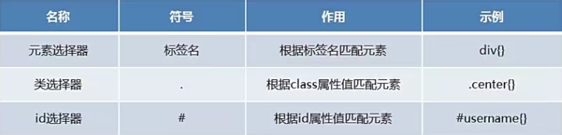
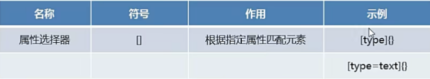
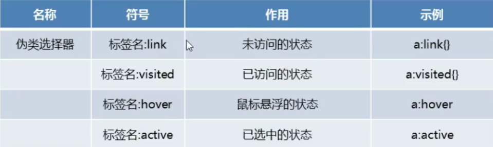
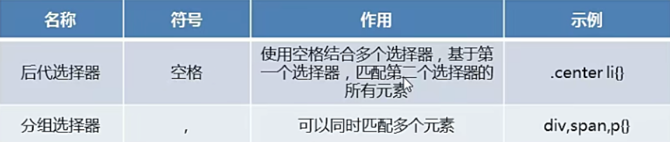

# CSS基本语法

## CSS的引入方式

1. 内联方式
* 在标签中通过style属性来控制样式，只能影响当前这一行
* 格式：
```html
<标签style = "属性名:属性值; 属性名：属性值;">内容</标签>

```

```html
<!DOCTYPE html>
<html lang="en">
<head>
    <meta charset="UTF-8">
    <title>引入方式1</title>
</head>
<body>

    <!--内联样式 仅仅控制一行标签-->
    <h1 style="color:red; font-size:20px">hello world</h1>

</body>
</html>

```


2. 内部样式
* 在head标签中通过style标签来控制样式。只能影响当前文件
* 格式：
  
```html
<head>
    <style>
        选择器{
            属性名：属性值；
            属性名：属性值；
        }
    </style>
</head>
```

```html
<!DOCTYPE html>
<html lang="en">
<head>
    <meta charset="UTF-8">
    <title>引入方式2</title>

    <!--内部样式-->
    <style>
        div{
            color:red;
            font-size:20px;
        }
    </style>


</head>
<body>


<div>div1</div>
<div>div2</div>

</body>
</html>
```


3. 外部样式
* 在head标签中通过link标签中引入独立css文件，可以影响不同的文件
* 格式：```<link rel="stylesheet" href="css文件">                   ```


```html
<!DOCTYPE html>
<html lang="en">
<head>
    <meta charset="UTF-8">
    <title>引入方式3</title>

    <!--外部样式-->
    <link rel = "stylesheet" href = "../CSS/01.css"/>


</head>
<body>
    <div>div1</div>
    <div>div2</div>
</body>
</html>
```

```css
div{
    color:red;
    font-size:20px;
}
```


## 选择器
利用选择器对不同的标签进行样式控制,head标签中添加style标签

1.选择器的定义
* 一个HTML文件中会存在很多个元素，如果想对不同的元素添加不同的样式，就需要使用到选择器！说白了，选择器就是用来选择指定的元素的！


2.选择器的分类

* 基本选择器

  

```html
<!DOCTYPE html>
<html lang="en">
<head>
    <meta charset="UTF-8">
    <title>基本选择器</title>
    <style>
      /*选择器用来选择指定的元素 进而控制样式*/


      /*元素选择器*/
      div{
        color:red;


      }

      /*类选择器*/
      .cls{
        color:blue;


      }


      #d1{
        color:green;

      }

      #d2{
        color:pink;

      }

    </style>


</head>
<body>
    <div>div1</div>
    <div class = "cls">div2</div>
    <div class = "cls">div3</div>
    <div id = "d1">div4</div>
    <div id = "d2">div5</div>
</body>
</html>

```


* 属性选择器
格局标签中是否有该属性来进行选择 进而指定样式
  


```html
<!DOCTYPE html>
<html lang="en">
<head>
    <meta charset="UTF-8">
    <title>属性选择器</title>

    <style>

        /*只要含有type标签的全部变为红色*/
        [type]{

            color:red;

        }

        /*含有type标签 且值为password 变为蓝色*/
        [type = password]
        {
            color:blue;
        }

    </style>


</head>
<body>

    用户名：<input type="text"/> <br/>
    密码：<input type = "password"/> <br/>
    邮箱：<input type = "email"/> <br/>
</body>
</html>


```


## 伪类选择器

  

```html
<!DOCTYPE html>
<html lang="en">
<head>
    <meta charset="UTF-8">
    <title>伪类选择器</title>

    <style>

        /*去掉下划线*/
        a{
            text-decoration:none;
        }

        /*未访问的状态*/
        a:link{
            color:black;
        }

        /*已访问的状态*/
        a:visited{
            color:blue;
        }

        /*鼠标悬浮的状态*/
        a:hover{
            color:red;

        }

        /*已选中的状态*/
        a:active{
            color:yellow;

        }

    </style>


</head>
<body>
    <a href = "https://www.baidu.com" target = "_blank">百度一下</a>
</body>
</html>
```

## 组合选择器


  


后代选择器：第一个选择器使用class属性进行选择，第二个选择器使用标签名进行匹配。
分组选择器：一次性选择多个元素进行控制

```html
<!DOCTYPE html>
<html lang="en">
<head>
    <meta charset="UTF-8">
    <title>组合选择器</title>

    <style>


        /*代表后代选择器  表示选择class属性的div标签中li标签*/
        .center li{
            color:red;
        }

        /*分组选择器 一次性控制多个元素标签*/
        span,p{
            color:blue;

        }

    </style>

</head>
<body>

    <div class = "top">
        <ol>
            <li>aa</li>
            <li>bb</li>
        </ol>
    </div>

    <div class = "center">
        <ol>
            <li>cc</li>
            <li>dd</li>
        </ol>
    </div>

    <!--span标签只定义一行元素-->
    <span>span</span><br/>
    <p>段落</p>


</body>
</html>
```